[TOC]


### 一、Java入门

#### 变量与数据类型

| 数据类型     | 关键字       | 字节 | 取值                  |
| ------------ | ------------ | ---- | --------------------- |
| 字节型       | byte         | 1    | -128-127              |
| 短整型       | short        | 2    | -32768-32767          |
| 整型         | int(默认)    | 4    | -2^31^~2^31^-1        |
| 长整型       | long         | 8    | -2^63^~2^63^-1        |
| 单精度浮点数 | float        | 4    | 1.4013E-45~3.4028E+38 |
| 双精度浮点数 | double(默认) | 8    | 4.9E-324~1.7977E+308  |
| 字符型       | char         | 2    | 0-65535               |
| 布尔类型     | boolean      | 1    | true,false            |

#### 数据类型转换

- 自动类型转换

  将取值范围小的类型自动提升为取值范围大的类型 。

  byte、short、char‐‐>int‐‐>long‐‐>float‐‐>double

- 强制转换

  将取值范围大的类型强制转换成 取值范围小的类型 。

  ```java
  public static void main(String[] args) { //short类型变量，内存中2个字节 
      short s = 1; 
      /*出现编译失败 s和1做运算的时候，1是int类型，s会被提升为int类型 s+1后的结果是int类型，	  将结果在赋值会short类型时发生错误 short内存2个字节，int类型4个字节 必须将int强制转成		short才能完成赋值 */
      s = s + 1；//编译失败 
      s = (short)(s+1);//编译成功 }
  ```

#### ASCII码表

48-57:0-9,65-90:A-Z,97-122:a-z 

#### 循环语句

```java
public static void main(String[] args) { 
    int score = 100; 
    if(score<0 || score>100){ 
        System.out.println("你的成绩是错误的"); }
    else if(score>=90 && score<=100){ 
        System.out.println("你的成绩属于优秀"); }
    else if(score>=80 && score<90){ 
        System.out.println("你的成绩属于好"); }
    else if(score>=70 && score<80){ 
        System.out.println("你的成绩属于良"); }
    else if(score>=60 && score<70){ 
        System.out.println("你的成绩属于及格"); }
    else { 
        System.out.println("你的成绩属于不及格"); } }}
```

```java
public static void main(String[] args) { //定义变量，判断是星期几 
    int weekday = 6; 
    //switch语句实现选择 
    switch(weekday) { 
        case 1: 
            System.out.println("星期一"); 
            break; 
        case 2: 
            System.out.println("星期二"); 
            break; 
        default: 
            System.out.println("你输入的数字有误"); 
            break; } }
```

#### 方法重载

指在同一个类中，允许存在一个以上的同名方法，只要它们的参数列表不同即可，与修饰符和返回值类型无关。 参数列表：个数不同，数据类型不同，顺序不同。

#### 成员变量默认值

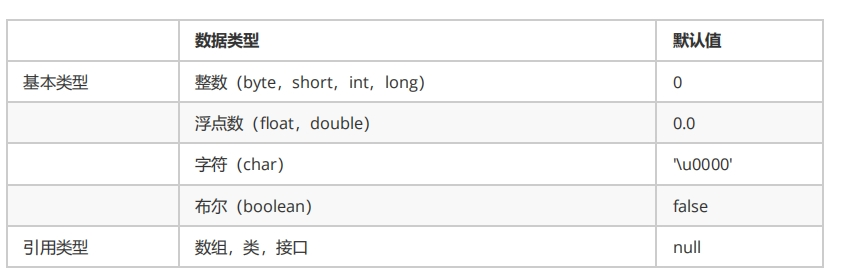

#### 构造方法

无论你与否自定义构造方法，所有的类都有构造方法，因为Java自动提供了一个无参数构造方法， 一旦自己定义了构造方法，Java自动提供的默认无参数构造方法就会失效。

#### JavaBean

JavaBean 是 Java语言编写类的一种标准规范。符合 JavaBean 的类，要求类必须是具体的和公共的，并且具有无参数的构造方法，提供用来操作成员变量的 set 和 get 方法。

```java
public class Student { 
    //成员变量 
    private String name; 
    private int age; 
    //构造方法 
    public Student() {} 
    public Student(String name,int age) { 
        this.name = name; this.age = age; }
    //成员方法 
    public void setName(String name) { 
        this.name = name; }
    public String getName() { 
        return name; }
    public void setAge(int age) { 
        this.age = age; }
    public int getAge() { 
        return age; } }
```

#### ArrayList

ArrayList对象不能存储基本类型，只能存储引用类型的数据。

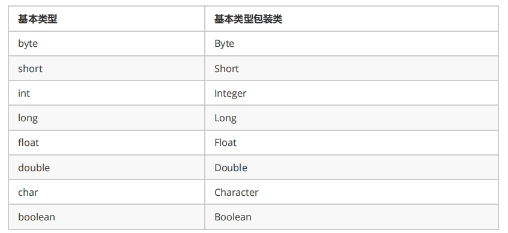

#### 静态方法

静态方法调用的注意事项： 

- 静态方法可以直接访问类变量和静态方法。

- 静态方法不能直接访问普通成员变量或成员方法，只能访问静态成员。。反之，成员方法可以直接访问类变量或静态方法。

-  静态方法中，不能使用this关键字。

#### 继承

1. 子类方法覆盖父类方法，必须要保证权限大于等于父类权限。 
2. 子类方法覆盖父类方法，返回值类型、函数名和参数列表都要一模一样。
3. 构造方法的名字是与类名一致的。所以子类是无法继承父类构造方法的。 
4. 构造方法的作用是初始化成员变量的。所以子类的初始化过程中，必须先执行父类的初始化动作。子类的构造方法中默认有一个 super() ，表示调用父类的构造方法，父类成员变量初始化后，才可以给子类使用。
5. 如果父类成员非private修饰，则子类可以随意使用父类成员。
6. 子类的每个构造方法中均有默认的super()，调用父类的空参构造。手动调用父类构造会覆盖默认的super()。 super() 和 this() 都必须是在构造方法的第一行，所以不能同时出现。

```java
class Fu { 
    private int n; 
    Fu(){ 
        System.out.println("Fu()"); } }
class Zi extends Fu { 
    Zi(){ // super（），调用父类构造方法 
        super(); 
        System.out.println("Zi（）"); } }
```

#### 抽象类与抽象方法

抽象类中，不一定包含抽象方法，但是有抽象方法的类必定是抽象类。

#### 接口，多态

接口的定义，它与定义类方式相似，但是使用 interface 关键字。它也会被编译成.class文件，但一定要明确它并 不是类，而是另外一种引用数据类型。

- 当一个类，既继承一个父类，又实现若干个接口时，父类中的成员方法与接口中的默认方法重名，子类就近选择执 行父类的成员方法。

- 成员变量其实是常量，格式：
  [public] [static] [final] 数据类型 常量名称 = 数据值;
  注意：
  常量必须进行赋值，而且一旦赋值不能改变。
  ==常量名称完全大写，用下划线进行分隔==。

- 接口中最重要的就是抽象方法，格式：
  [public] [abstract] 返回值类型 方法名称(参数列表);
  注意：实现类必须覆盖重写接口所有的抽象方法，除非实现类是抽象类。

- 从Java 8开始，接口里允许定义默认方法，格式：
  [public] default 返回值类型 方法名称(参数列表) { 方法体 }
  ，注意：默认方法也可以被覆盖重写

- 从Java 8开始，接口里允许定义静态方法，格式：
  [public] static 返回值类型 方法名称(参数列表) { 方法体 }， 注意：应该通过接口名称进行调用，不能通过实现类对象调用接口静态方法

- 从Java 9开始，接口里允许定义私有很乏，格式：
  普通私有方法：private 返回值类型 方法名称(参数列表) { 方法体 }， 静态私有方法：private static 返回值类型 方法名称(参数列表) { 方法体 }
  ，注意：private的方法只有接口自己才能调用，不能被实现类或别人使用。私有方法：只有默认方法可以调用。 私有静态方法：默认方法和静态方法可以调用。

- 子接口重写默认方法时，default关键字可以保留。 子类重写默认方法时，default关键字不可以保留。
- 接口中，没有构造方法，不能创建对象。 接口中，没有静态代码块。


#### final关键字

被final修饰的常量名称，一般都有书写规范，所有字母都大写。

类：被修饰的类，不能被继承。 

方法：被修饰的方法，不能被重写。 

变量：被修饰的变量，不能被重新赋值。

#### 权限修饰符

|                        | public | protected | (default) | private |
| ---------------------- | ------ | --------- | --------- | ------- |
| 同一类                 | √      | √         | √         | √       |
| 同一包（子类与无关类） | √      | √         | √         |         |
| 不同包的子类           | √      | √         |           |         |
| 不同包的无关类         | √      |           |           |         |

#### 集合

集合是Java中提供的一种容器，可以用来存储多个数据。

集合和数组既然都是容器，它们有啥区别呢？

* 数组的长度是固定的。集合的长度是可变的。
* 数组中存储的是同一类型的元素，可以存储基本数据类型值。集合存储的都是对象。而且对象的类型可以不一致。在开发中一般当对象多的时候，使用集合进行存储。

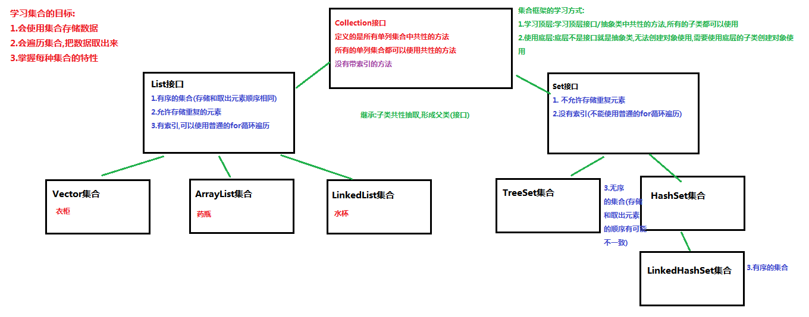

#### 泛型

定义和使用含有泛型的类

```java
public class MyGenericClass<MVP> {
	//没有MVP类型，在这里代表 未知的一种数据类型 未来传递什么就是什么类型
	private MVP mvp;
     
    public void setMVP(MVP mvp) {
        this.mvp = mvp;
    }
     
    public MVP getMVP() {
        return mvp;
    }
}
public class GenericClassDemo {
  	public static void main(String[] args) {		 
         // 创建一个泛型为String的类
         MyGenericClass<String> my = new MyGenericClass<String>();    	
         // 调用setMVP
         my.setMVP("大胡子登登");
         // 调用getMVP
         String mvp = my.getMVP();
         System.out.println(mvp);
         //创建一个泛型为Integer的类
         MyGenericClass<Integer> my2 = new MyGenericClass<Integer>(); 
         my2.setMVP(123);   	  
         Integer mvp2 = my2.getMVP();
    }
}
```

含有泛型的方法

```java
public class MyGenericMethod {	  
    public <MVP> void show(MVP mvp) {
    	System.out.println(mvp.getClass());
    }
    
    public <MVP> MVP show2(MVP mvp) {	
    	return mvp;
    }
}
public class GenericMethodDemo {
    public static void main(String[] args) {
        // 创建对象
        MyGenericMethod mm = new MyGenericMethod();
        // 演示看方法提示
        mm.show("aaa");
        mm.show(123);
        mm.show(12.45);
    }
}
```

含有泛型的接口

```java
public interface MyGenericInterface<E>{
	public abstract void add(E e);
	
	public abstract E getE();  
}
//定义类时确定泛型的类型
public class MyImp1 implements MyGenericInterface<String> {
	@Override
    public void add(String e) {
        // 省略...
    }

	@Override
	public String getE() {
		return null;
	}
}
//始终不确定泛型的类型，直到创建对象时，确定泛型的类型
public class MyImp2<E> implements MyGenericInterface<E> {
	@Override
	public void add(E e) {
       	 // 省略...
	}

	@Override
	public E getE() {
		return null;
	}
}
public class GenericInterface {
    public static void main(String[] args) {
        MyImp2<String>  my = new MyImp2<String>();  
        my.add("aa");
    }
}
```

**泛型的上限**：

* **格式**： `类型名称 <? extends 类 > 对象名称`
* **意义**： `只能接收该类型及其子类`

**泛型的下限**：

- **格式**： `类型名称 <? super 类 > 对象名称`
- **意义**： `只能接收该类型及其父类型`

```java
public static void main(String[] args) {
    Collection<Integer> list1 = new ArrayList<Integer>();
    Collection<String> list2 = new ArrayList<String>();
    Collection<Number> list3 = new ArrayList<Number>();
    Collection<Object> list4 = new ArrayList<Object>();
    
    getElement(list1);
    getElement(list2);//报错
    getElement(list3);
    getElement(list4);//报错
  
    getElement2(list1);//报错
    getElement2(list2);//报错
    getElement2(list3);
    getElement2(list4);
  
}
// 泛型的上限：此时的泛型?，必须是Number类型或者Number类型的子类
public static void getElement1(Collection<? extends Number> coll){}
// 泛型的下限：此时的泛型?，必须是Number类型或者Number类型的父类
public static void getElement2(Collection<? super Number> coll){}
```

#### List子类

##### ArrayList集合

`java.util.ArrayList`集合数据存储的结构是数组结构。元素增删慢，查找快，由于日常开发中使用最多的功能为查询数据、遍历数据，所以`ArrayList`是最常用的集合。

##### LinkedList集合

`java.util.LinkedList`集合数据存储的结构是链表结构。方便元素添加、删除的集合。LinkedList是一个双向链表。LinkedList提供了大量首尾操作的方法。

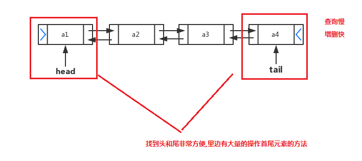

#### Set子类

##### HashSet集合

`java.util.HashSet`是`Set`接口的一个实现类，它所存储的元素是不可重复的，并且元素都是无序的(即存取顺序不一致)。`java.util.HashSet`底层的实现其实是一个`java.util.HashMap`支持。

`HashSet`是根据对象的哈希值来确定元素在集合中的存储位置，因此具有良好的存取和查找性能。保证元素唯一性的方式依赖于：`hashCode`与`equals`方法。如果我们往集合中存放自定义的对象，那么保证其唯一，就必须复写hashCode和equals方法建立属于当前对象的比较方式。

HashSet集合存储数据的结构（哈希表），在JDK1.8之前，哈希表底层采用数组+链表实现。而JDK1.8中，哈希表存储采用数组+链表+红黑树实现，当链表长度超过阈值8时，将链表转换为红黑树。

简单的来说，哈希表是由数组+链表+红黑树（JDK1.8增加了红黑树部分）实现的，如下图所示。

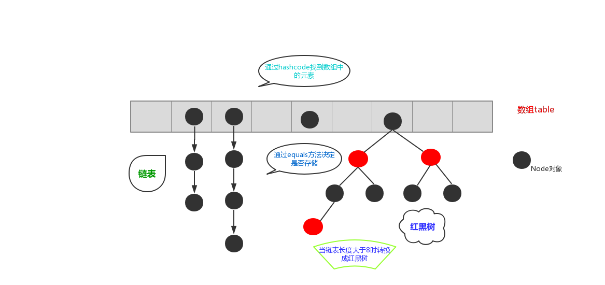

##### LinkedHashSet

在HashSet下面有一个子类`java.util.LinkedHashSet`，它是链表和哈希表组合的一个数据存储结构。

#### 可变参数

定义一个方法需要接受多个参数，并且多个参数类型一致

```java
public class ChangeArgs {
    public static void main(String[] args) {
        int[] arr = { 1, 4, 62, 431, 2 };
        int sum = getSum(arr);
        System.out.println(sum);
        // 求 这几个元素和 6  7  2 12 2121
        int sum2 = getSum(6, 7, 2, 12, 2121);
        System.out.println(sum2);
    }

    //可变参数写法
    public static int getSum(int... arr) {
        int sum = 0;
        for (int a : arr) {
            sum += a;
        }
        return sum;
    }
}
```

#### Comparator比较器

在JAVA中提供了两种比较实现的方式，一种是比较死板的采用`java.lang.Comparable`接口去实现，一种是灵活的当我需要做排序的时候在去选择的`java.util.Comparator`接口完成。

```java
public class CollectionsDemo3 {
    public static void main(String[] args) {
        ArrayList<String> list = new ArrayList<String>();
        list.add("cba");
        list.add("aba");
        list.add("sba");
        list.add("nba");
        //排序方法  按照第一个单词的降序
        Collections.sort(list, new Comparator<String>() {
            @Override
            public int compare(String o1, String o2) {
                return o2.charAt(0) - o1.charAt(0);
            }
        });
        System.out.println(list);
    }
}
```

**Comparable**：强行对实现它的每个类的对象进行整体排序。这种排序被称为类的自然排序，类的compareTo方法被称为它的自然比较方法。只能在类中实现compareTo()一次，不能经常修改类的代码实现自己想要的排序。

**Comparator**强行对某个对象进行整体排序。可以将Comparator 传递给sort方法（如Collections.sort或 Arrays.sort），从而允许在排序顺序上实现精确控制。还可以使用Comparator来控制某些数据结构（如有序set或有序映射）的顺序，或者为那些没有自然顺序的对象collection提供排序。

```java
public class Student implements Comparable<Student>{
    ....
    @Override
    public int compareTo(Student o) {
        return this.age-o.age;//升序
    }
}
Collections.sort(list, new Comparator<Student>() {
            @Override
            public int compare(Student o1, Student o2) {
                // 年龄降序
                int result = o2.getAge()-o1.getAge();//年龄降序

                if(result==0){//第一个规则判断完了 下一个规则 姓名的首字母 升序
                    result = o1.getName().charAt(0)-o2.getName().charAt(0);
                }

                return result;
            }
        });
```

#### 异常

异常的根类是`java.lang.Throwable`，其下有两个子类：`java.lang.Error`与`java.lang.Exception`，平常所说的异常指`java.lang.Exception`。

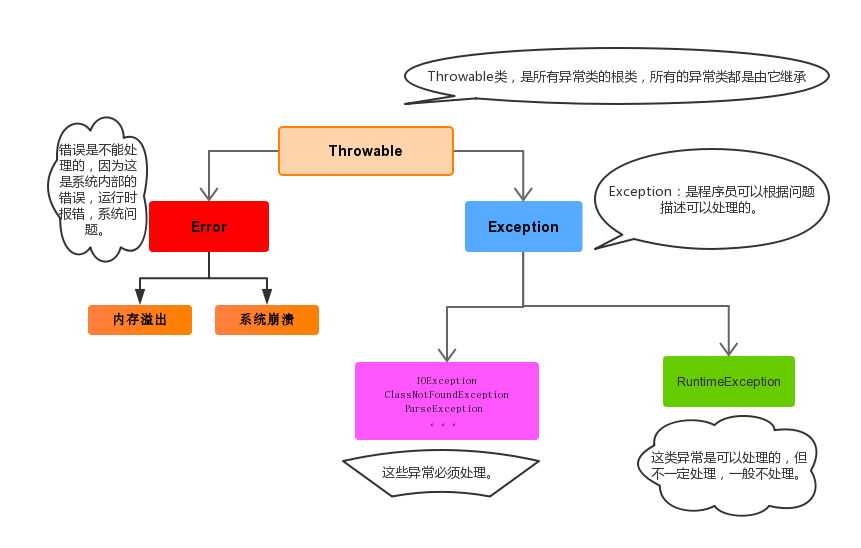

#### 异常处理方式

##### 抛出异常throw

throw用在方法内，用来抛出一个异常对象，将这个异常对象传递到调用者处，并结束当前方法的执行。对于调用者来说，一种是进行捕获处理，另一种就是继续讲问题声明出去，使用throws声明处理。

```java
public class ThrowDemo {
    public static void main(String[] args) {
        //创建一个数组 
        int[] arr = {2,4,52,2};
        //根据索引找对应的元素 
        int index = 4;
        int element = getElement(arr, index);

        System.out.println(element);
        System.out.println("over");
    }
    /*
     * 根据 索引找到数组中对应的元素
     */
    public static int getElement(int[] arr,int index){ 
       	//判断  索引是否越界
        if(index<0 || index>arr.length-1){
             /*
             判断条件如果满足，当执行完throw抛出异常对象后，方法已经无法继续运算。
             这时就会结束当前方法的执行，并将异常告知给调用者。这时就需要通过异常来解决。 
              */
             throw new ArrayIndexOutOfBoundsException("哥们，角标越界了~~~");
        }
        int element = arr[index];
        return element;
    }
}
```

##### 声明异常throws

关键字**throws**运用于方法声明之上,用于表示当前方法不处理异常,而是提醒该方法的调用者来处理异常(抛出异常).

```java
public class ThrowsDemo {
    public static void main(String[] args) throws FileNotFoundException {
        read("a.txt");
    }

    // 如果定义功能时有问题发生需要报告给调用者。可以通过在方法上使用throws关键字进行声明
    public static void read(String path) throws FileNotFoundException {
        if (!path.equals("a.txt")) {//如果不是 a.txt这个文件 
            // 我假设  如果不是 a.txt 认为 该文件不存在 是一个错误 也就是异常  throw
            throw new FileNotFoundException("文件不存在");
        }
    }
}
```

##### 捕获异常try…catch

多个catch中的异常不能相同，并且若catch中的多个异常之间有子父类异常的关系，那么子类异常要求在上面的catch处理，父类异常在下面的catch处理。

```java
try{
     编写可能会出现异常的代码
}catch(异常类型A  e){  当try中出现A类型异常,就用该catch来捕获.
     处理异常的代码
     //记录日志/打印异常信息/继续抛出异常
}catch(异常类型B  e){  当try中出现B类型异常,就用该catch来捕获.
     处理异常的代码
     //记录日志/打印异常信息/继续抛出异常
}finally{

}
```

如果父类抛出了多个异常,子类重写父类方法时,抛出和父类相同的异常或者是父类异常的子类不抛出异常。

父类方法没有抛出异常，子类重写父类该方法时也不可抛出异常。此时子类产生该异常，只能捕获处理，不能声明抛出。

#### 自定义异常类

自定义一个编译期异常: 自定义类 并继承于`java.lang.Exception`。

自定义一个运行时期的异常类:自定义类 并继承于`java.lang.RuntimeException`。

```java
// 业务逻辑异常
public class RegisterException extends Exception {
    /**
     * 空参构造
     */
    public RegisterException() {
    }

    /**
     *
     * @param message 表示异常提示
     */
    public RegisterException(String message) {
        super(message);
    }
}

public class Demo {
    // 模拟数据库中已存在账号
    private static String[] names = {"bill","hill","jill"};
   
    public static void main(String[] args) {     
        //调用方法
        try{
              // 可能出现异常的代码
            checkUsername("nill");
            System.out.println("注册成功");//如果没有异常就是注册成功
        }catch(RegisterException e){
            //处理异常
            e.printStackTrace();
        }
    }

    //判断当前注册账号是否存在
    //因为是编译期异常，又想调用者去处理 所以声明该异常
    public static boolean checkUsername(String uname) throws LoginException{
        for (String name : names) {
            if(name.equals(uname)){//如果名字在这里面 就抛出登陆异常
                throw new RegisterException("亲"+name+"已经被注册了！");
            }
        }
        return true;
    }
```

#### 线程类

Java中通过继承Thread类来创建并启动多线程的步骤如下：

1. 定义Thread类的子类，并重写该类的run()方法，该run()方法的方法体就代表了线程需要完成的任务,因此把run()方法称为线程执行体。
2. 创建Thread子类的实例，即创建了线程对象
3. 调用线程对象的start()方法来启动该线程

代码如下：

```java
public class MyThread extends Thread {
	//定义指定线程名称的构造方法
	public MyThread(String name) {
		//调用父类的String参数的构造方法，指定线程的名称
		super(name);
	}
	/**
	 * 重写run方法，完成该线程执行的逻辑
	 */
	@Override
	public void run() {
		for (int i = 0; i < 10; i++) {
			System.out.println(getName()+"：正在执行！"+i);
		}
	}
}
public class Demo01 {
	public static void main(String[] args) {
		//创建自定义线程对象
		MyThread mt = new MyThread("新的线程！");
		//开启新线程
		mt.start();
		//在主方法中执行for循环
		for (int i = 0; i < 10; i++) {
			System.out.println("main线程！"+i);
		}
	}
}
```

采用 `java.lang.Runnable` 也是非常常见的一种，我们只需要重写run方法即可。 步骤如下：

1. 定义Runnable接口的实现类，并重写该接口的run()方法，该run()方法的方法体同样是该线程的线程执行体。 

2. 创建Runnable实现类的实例，并以此实例作为Thread的target来创建Thread对象，该Thread对象才是真正的线程对象。 
3. 调用线程对象的start()方法来启动线程。 

代码如下

```java
public class MyRunnable implements Runnable{ 
    @Override 
    public void run() { 
        for (int i = 0; i < 20; i++) {  
            System.out.println(Thread.currentThread().getName()+" "+i); } } }
public class Demo { 
    public static void main(String[] args) { 
        //创建自定义类对象 线程任务对象 
        MyRunnable mr = new MyRunnable(); //创建线程对象 
        Thread t = new Thread(mr, "小强"); 
        t.start(); 
        for (int i = 0; i < 20; i++) { 
            System.out.println("旺财 " + i); } } }
public class NoNameInnerClassThread { 
    public static void main(String[] args) { 
        Runnable r = new Runnable(){ 
            public void run(){ for (int i = 0; i < 20; i++) { 
                System.out.println("张宇:"+i); } } };
        new Thread(r).start();}
```

**总结**： 实现Runnable接口比继承Thread类所具有的优势： 

1. 适合多个相同的程序代码的线程去共享同一个资源。 
2. 可以避免Java中的单继承的局限性。 
3. 增加程序的健壮性，实现解耦操作，代码可以被多个线程共享，代码和线程独立。
4. 线程池只能放入实现Runable或Callable类线程，不能直接放入继承Thread的类。 

扩充：在Java中，每次程序运行至少启动2个线程。一个是main线程，一个是垃圾收集线程。因为每当使用 java命令执行一个类的时候，实际上都会启动一个JVM，每一个JVM其实在就是在操作系统中启动了一个进程。

#### 线程同步

##### 同步代码块

synchronized 关键字可以用于方法中的某个区块中，表示只对这个区块的资源实行互斥访问。

```java
public class Ticket implements Runnable{ 
    private int ticket = 100; 
    Object lock = new Object(); 
    /** 执行卖票操作 */ 
    @Override public void run() { 
       //窗口 永远开启 
        while(true){ 
            synchronized (lock) { 
                if(ticket>0){//有票 可以卖 
                   try {
                       Thread.sleep(50); } 
                    catch (InterruptedException e) { 
                       e.printStackTrace(); }
                    //获取当前线程对象的名字 
                    String name = Thread.currentThread().getName(); 
                    System.out.println(name+"正在卖:"+ticket‐‐); } }}}}
```

##### 同步方法

同步方法:使用synchronized修饰的方法,就叫做同步方法,保证A线程执行该方法的时候,其他线程只能在方法外 等着。

对于非static方法,同步锁就是this。 对于static方法,我们使用当前方法所在类的字节码对象(类名.class)。

```java
public class Ticket implements Runnable{ 
    private int ticket = 100; /** 执行卖票操作 */ 
    @Override 
    public void run() { 
        while(true){ sellTicket(); } }
    /** 锁对象 是 谁调用这个方法 就是谁 * 隐含 锁对象 就是 this **/
    public synchronized void sellTicket(){ 
        if(ticket>0){
            try {
                Thread.sleep(100); } 
            catch (InterruptedException e) { 
                e.printStackTrace();
                }//获取当前线程对象的名字 
            String name = Thread.currentThread().getName(); 
            System.out.println(name+"正在卖:"+ticket‐‐); } } }
```

##### Lock锁

`java.util.concurrent.locks.Lock` 机制提供了比synchronized代码块和synchronized方法更广泛的锁定操作, 同步代码块/同步方法具有的功能Lock都有,除此之外更强大,更体现面向对象。 

Lock锁也称同步锁，加锁与释放锁方法化了，如下： public void lock() :加同步锁。 public void unlock() :释放同步锁。

```java
public class Ticket implements Runnable{ 
    private int ticket = 100; 
    Lock lock = new ReentrantLock();
    @Override public void run() { 
        while(true){ 
            lock.lock(); 
            if(ticket>0){
                try {
                    Thread.sleep(50); } 
                catch (InterruptedException e) { 
                    e.printStackTrace(); }
                //获取当前线程对象的名字 
                String name = Thread.currentThread().getName(); 
                System.out.println(name+"正在卖:"+ticket‐‐); }
            lock.unlock(); } } }
```

#### 线程状态

| 线程状态               | 条件                                                         |
| ---------------------- | ------------------------------------------------------------ |
| NEW(新建)              | 线程刚被创建，但是并未启动。还没调用start方法                |
| Runnable(可 运行)      | 线程可以在java虚拟机中运行的状态，可能正在运行自己代码，也可能没有，这取决于操 作系统处理器。 |
| Blocked(锁阻塞)        | 当一个线程试图获取一个对象锁，而该对象锁被其他的线程持有，则该线程进入Blocked状态；当该线程持有锁时，该线程将变成Runnable状态 |
| Waiting(无限等待)      | 一个线程在等待另一个线程执行一个（唤醒）动作时，该线程进入Waiting状态。进入这个 状态后是不能自动唤醒的，必须等待另一个线程调用notify或者notifyAll方法才能够唤醒。 |
| TimedWaiting(计时等待) | 同waiting状态，有几个方法有超时参数，调用他们将进入Timed Waiting状态。这一状态 将一直保持到超时期满或者接收到唤醒通知。带有超时参数的常用方法有Thread.sleep 、 Object.wait。 |
| Terminated(被 终止)    | 因为run方法正常退出而死亡，或者因为没有捕获的异常终止了run方法而死亡 |

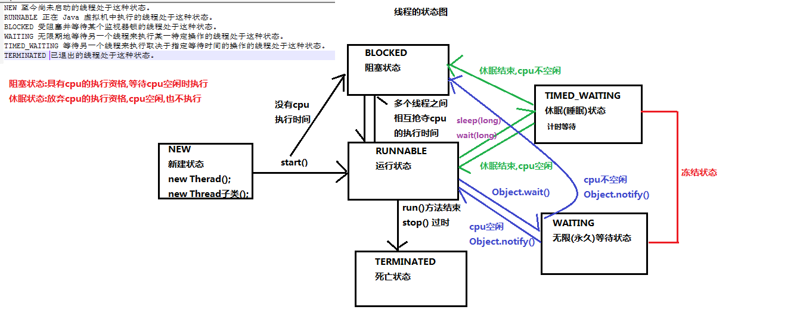

#### 等待与唤醒

哪怕只通知了一个等待的线程，被通知线程也不能立即恢复执行，因为它当初中断的地方是在同步块内，而此刻它已经不持有锁，所以她需要再次尝试去获取锁（很可能面临其它线程的竞争），成功后才能在当初调用 wait 方法之后的地方恢复执行。

wait方法与notify方法必须要由同一个锁对象调用。因为：对应的锁对象可以通过notify唤醒使用同一个锁对象调用的wait方法后的线程。

wait方法与notify方法是属于Object类的方法的。因为：锁对象可以是任意对象，而任意对象的所属类都是继承了Object类的。

wait方法与notify方法必须要在同步代码块或者是同步函数中使用。因为：必须要通过锁对象调用这2个方法。

#### 线程池

Java里面线程池的顶级接口是`java.util.concurrent.Executor`，但是严格意义上讲`Executor`并不是一个线程池，而只是一个执行线程的工具。真正的线程池接口是`java.util.concurrent.ExecutorService`。

```java
public class MyRunnable implements Runnable {
    @Override
    public void run() {
        System.out.println("我要一个教练");
        try {
            Thread.sleep(2000);
        } catch (InterruptedException e) {
            e.printStackTrace();
        }
        System.out.println("教练来了： " + Thread.currentThread().getName());
        System.out.println("教我游泳,交完后，教练回到了游泳池");
    }
}
public class ThreadPoolDemo {
    public static void main(String[] args) {
        // 创建线程池对象
        ExecutorService service = Executors.newFixedThreadPool(2);//包含2个线程对象
        // 创建Runnable实例对象
        MyRunnable r = new MyRunnable();

        //自己创建线程对象的方式
        // Thread t = new Thread(r);
        // t.start(); ---> 调用MyRunnable中的run()

        // 从线程池中获取线程对象,然后调用MyRunnable中的run()
        service.submit(r);
        // 再获取个线程对象，调用MyRunnable中的run()
        service.submit(r);
        service.submit(r);
        // 注意：submit方法调用结束后，程序并不终止，是因为线程池控制了线程的关闭。
        // 将使用完的线程又归还到了线程池中
        // 关闭线程池
        //service.shutdown();
    }
}
```

#### lambda表达式

1. 使用Lambda必须具有接口，且要求**接口中有且仅有一个抽象方法**。
   无论是JDK内置的`Runnable`、`Comparator`接口还是自定义的接口，只有当接口中的抽象方法存在且唯一时，才可以使用Lambda。
2. 使用Lambda必须具有**上下文推断**。
   也就是方法的参数或局部变量类型必须为Lambda对应的接口类型，才能使用Lambda作为该接口的实例。

有且仅有一个抽象方法的接口，称为“**函数式接口**”。

#### 文件过滤器Filter

`java.io.FileFilter`是一个接口，是File的过滤器。 该接口的对象可以传递给File类的`listFiles(FileFilter)` 作为参数， 接口中只有一个方法。

`boolean accept(File pathname)  ` ：测试pathname是否应该包含在当前File目录中，符合则返回true。

```java
public static void printDir3(File dir) {
  	// lambda的改写
    File[] files = dir.listFiles(f ->{ 
      	return f.getName().endsWith(".java") || f.isDirectory(); 
    });
  	
	// 循环打印
    for (File file : files) {
        if (file.isFile()) {
            System.out.println("文件名:" + file.getAbsolutePath());
      	} else {
        	printDir3(file);
      	}
    }
}
```

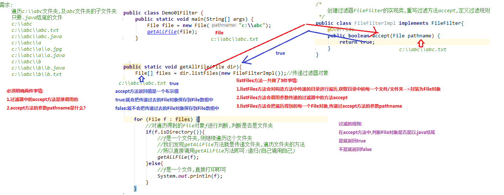

#### 字节流与字符流

|            |           **输入流**            |              输出流              |
| :--------: | :-----------------------------: | :------------------------------: |
| **字节流** | 字节输入流<br />**InputStream** | 字节输出流<br />**OutputStream** |
| **字符流** |   字符输入流<br />**Reader**    |    字符输出流<br />**Writer**    |

```java
public class Copy {
    public static void main(String[] args) throws IOException {
        // 1.创建流对象
        // 1.1 指定数据源
        FileInputStream fis = new FileInputStream("D:\\test.jpg");
        // 1.2 指定目的地
        FileOutputStream fos = new FileOutputStream("test_copy.jpg");

        // 2.读写数据
        // 2.1 定义数组
        byte[] b = new byte[1024];
        // 2.2 定义长度
        int len;
        // 2.3 循环读取
        while ((len = fis.read(b))!=-1) {
            // 2.4 写出数据
            fos.write(b, 0 , len);
        }

        // 3.关闭资源
        fos.close();
        fis.close();
    }
}
```

#### Properties类

`public Object setProperty(String key, String value)` ： 保存一对属性。  

`public String getProperty(String key) ` ：使用此属性列表中指定的键搜索属性值。

`public Set<String> stringPropertyNames() ` ：所有键的名称的集合。

```java
public class ProDemo2 {
    public static void main(String[] args) throws FileNotFoundException {
        // 创建属性集对象
        Properties pro = new Properties();
        // 加载文本中信息到属性集
        pro.load(new FileInputStream("read.txt"));
        // 遍历集合并打印
        Set<String> strings = pro.stringPropertyNames();
        for (String key : strings ) {
          	System.out.println(key+" -- "+pro.getProperty(key));
        }
     }
}
输出结果：
filename -- a.txt
length -- 209385038
location -- D:\a.txt
```

小贴士：文本中的数据，必须是键值对形式，可以使用空格、等号、冒号等符号分隔。

#### 序列化

`java.io.ObjectOutputStream ` 类，将Java对象的原始数据类型写出到文件,实现对象的持久存储。

一个对象要想序列化，必须满足两个条件:

- 该类必须实现`java.io.Serializable ` 接口，`Serializable` 是一个标记接口，不实现此接口的类将不会使任何状态序列化或反序列化，会抛出`NotSerializableException` 。

- 该类的所有属性必须是可序列化的。如果有一个属性不需要可序列化的，则该属性必须注明是瞬态的，使用`transient` 关键字修饰。

序列化操作代码

```java
public class Employee implements java.io.Serializable {
    public String name;
    public String address;
    public transient int age; // transient瞬态修饰成员,不会被序列化
    public void addressCheck() {
      	System.out.println("Address  check : " + name + " -- " + address);
    }
}
public class SerializeDemo{
   	public static void main(String [] args)   {
    	Employee e = new Employee();
    	e.name = "zhangsan";
    	e.address = "beiqinglu";
    	e.age = 20; 
    	try {
      		// 创建序列化流对象
          ObjectOutputStream out = new ObjectOutputStream(new FileOutputStream("employee.txt"));
        	// 写出对象
        	out.writeObject(e);
        	// 释放资源
        	out.close();
        	fileOut.close();
        	System.out.println("Serialized data is saved"); // 姓名，地址被序列化，年龄没有被序列化。
        } catch(IOException i)   {
            i.printStackTrace();
        }
   	}
}
```

#### 反序列化

ObjectInputStream反序列化流，将之前使用ObjectOutputStream序列化的原始数据恢复为对象。

```java
public class DeserializeDemo {
   public static void main(String [] args)   {
        Employee e = null;
        try {		
             // 创建反序列化流
             FileInputStream fileIn = new FileInputStream("employee.txt");
             ObjectInputStream in = new ObjectInputStream(fileIn);
             // 读取一个对象
             e = (Employee) in.readObject();
             // 释放资源
             in.close();
             fileIn.close();
        }catch(IOException i) {
             // 捕获其他异常
             i.printStackTrace();
             return;
        }catch(ClassNotFoundException c)  {
        	// 捕获类找不到异常
             System.out.println("Employee class not found");
             c.printStackTrace();
             return;
        }
        // 无异常,直接打印输出
        System.out.println("Name: " + e.name);	// zhangsan
        System.out.println("Address: " + e.address); // beiqinglu
        System.out.println("age: " + e.age); // 0
    }
}
```

**另外，当JVM反序列化对象时，能找到class文件，但是class文件在序列化对象之后发生了修改，那么反序列化操作也会失败，抛出一个`InvalidClassException`异常。**发生这个异常的原因如下：

* 该类的序列版本号与从流中读取的类描述符的版本号不匹配 
* 该类包含未知数据类型 
* 该类没有可访问的无参数构造方法 

`Serializable` 接口给需要序列化的类，提供了一个序列版本号。`serialVersionUID` 该版本号的目的在于验证序列化的对象和对应类是否版本匹配。

```java
public class Employee implements java.io.Serializable {
     // 加入序列版本号
     private static final long serialVersionUID = 1L;
     public String name;
     public String address;
     // 添加新的属性 ,重新编译, 可以反序列化,该属性赋为默认值.
     public int eid; 

     public void addressCheck() {
         System.out.println("Address  check : " + name + " -- " + address);
     }
}
```

#### 网络通信协议

**TCP/IP协议**：传输控制协议/因特网互联协议( Transmission Control Protocol/Internet Protocol)，是Internet最基本、最广泛的协议。它定义了计算机如何连入因特网，以及数据如何在它们之间传输的标准。它的内部包含一系列的用于处理数据通信的协议，并采用了4层的分层模型，每一层都呼叫它的下一层所提供的协议来完成自己的需求。

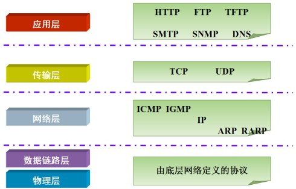

上图中，TCP/IP协议中的四层分别是应用层、传输层、网络层和链路层，每层分别负责不同的通信功能。
链路层：链路层是用于定义物理传输通道，通常是对某些网络连接设备的驱动协议，例如针对光纤、网线提供的驱动。
网络层：网络层是整个TCP/IP协议的核心，它主要用于将传输的数据进行分组，将分组数据发送到目标计算机或者网络。
运输层：主要使网络程序进行通信，在进行网络通信时，可以采用TCP协议，也可以采用UDP协议。
应用层：主要负责应用程序的协议，例如HTTP协议、FTP协议等。

#### IP地址

* **IP地址：指互联网协议地址（Internet Protocol Address）**，俗称IP。IP地址用来给一个网络中的计算机设备做唯一的编号。假如我们把“个人电脑”比作“一台电话”的话，那么“IP地址”就相当于“电话号码”。

**IP地址分类**

* IPv4：是一个32位的二进制数，通常被分为4个字节，表示成`a.b.c.d` 的形式，例如`192.168.65.100` 。其中a、b、c、d都是0~255之间的十进制整数，那么最多可以表示42亿个。

* IPv6：由于互联网的蓬勃发展，IP地址的需求量愈来愈大，但是网络地址资源有限，使得IP的分配越发紧张。

  为了扩大地址空间，拟通过IPv6重新定义地址空间，采用128位地址长度，每16个字节一组，分成8组十六进制数，表示成`ABCD:EF01:2345:6789:ABCD:EF01:2345:6789`，号称可以为全世界的每一粒沙子编上一个网址，这样就解决了网络地址资源数量不够的问题。

#### 端口号

网络的通信，本质上是两个进程（应用程序）的通信。每台计算机都有很多的进程，那么在网络通信时，如何区分这些进程呢？

如果说**IP地址**可以唯一标识网络中的设备，那么**端口号**就可以唯一标识设备中的进程（应用程序）了。

* **端口号：用两个字节表示的整数，它的取值范围是0~65535**。其中，0~1023之间的端口号用于一些知名的网络服务和应用，普通的应用程序需要使用1024以上的端口号。如果端口号被另外一个服务或应用所占用，会导致当前程序启动失败。

利用`协议`+`IP地址`+`端口号` 三元组合，就可以标识网络中的进程了，那么进程间的通信就可以利用这个标识与其它进程进行交互。

#### Socket类

**在Java中，提供了两个类用于实现TCP通信程序：**

客户端：`java.net.Socket` 类表示。创建`Socket`对象，向服务端发出连接请求，服务端响应请求，两者建立连接开始通信。

服务端：`java.net.ServerSocket` 类表示。创建`ServerSocket`对象，相当于开启一个服务，并等待客户端的连接。

#### TCP通信分析图解

1. 【服务端】启动,创建ServerSocket对象，等待连接。
2. 【客户端】启动,创建Socket对象，请求连接。
3. 【服务端】接收连接,调用accept方法，并返回一个Socket对象。
4. 【客户端】Socket对象，获取OutputStream，向服务端写出数据。
5. 【服务端】Socket对象，获取InputStream，读取客户端发送的数据。

> 自此，服务端向客户端回写数据。

6. 【服务端】Socket对象，获取OutputStream，向客户端回写数据。
7. 【客户端】Socket对象，获取InputStream，解析回写数据。
8. 【客户端】释放资源，断开连接。

**客户端实现：**

```java
public class FileUpload_Client {
    public static void main(String[] args) throws IOException {
        // 1.创建流对象
        // 1.1 创建输入流,读取本地文件
        BufferedInputStream bis = new BufferedInputStream(new FileInputStream("test.jpg"));
        // 1.2 创建输出流,写到服务端
        Socket socket = new Socket("localhost", 6666);
        BufferedOutputStream bos = new BufferedOutputStream(socket.getOutputStream());

        //2.写出数据.
        byte[] b  = new byte[1024 * 8 ];
        int len ;
        while (( len  = bis.read(b))!=-1) {
            bos.write(b, 0, len);
        }
      	// 关闭输出流,通知服务端,写出数据完毕
        socket.shutdownOutput();
        System.out.println("文件发送完毕");
        // 3. =====解析回写============
        InputStream in = socket.getInputStream();
        byte[] back = new byte[20];
        in.read(back);
        System.out.println(new String(back));
        in.close();
        // ============================

        // 4.释放资源
        socket.close();
        bis.close();
    }
}
```

**回写实现**

```java
public class FileUpload_Server {
    public static void main(String[] args) throws IOException {
        System.out.println("服务器 启动.....  ");
        // 1. 创建服务端ServerSocket
        ServerSocket serverSocket = new ServerSocket(6666);
        // 2. 循环接收,建立连接
        while (true) {
            Socket accept = serverSocket.accept();
          	/*
          	3. socket对象交给子线程处理,进行读写操作
               Runnable接口中,只有一个run方法,使用lambda表达式简化格式
            */
            new Thread(() -> {
                try (
                    //3.1 获取输入流对象
                    BufferedInputStream bis = new BufferedInputStream(accept.getInputStream());
                    //3.2 创建输出流对象, 保存到本地 .
                    FileOutputStream fis = new FileOutputStream(System.currentTimeMillis() + ".jpg");
                    BufferedOutputStream bos = new BufferedOutputStream(fis);
                ) {
                    // 3.3 读写数据
                    byte[] b = new byte[1024 * 8];
                    int len;
                    while ((len = bis.read(b)) != -1) {
                        bos.write(b, 0, len);
                    }

                    // 4.=======信息回写===========================
                    System.out.println("back ........");
                    OutputStream out = accept.getOutputStream();
                    out.write("上传成功".getBytes());
                    out.close();
                    //================================

                    //5. 关闭 资源
                    bos.close();
                    bis.close();
                    accept.close();
                    System.out.println("文件上传已保存");
                } catch (IOException e) {
                    e.printStackTrace();
                }
            }).start();
        }
    }
}
```

#### 函数式接口

```java
@FunctionalInterface 
public interface MessageBuilder { 
    String buildMessage(); }
public class Demo02LoggerLambda { 
    private static void log(int level, MessageBuilder builder) { 
        if (level == 1) { 
            System.out.println(builder.buildMessage()); } }
    public static void main(String[] args) { 
        String msgA = "Hello"; 
        String msgB = "World"; 
        String msgC = "Java"; 
        log(1, () ‐> msgA + msgB + msgC ); } }
```

只有当级别满足要求的时候，才会进行三个字符串的拼接；否则三个字符串将不会进行拼接。

##### Supplier接口

java.util.function.Supplier<T> 接口仅包含一个无参的方法： T. get() 。用来获取一个泛型参数指定类型的对 象数据。由于这是一个函数式接口，这也就意味着对应的Lambda表达式需要“对外提供”一个符合泛型类型的对象 数据。

```java
public class Demo02Test { 
    //定一个方法,方法的参数传递Supplier,泛型使用Integer 
    public static int getMax(Supplier<Integer> sup){ 
        return sup.get(); }
    public static void main(String[] args) { 
        int arr[] = {2,3,4,52,333,23}; 
        //调用getMax方法,参数传递Lambda 
        int maxNum = getMax(()‐>{ //计算数组的最大值 
            int max = arr[0]; 
            for(int i : arr){ 
                if(i>max){ 
                    max = i; } }
            return max; }); 
        System.out.println(maxNum); } }
```

##### Consumer接口

java.util.function.Consumer<T> 接口则正好与Supplier接口相反，它不是生产一个数据，而是消费一个数据， 其数据类型由泛型决定。

```java
public class Demo10ConsumerAndThen { 
    private static void consumeString(Consumer<String> one, Consumer<String> two) {
        one.andThen(two).accept("Hello"); }
    public static void main(String[] args) { 
        consumeString( s ‐> System.out.println(s.toUpperCase()), 
                      s ‐> System.out.println(s.toLowerCase())); } }
```

##### Predicate接口 

有时候我们需要对某种类型的数据进行判断，从而得到一个boolean值结果。这时可以使用 java.util.function.Predicate<T> 接口。

```java
public class Demo16PredicateAnd { 
    private static void method(Predicate<String> one, Predicate<String> two) { 
        boolean isValid = one.and(two).test("Helloworld"); 
        System.out.println("字符串符合要求吗：" + isValid); }
    public static void main(String[] args) { 
        method(s ‐> s.contains("H"), s ‐> s.contains("W")); } }
```

##### Function接口 

java.util.function.Function<T,R> 接口用来根据一个类型的数据得到另一个类型的数据，前者称为前置条件， 后者称为后置条件。

```java
public class Demo12FunctionAndThen { 
    private static void method(Function<String, Integer> one, 
                               Function<Integer, Integer> two) { 
        int num = one.andThen(two).apply("10"); 
        System.out.println(num + 20); }
    public static void main(String[] args) { 
        method(str‐>Integer.parseInt(str)+10, i ‐> i *= 10); } }
```

#### Stream流

```java
public class Demo03StreamFilter { 
    public static void main(String[] args) { 
        List<String> list = new ArrayList<>(); 
        list.add("张无忌"); 
        list.add("周芷若"); 
        list.add("赵敏"); 
        list.add("张强"); 
        list.add("张三丰"); 
        list.stream() 
            .filter(s ‐> s.startsWith("张")) 
            .filter(s ‐> s.length() == 3) 
            .forEach(System.out::println); } }
```

#### 方法引用

双冒号 :: 为引用运算符，而它所在的表达式被称为方法引用。如果Lambda要表达的函数方案已经存在于某个方 法的实现中，那么则可以通过双冒号来引用该方法作为Lambda的替代者。

##### 通过对象名引用成员方法

```java
public class MethodRefObject { 
    public void printUpperCase(String str) { 
        System.out.println(str.toUpperCase()); } }
@FunctionalInterface 
public interface Printable { 
    void print(String str); }
public class Demo04MethodRef { 
    private static void printString(Printable lambda) { 
        lambda.print("Hello"); }
    public static void main(String[] args) { 
        MethodRefObject obj = new MethodRefObject(); 
        printString(obj::printUpperCase); } }
```

##### 通过类名称引用静态方法

```java
@FunctionalInterface 
public interface Calcable { 
    int calc(int num); }
public class Demo06MethodRef { 
    private static void method(int num, Calcable lambda) { 
        System.out.println(lambda.calc(num)); }
    public static void main(String[] args) { 
        method(‐10, Math::abs); } }
```

##### 通过super引用成员方法

```java
@FunctionalInterface 
public interface Greetable { 
    void greet(); }
public class Human { 
    public void sayHello() { 
        System.out.println("Hello!"); } }
public class Man extends Human { 
    @Override 
    public void sayHello() { S
        ystem.out.println("大家好,我是Man!"); }
    //定义方法method,参数传递Greetable接口 
    public void method(Greetable g){ g.greet(); }
    public void show(){ method(super::sayHello); } }
```

##### 通过this引用成员方法

```java
@FunctionalInterface 
public interface Richable { void buy(); }
public class Husband { 
    private void buyHouse() { 
        System.out.println("买套房子"); }
    private void marry(Richable lambda) { 
        lambda.buy(); }
    public void beHappy() { marry(this::buyHouse); } }
```

#####  类的构造器引用

```java
public class Person { 
    private String name; 
    public Person(String name) { 
        this.name = name; }
    public String getName() { 
        return name; }
    public void setName(String name) { 
        this.name = name; } }
public interface PersonBuilder { 
    Person buildPerson(String name); }
public class Demo10ConstructorRef { 
    public static void printName(String name, PersonBuilder builder) { 
        System.out.println(builder.buildPerson(name).getName()); }
    public static void main(String[] args) { 
        printName("赵丽颖", Person::new); } }
```

##### 数组的构造器引用

```java
@FunctionalInterface 
public interface ArrayBuilder { 
    int[] buildArray(int length); }
public class Demo12ArrayInitRef { 
    private static int[] initArray(int length, ArrayBuilder builder) { 
        return builder.buildArray(length); }
    public static void main(String[] args) { i
        nt[] array = initArray(10, int[]::new); } }
```

#### 反射

反射：将类的各个组成部分封装为其他对象，这就是反射机制

好处：
1. 可以在程序运行过程中，操作这些对象。
2. 可以解耦，提高程序的可扩展性。

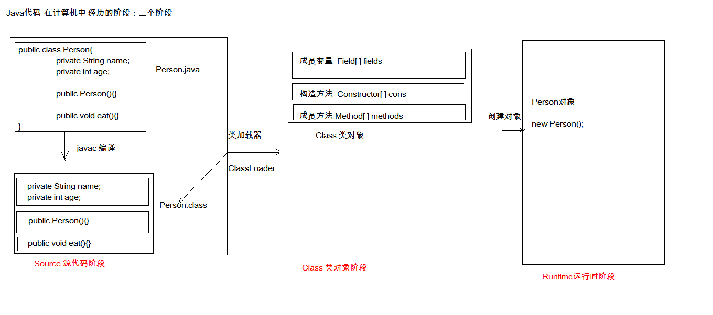

##### 获取Class对象的方式：

1. Class.forName("全类名")：将字节码文件加载进内存，返回Class对象

​        多用于配置文件，将类名定义在配置文件中。读取文件，加载类

2. 类名.class：通过类名的属性class获取

   多用于参数的传递

3. 对象.getClass()：getClass()方法在Object类中定义着。

   多用于对象的获取字节码的方式

同一个字节码文件(*.class)在一次程序运行过程中，只会被加载一次，不论通过哪一种方式获取的Class对象都是同一个。

##### Class对象功能：

1. 获取成员变量们

   Field[] getFields() ：获取所有public修饰的成员变量

   Field getField(String name)   获取指定名称的 public修饰的成员变量

   Field[] getDeclaredFields()  获取所有的成员变量，不考虑修饰符

   Field getDeclaredField(String name)  

2. 获取构造方法们

   Constructor<?>[] getConstructors()  

   Constructor<T> getConstructor(类<?>... parameterTypes)  

   Constructor<T> getDeclaredConstructor(类<?>... parameterTypes)  

   Constructor<?>[] getDeclaredConstructors()  

3. 获取成员方法们：

   Method[] getMethods()  

   Method getMethod(String name, 类<?>... parameterTypes)  

   Method[] getDeclaredMethods()  

   Method getDeclaredMethod(String name, 类<?>... parameterTypes)  

   

4. 获取全类名	

   String getName()  

##### Field：成员变量

1. 设置值：void set(Object obj, Object value)  
2. 获取值：get(Object obj) 

 	3. 忽略访问权限修饰符的安全检查：setAccessible(true):暴力反射

##### Constructor:构造方法

创建对象：T newInstance(Object... initargs)  

如果使用空参数构造方法创建对象，操作可以简化：Class对象的newInstance方法

##### Method：方法对象

1. 执行方法：Object invoke(Object obj, Object... args)  

2. 获取方法名称：String getName

#### 注解

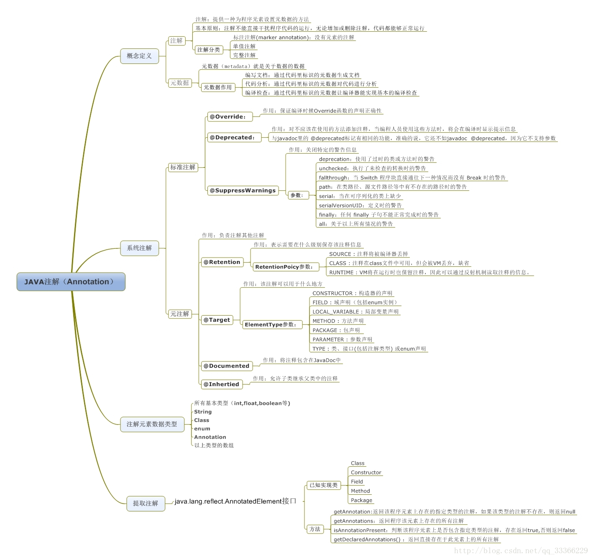

##### 作用分类：

①编写文档：通过代码里标识的注解生成文档【生成文档doc文档】

②代码分析：通过代码里标识的注解对代码进行分析【使用反射】

③编译检查：通过代码里标识的注解让编译器能够实现基本的编译检查【Override】

##### 自定义注解

	* 格式：
		元注解
		public @interface 注解名称{
			属性列表;
		}

* 本质：注解本质上就是一个接口，该接口默认继承Annotation接口
	* public interface MyAnno extends java.lang.annotation.Annotation {}

* 属性：接口中的抽象方法
  1. 属性的返回值类型有下列取值
  	* 基本数据类型
  	* String
  	* 枚举
  	* 注解
  	* 以上类型的数组

  2. 定义了属性，在使用时需要给属性赋值
  	1. 如果定义属性时，使用default关键字给属性默认初始化值，则使用注解时，可以不进行属性的赋值。
  	2. 如果只有一个属性需要赋值，并且属性的名称是value，则value可以省略，直接定义值即可。
  	3. 数组赋值时，值使用{}包裹。如果数组中只有一个值，则{}可以省略

* 元注解：用于描述注解的注解
	* @Target：描述注解能够作用的位置
		* ElementType取值：
			* TYPE：可以作用于类上
			* METHOD：可以作用于方法上
			* FIELD：可以作用于成员变量上
	* @Retention：描述注解被保留的阶段
		* @Retention(RetentionPolicy.RUNTIME)：当前被描述的注解，会保留到class字节码文件中，并被JVM读取到
	* @Documented：描述注解是否被抽取到api文档中
	* @Inherited：描述注解是否被子类继承

#### 	JDBC

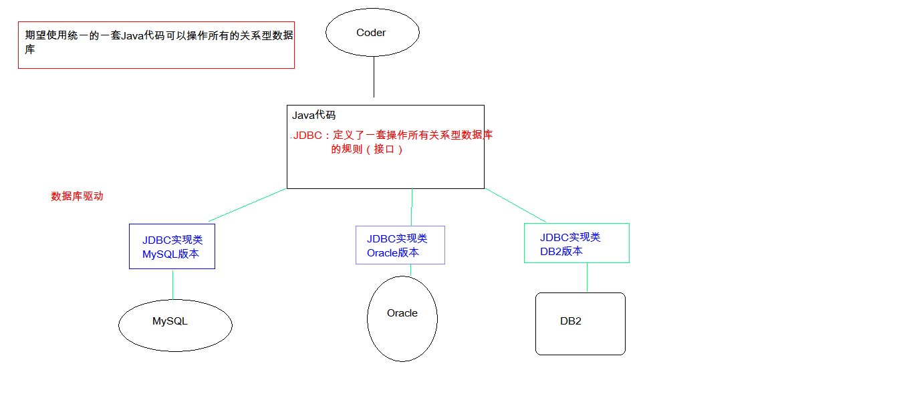


```java
//1. 导入驱动jar包
//2.注册驱动
Class.forName("com.mysql.jdbc.Driver");
//3.获取数据库连接对象
Connection conn = DriverManager.getConnection("jdbc:mysql://localhost:3306/db3", "root", "root");
//4.定义sql语句
String sql = "update account set balance = 500 where id = 1";
//5.获取执行sql的对象 Statement
Statement stmt = conn.createStatement();
//6.执行sql
int count = stmt.executeUpdate(sql);
//7.处理结果
System.out.println(count);
//8.释放资源
stmt.close();
conn.close();


1. DriverManager：驱动管理对象
	功能：
			1. 注册驱动：告诉程序该使用哪一个数据库驱动jar
				static void registerDriver(Driver driver) :注册给定的驱动程序 
				写代码使用：  Class.forName("com.mysql.jdbc.Driver");
				通过查看源码发现：在com.mysql.jdbc.Driver类中存在静态代码块
				 static {
				        try {
				            java.sql.DriverManager.registerDriver(new Driver());
				        } catch (SQLException E) {
				            throw new RuntimeException("Can't register driver!");
				        }
					}

				注意：mysql5之后的驱动jar包可以省略注册驱动的步骤。
			2. 获取数据库连接：
				* 方法：static Connection getConnection(String url, String user, String password) 

2. Connection：数据库连接对象
	功能：
			1. 获取执行sql 的对象
				* Statement createStatement()
				* PreparedStatement prepareStatement(String sql)  
			2. 管理事务：
				* 开启事务：setAutoCommit(boolean autoCommit) ：调用该方法设置参数为					false，即开启事务
				* 提交事务：commit() 
				* 回滚事务：rollback() 
3. Statement：执行sql的对象
			1. boolean execute(String sql) ：可以执行任意的sql 了解 
			2. int executeUpdate(String sql) ：执行DML（insert、update、delete）语句、DDL(create，alter、drop)语句
			3. ResultSet executeQuery(String sql)  ：执行DQL（select)语句
		
			
4. ResultSet：结果集对象,封装查询结果
           //循环判断游标是否是最后一行末尾。
           while(rs.next()){
                 //获取数据
                 int id = rs.getInt(1);
                 String name = rs.getString("name");
                 double balance = rs.getDouble(3);}

					
5. PreparedStatement：执行sql的对象
		预编译的SQL：参数使用?作为占位符
		步骤：
			1. 导入驱动jar包 mysql-connector-java-5.1.37-bin.jar
			2. 注册驱动
			3. 获取数据库连接对象 Connection
			4. 定义sql
				* 注意：sql的参数使用？作为占位符。 
			5. 获取执行sql语句的对象 Connection.prepareStatement(String sql) 
			6. 给？赋值：
				* 方法： setXxx(参数1,参数2)
					* 参数1：？的位置编号 从1 开始
					* 参数2：？的值
			7. 执行sql，接受返回结果，不需要传递sql语句
			8. 处理结果
			9. 释放资源

```
##### JDBCUtils

```java
public class JDBCUtils {
    private static String url;
    private static String user;
    private static String password;
    private static String driver;
    /**
     * 文件的读取，只需要读取一次即可拿到这些值。使用静态代码块
     */
    static{

        try {
            //1. 创建Properties集合类。
            Properties pro = new Properties();

            //获取src路径下的文件的方式--->ClassLoader 类加载器
            ClassLoader classLoader = JDBCUtils.class.getClassLoader();
            URL res  = classLoader.getResource("jdbc.properties");
            String path = res.getPath();
            
            
            pro.load(new FileReader(path));

            //3. 获取数据，赋值
            url = pro.getProperty("url");
            user = pro.getProperty("user");
            password = pro.getProperty("password");
            driver = pro.getProperty("driver");
            //4. 注册驱动
            Class.forName(driver);
        } catch (IOException e) {
            e.printStackTrace();
        } catch (ClassNotFoundException e) {
            e.printStackTrace();
        }
    }
    /**
     * 获取连接
     * @return 连接对象
     */
    public static Connection getConnection() throws SQLException {

        return DriverManager.getConnection(url, user, password);
    }

    /**
     * 释放资源
     * @param stmt
     * @param conn
     */
    public static void close(Statement stmt,Connection conn){
        close(null,stmt,conn);
    }
    /**
     * 释放资源
     * @param stmt
     * @param conn
     */
    public static void close(ResultSet rs,Statement stmt, Connection conn){
        if( rs != null){
            try {
                rs.close();
            } catch (SQLException e) {
                e.printStackTrace();
            }
        }

        if( stmt != null){
            try {
                stmt.close();
            } catch (SQLException e) {
                e.printStackTrace();
            }
        }

        if( conn != null){
            try {
                conn.close();
            } catch (SQLException e) {
                e.printStackTrace();
            }
        }
    }

}

使用工具类
public boolean login(String username ,String password){
    Connection conn = null;
	Statement stmt =  null;
	ResultSet rs = null;
	try {
		conn =  JDBCUtils.getConnection();
			           
		String sql = "select * from user where username = '"+username+"' and password = '"+password+"' ";
		
		stmt = conn.createStatement();
		rs = stmt.executeQuery(sql);
		return rs.next();//如果有下一行，则返回true
		} catch (SQLException e) {
			e.printStackTrace();
		}finally {
			JDBCUtils.close(rs,stmt,conn);
		}
		return false;}
			
```

##### JDBC控制事务

```java
public class JDBCDemo10 {

	    public static void main(String[] args) {
	        Connection conn = null;
	        PreparedStatement pstmt1 = null;
	        PreparedStatement pstmt2 = null;
	
	        try {
	            //1.获取连接
	            conn = JDBCUtils.getConnection();
	            //开启事务
	            conn.setAutoCommit(false);
	
	            //2.定义sql
	            //2.1 张三 - 500
	            String sql1 = "update account set balance = balance - ? where id = ?";
	            //2.2 李四 + 500
	            String sql2 = "update account set balance = balance + ? where id = ?";
	            //3.获取执行sql对象
	            pstmt1 = conn.prepareStatement(sql1);
	            pstmt2 = conn.prepareStatement(sql2);
	            //4. 设置参数
	            pstmt1.setDouble(1,500);
	            pstmt1.setInt(2,1);
	
	            pstmt2.setDouble(1,500);
	            pstmt2.setInt(2,2);
	            //5.执行sql
	            pstmt1.executeUpdate();
	            // 手动制造异常
	            int i = 3/0;
	
	            pstmt2.executeUpdate();
	            //提交事务
	            conn.commit();
	        } catch (Exception e) {
	            //事务回滚
	            try {
	                if(conn != null) {
	                    conn.rollback();
	                }
	            } catch (SQLException e1) {
	                e1.printStackTrace();
	            }
	            e.printStackTrace();
	        }finally {
	            JDBCUtils.close(pstmt1,conn);
	            JDBCUtils.close(pstmt2,null);
	        }
        }}
```

##### 数据库连接池

实现：
 1. 标准接口：DataSource   javax.sql包下的
    1. 方法：

       获取连接：getConnection()

       归还连接：Connection.close()。如果连接对象Connection是从连接池中获取的，那么调用Connection.close()方法，则不会再关闭连接了，而是归还连接。

2. 一般我们不去实现它，有数据库厂商来实现
	1. C3P0：数据库连接池技术
	2. Druid：数据库连接池实现技术，由阿里巴巴提供的

3. C3P0：数据库连接池技术

* 步骤：
  1. 导入jar包 (两个) c3p0-0.9.5.2.jar mchange-commons-java-0.2.12.jar ，

    不要忘记导入数据库驱动jar包
  2. 定义配置文件：

    名称： c3p0.properties 或者 c3p0-config.xml

    路径：直接将文件放在src目录下即可。

  3. 创建核心对象 数据库连接池对象 ComboPooledDataSource
  4. 获取连接： getConnection

* 代码：
	
   ```java
   DataSource ds  = new ComboPooledDataSource();
   Connection conn = ds.getConnection();
   ```
   
   
   
   

4. Druid：数据库连接池实现技术，由阿里巴巴提供的

- 步骤：

1. 导入jar包 druid-1.0.9.jar

2. 定义配置文件：

  是properties形式的

  可以叫任意名称，可以放在任意目录下

3. 加载配置文件。Properties

4. 获取数据库连接池对象：通过工厂来来获取  DruidDataSourceFactory

5. 获取连接：getConnection

```java
Properties pro = new Properties();
InputStream is = DruidDemo.class.getClassLoader().getResourceAsStream("druid.properties");
pro.load(is);  
DataSource ds = DruidDataSourceFactory.createDataSource(pro);
Connection conn = ds.getConnection();
```

##### JDBCUtils连接池工具类

```java
public class JDBCUtils {

		    //1.定义成员变量 DataSource
		    private static DataSource ds ;
		
		    static{
		        try {
		            //1.加载配置文件
		            Properties pro = new Properties();
		            pro.load(JDBCUtils.class.getClassLoader().getResourceAsStream("druid.properties"));
		            //2.获取DataSource
		            ds = DruidDataSourceFactory.createDataSource(pro);
		        } catch (IOException e) {
		            e.printStackTrace();
		        } catch (Exception e) {
		            e.printStackTrace();
		        }
		    }
		
		    /**
		     * 获取连接
		     */
		    public static Connection getConnection() throws SQLException {
		        return ds.getConnection();
		    }
		
		    /**
		     * 释放资源
		     */
		    public static void close(Statement stmt,Connection conn){
		
		       close(null,stmt,conn);
		    }
		    public static void close(ResultSet rs , Statement stmt, Connection conn){
                if(rs != null){
		            try {
		                rs.close();
		            } catch (SQLException e) {
		                e.printStackTrace();
		            }
		        }
                if(stmt != null){
		            try {
		                stmt.close();
		            } catch (SQLException e) {
		                e.printStackTrace();
		            }
		        }
		
		        if(conn != null){
		            try {
		                conn.close();//归还连接
		            } catch (SQLException e) {
		                e.printStackTrace();
		            }
		        }
		    }
		
		    /**
		     * 获取连接池方法
		     */
		
		    public static DataSource getDataSource(){
		        return  ds;
		    }
		
		}
```

##### Spring JDBC

Spring框架对JDBC的简单封装。提供了一个JDBCTemplate对象简化JDBC的开发
* 步骤：
	1. 导入jar包
	2. 创建JdbcTemplate对象。依赖于数据源DataSource
		* JdbcTemplate template = new JdbcTemplate(ds);

	3. 调用JdbcTemplate的方法来完成CRUD的操作
		* update():执行DML语句。增、删、改语句
		* queryForMap():查询结果将结果集封装为map集合，将列名作为key，将值作为value 将这条记录封装为一个map集合
			* 注意：这个方法查询的结果集长度只能是1
		* queryForList():查询结果将结果集封装为list集合
			* 注意：将每一条记录封装为一个Map集合，再将Map集合装载到List集合中
		* query():查询结果，将结果封装为JavaBean对象
			* query的参数：RowMapper
				* 一般我们使用BeanPropertyRowMapper实现类。可以完成数据到JavaBean的自动封装
				* new BeanPropertyRowMapper<类型>(类型.class)
		* queryForObject：查询结果，将结果封装为对象
			* 一般用于聚合函数的查询

### 二、java-web

#### 软件架构

C/S: Client/Server 客户端/服务器端
	

B/S: Browser/Server 浏览器/服务器端
		

B/S架构详解
* 资源分类：
	1. 静态资源：
		* 使用静态网页开发技术发布的资源。
		* 特点：
			* 所有用户访问，得到的结果是一样的。
			* 如：文本，图片，音频、视频, HTML,CSS,JavaScript
			* 如果用户请求的是静态资源，那么服务器会直接将静态资源发送给浏览器。浏览器中内置了静态资源的解析引擎，可以展示静态资源
	2. 动态资源：
		* 使用动态网页及时发布的资源。
		* 特点：
			* 所有用户访问，得到的结果可能不一样。
			* 如：jsp/servlet,php,asp...
			* 如果用户请求的是动态资源，那么服务器会执行动态资源，转换为静态资源，再发送给浏览器

#### 标签学习

```
	1. 文件标签：构成html最基本的标签
		* html:html文档的根标签
		* head：头标签。用于指定html文档的一些属性。引入外部的资源
		* title：标题标签。
		* body：体标签
		* <!DOCTYPE html>：html5中定义该文档是html文档
	2. 文本标签：和文本有关的标签
		* 注释：<!-- 注释内容 -->
		* <h1> to <h6>：标题标签
			* h1~h6:字体大小逐渐递减
		* <p>：段落标签
		* <br>：换行标签
		* <hr>：展示一条水平线
			* 属性：
				* color：颜色
				* width：宽度
				* size：高度
				* align：对其方式
					* center：居中
					* left：左对齐
					* right：右对齐
		* <b>：字体加粗
		* <i>：字体斜体
		* <font>:字体标签
		* <center>:文本居中
			* 属性：
				* color：颜色
				* size：大小
				* face：字体

		* 属性定义：
			* color：
				1. 英文单词：red,green,blue
				2. rgb(值1，值2，值3)：值的范围：0~255  如  rgb(0,0,255)
				3. #值1值2值3：值的范围：00~FF之间。如： #FF00FF
			* width：
				1. 数值：width='20' ,数值的单位，默认是 px(像素)
				2. 数值%：占比相对于父元素的比例
	3. 图片标签：
		* img：展示图片
			* 属性：
				* src：指定图片的位置
	4. 列表标签：
		* 有序列表：
			* ol:
			* li:
		* 无序列表：
			* ul:
			* li:
	5. 链接标签：
		* a:定义一个超链接
			* 属性：
				* href：指定访问资源的URL(统一资源定位符)
				* target：指定打开资源的方式
					* _self:默认值，在当前页面打开
					* _blank：在空白页面打开
	6. div和span：
		* div:每一个div占满一整行。块级标签
    	* span：文本信息在一行展示，行内标签 内联标签

	7. 语义化标签：html5中为了提高程序的可读性，提供了一些标签。
		1. <header>：页眉
		2. <footer>：页脚
	8. 表格标签：
		* table：定义表格
			* width：宽度
			* border：边框
			* cellpadding：定义内容和单元格的距离
			* cellspacing：定义单元格之间的距离。如果指定为0，则单元格的线会合为一条、
			* bgcolor：背景色
			* align：对齐方式
		* tr：定义行
			* bgcolor：背景色
			* align：对齐方式
		* td：定义单元格
			* colspan：合并列
			* rowspan：合并行
		* th：定义表头单元格
		* <caption>：表格标题
		* <thead>：表示表格的头部分
		* <tbody>：表示表格的体部分
		* <tfoot>：表示表格的脚部分
	9.  表单项标签：
		* input：可以通过type属性值，改变元素展示的样式
			* type属性：
				* text：文本输入框，默认值
				* placeholder：指定输入框的提示信息，当输入框的内容发生变化，会自动清空提示信息
				* password：密码输入框
				* radio:单选框  checked属性，可以指定默认值
				* checkbox：复选框
				* file：文件选择框
				* hidden：隐藏域，用于提交一些信息。
				* 按钮：
					* submit：提交按钮。可以提交表单
					* button：普通按钮
					* image：图片提交按钮
		   * label：指定输入项的文字描述信息
			   * 注意：label的for属性一般会和input的id属性值对应。如果对应了，
			   		则点击label区域，会让input输入框获取焦点。
		* select: 下拉列表
			* 子元素：option，指定列表项
		* textarea：文本域
			* cols：指定列数，每一行有多少个字符
			* rows：默认多少行。
```

#### CSS

```
CSS的使用：CSS与html结合方式
	1. 内联样式
		 * 在标签内使用style属性指定css代码
		 * 如：<div style="color:red;">hello css</div>
	2. 内部样式
		* 在head标签内，定义style标签，style标签的标签体内容就是css代码
		* 如：
			<style>
		        div{
		            color:blue;
		        }
		
		    </style>
			<div>hello css</div>
	3. 外部样式
		1. 定义css资源文件。
		2. 在head标签内，定义link标签，引入外部的资源文件
		* 如：
			<link rel="stylesheet" href="css/a.css">
			<style>
		        @import "css/a.css";
		    </style>

    4. css语法：
        * 格式：
            选择器 {
                属性名1:属性值1;
                属性名2:属性值2;
                ...
            }
        * 选择器:筛选具有相似特征的元素
        * 注意：
            * 每一对属性需要使用；隔开，最后一对属性可以不加；
    5. 选择器：筛选具有相似特征的元素
	分类：
		1. 基础选择器
			1. id选择器：选择具体的id属性值的元素.建议在一个html页面中id值唯一
		        * 语法：#id属性值{}
		    2. 元素选择器：选择具有相同标签名称的元素
		        * 语法： 标签名称{}
		        * 注意：id选择器优先级高于元素选择器
		    3. 类选择器：选择具有相同的class属性值的元素。
		        * 语法：.class属性值{}
		        * 注意：类选择器选择器优先级高于元素选择器
		2. 扩展选择器：
			1. 选择所有元素：
				* 语法： *{}
			2. 并集选择器：
				* 选择器1,选择器2{}
			
			3. 子选择器：筛选选择器1元素下的选择器2元素
				* 语法：  选择器1 选择器2{}
			4. 父选择器：筛选选择器2的父元素选择器1
				* 语法：  选择器1 > 选择器2{}

			5. 属性选择器：选择元素名称，属性名=属性值的元素
				* 语法：  元素名称[属性名="属性值"]{}

			6. 伪类选择器：选择一些元素具有的状态
				* 语法： 元素:状态{}
				* 如： <a>
					* 状态：
						* link：初始化的状态
						* visited：被访问过的状态
						* active：正在访问状态
						* hover：鼠标悬浮状态
        6. 属性
            1. 字体、文本
                * font-size：字体大小
                * color：文本颜色
                * text-align：对其方式
                * line-height：行高 
            2. 背景
                * background：
            3. 边框
                * border：设置边框，符合属性
            4. 尺寸
                * width：宽度,height：高度
            5. 盒子模型：控制布局
                * margin：外边距
                * padding：内边距
                    * 默认情况下内边距会影响整个盒子的大小
                    * box-sizing: border-box;  设置盒子的属性，
                    让width和height就是最终盒子的大小
                * float：浮动
                    * left,right
```

#### JavaScript

一门客户端脚本语言，运行在客户端浏览器中的。每一个浏览器都有JavaScript的解析引擎
，不需要编译，直接就可以被浏览器解析执行了。

可以来增强用户和html页面的交互过程，可以来控制html元素，让页面有一些动态的效果，增强用户的体验。

##### ECMAScript

```
ECMAScript：客户端脚本语言的标准
	1. 基本语法：
		1. 与html结合方式
			1. 内部JS：
				* 定义<script>，标签体内容就是js代码
			2. 外部JS：
				* 定义<script>，通过src属性引入外部的js文件

			* 注意：
				1. <script>可以定义在html页面的任何地方。但是定义的位置会影响执行顺序。
				2. <script>可以定义多个。
		2. 注释
			1. 单行注释：//注释内容
			2. 多行注释：/*注释内容*/
		3. 数据类型：
			1. 原始数据类型(基本数据类型)：
				1. number：数字。 整数/小数/NaN(not a number 一个不是数字的数字类型)
				2. string：字符串。 字符串  "abc" "a" 'abc'
				3. boolean: true和false
				4. null：一个对象为空的占位符
				5. undefined：未定义。如果一个变量没有给初始化值，则会被默认赋值为undefined
				
			2. 引用数据类型：对象
			
		4. 变量
			* 变量：一小块存储数据的内存空间
			* Java语言是强类型语言，而JavaScript是弱类型语言。
				* 强类型：在开辟变量存储空间时，定义了空间将来存储的数据的数据类型。只能存储固定类型的数据
				* 弱类型：在开辟变量存储空间时，不定义空间将来的存储数据类型，可以存放任意类型的数据。
			* 语法：
				* var 变量名 = 初始化值;
			
			* typeof运算符：获取变量的类型。
				* 注：null运算后得到的是object
		5. 运算符
			1. 一元运算符：只有一个运算数的运算符
				++，-- ， +(正号)  
				* ++ --: 自增(自减)
					* ++(--) 在前，先自增(自减)，再运算
					* ++(--) 在后，先运算，再自增(自减)
				* +(-)：正负号
			    * 在JS中，如果运算数不是运算符所要求的类型，那么js引擎会自动的将运算数进行类型转换
                其他类型转number：
                * string转number：按照字面值转换。如果字面值不是数字，则转为NaN
                * boolean转number：true转为1，false转为0
			2. 算数运算符
				+ - * / % ...
			3. 赋值运算符
				= += -+....
			4. 比较运算符
				> < >= <= == ===(全等于)
				* 比较方式
                  1. 类型相同：直接比较
                      * 字符串：按照字典顺序比较。按位逐一比较，直到得出大小为止。
                  2. 类型不同：先进行类型转换，再比较
                      * ===：全等于。在比较之前，先判断类型，如果类型不一样，则直接返回false
                      5. 逻辑运算符
				&& || !
				* 其他类型转boolean：
                   1. number：0或NaN为假，其他为真
                   2. string：除了空字符串("")，其他都是true
                   3. null&undefined:都是false
                   4. 对象：所有对象都为true
			
		6. 三元运算符
				* 语法：
					* 表达式? 值1:值2;
					* 判断表达式的值，如果是true则取值1，如果是false则取值2；
			
		7. 流程控制语句：
			1. if...else...
			2. switch:
				* 在java中，switch语句可以接受的数据类型： 
				byte int shor char,枚举(1.5) ,String(1.7)
				* 在JS中,switch语句可以接受任意的原始数据类型
			3. while
			4. do...while
			5. for
			
			
基本对象：
		1. Function：函数(方法)对象
            1. 创建：
                    function 方法名称(形式参数列表){
                        方法体
                    }


            2. 属性：
                length:代表形参的个数
            3. 特点：
                1. 方法定义是，形参的类型不用写,返回值类型也不写。
                2. 方法是一个对象，如果定义名称相同的方法，会覆盖
                3. 在JS中，方法的调用只与方法的名称有关，和参数列表无关
                4. 在方法声明中有一个隐藏的内置对象（数组），arguments,封装所有的实际参数
            4. 调用：
                方法名称(实际参数列表);
		
		2. Array:数组对象
            1. 创建：
                1. var arr = new Array(元素列表);
                2. var arr = new Array(默认长度);
                3. var arr = [元素列表];
            2. 方法
                join(参数):将数组中的元素按照指定的分隔符拼接为字符串
                push()	向数组的末尾添加一个或更多元素，并返回新的长度。
            3. 属性
                length:数组的长度
            4. 特点：
                1. JS中，数组元素的类型可变的。
                2. JS中，数组长度可变的。
		3. Boolean
		4. Date：日期对象
            1. 创建：
                var date = new Date();
            2. 方法：
                toLocaleString()：返回当前date对象对应的时间本地字符串格式
                getTime():获取毫秒值。返回当前如期对象描述的时间到1970年1月1日零点的毫秒值差
		5. Math：数学对象
            1. 创建：
                * 特点：Math对象不用创建，直接使用。  Math.方法名();
            2. 方法：
                random():返回 0 ~ 1 之间的随机数。 含0不含1
                ceil(x)：对数进行上舍入。
                floor(x)：对数进行下舍入。
                round(x)：把数四舍五入为最接近的整数。
            3. 属性：
                PI
		6. Number
		7. String
		8. RegExp：正则表达式对象
			1. 正则表达式：定义字符串的组成规则。
				1. 单个字符:[]
					如： [a] [ab] [a-zA-Z0-9_]
					* 特殊符号代表特殊含义的单个字符:
						\d:单个数字字符 [0-9]
						\w:单个单词字符[a-zA-Z0-9_]
				2. 量词符号：
					?：表示出现0次或1次
					*：表示出现0次或多次
					+：出现1次或多次
					{m,n}:表示 m<= 数量 <= n
						* m如果缺省： {,n}:最多n次
						* n如果缺省：{m,} 最少m次
				3. 开始结束符号
					* ^:开始
					* $:结束
			2. 正则对象：
				1. 创建
					1. var reg = new RegExp("正则表达式");
					2. var reg = /正则表达式/;
				2. 方法	
					1. test(参数):验证指定的字符串是否符合正则定义的规范	
		9. Global
			1. 特点：全局对象，这个Global中封装的方法不需要对象就可以直接调用。  方法名();
			2. 方法：
			    encodeURI():url编码
			    decodeURI():url解码

			    encodeURIComponent():url编码,编码的字符更多
			    decodeURIComponent():url解码

			    parseInt():将字符串转为数字
			        * 逐一判断每一个字符是否是数字，直到不是数字为止，将前边数字部分转为number
			    isNaN():判断一个值是否是NaN
			        * NaN六亲不认，连自己都不认。NaN参与的==比较全部问false

			    eval():讲 JavaScript 字符串，并把它作为脚本代码来执行。
            3. URL编码
               传智播客 =  %E4%BC%A0%E6%99%BA%E6%92%AD%E5%AE%A2
```

##### DOM

```
概念： Document Object Model 文档对象模型
	* 将标记语言文档的各个组成部分，封装为对象。可以使用这些对象，对标记语言文档进行CRUD的动态操作
* W3C DOM 标准被分为 3 个不同的部分：

	* 核心 DOM - 针对任何结构化文档的标准模型
		* Document：文档对象
		* Element：元素对象
		* Attribute：属性对象
		* Text：文本对象
		* Comment:注释对象

		* Node：节点对象，其他5个的父对象
	* XML DOM - 针对 XML 文档的标准模型
	* HTML DOM - 针对 HTML 文档的标准模型

* 核心DOM模型：
	* Document：文档对象
		1. 创建(获取)：在html dom模型中可以使用window对象来获取
			1. window.document
			2. document
		2. 方法：
			1. 获取Element对象：
				1. getElementById()	： 根据id属性值获取元素对象。id属性值一般唯一
				2. getElementsByTagName()：根据元素名称获取元素对象们。返回值是一个数组
				3. getElementsByClassName():根据Class属性值获取元素对象们。返回值是一个数组
				4. getElementsByName(): 根据name属性值获取元素对象们。返回值是一个数组
			2. 创建其他DOM对象：
				createAttribute(name)
            	createComment()
            	createElement()
            	createTextNode()
		3. 属性
	* Element：元素对象
		1. 获取/创建：通过document来获取和创建
		2. 方法：
			1. removeAttribute()：删除属性
			2. setAttribute()：设置属性
	* Node：节点对象，其他5个的父对象
		* 特点：所有dom对象都可以被认为是一个节点
		* 方法：
			* CRUD dom树：
				* appendChild()：向节点的子节点列表的结尾添加新的子节点。
				* removeChild()	：删除（并返回）当前节点的指定子节点。
				* replaceChild()：用新节点替换一个子节点。
		* 属性：
			* parentNode 返回节点的父节点。

* HTML DOM
	1. 标签体的设置和获取：innerHTML
	2. 使用html元素对象的属性
	3. 控制元素样式
		1. 使用元素的style属性来设置
			如：
				 //修改样式方式1
		        div1.style.border = "1px solid red";
		        div1.style.width = "200px";
		        //font-size--> fontSize
		        div1.style.fontSize = "20px";
		2. 提前定义好类选择器的样式，通过元素的className属性来设置其class属性值。


```


##### BOM

```
1. 概念：Browser Object Model 浏览器对象模型
	* 将浏览器的各个组成部分封装成对象。

2. 组成：
	* Window：窗口对象
	* Navigator：浏览器对象
	* Screen：显示器屏幕对象
	* History：历史记录对象
	* Location：地址栏对象

3. Window：窗口对象
    1. 创建
    2. 方法
         1. 与弹出框有关的方法：
            alert()	显示带有一段消息和一个确认按钮的警告框。
            confirm()	显示带有一段消息以及确认按钮和取消按钮的对话框。
                * 如果用户点击确定按钮，则方法返回true
                * 如果用户点击取消按钮，则方法返回false
            prompt()	显示可提示用户输入的对话框。
                * 返回值：获取用户输入的值
         2. 与打开关闭有关的方法：
            close()	关闭浏览器窗口。
                * 谁调用我 ，我关谁
            open()	打开一个新的浏览器窗口
                * 返回新的Window对象
         3. 与定时器有关的方式
            setTimeout()	在指定的毫秒数后调用函数或计算表达式。
                * 参数：
                    1. js代码或者方法对象
                    2. 毫秒值
                * 返回值：唯一标识，用于取消定时器
            clearTimeout()	取消由 setTimeout() 方法设置的 timeout。
            setInterval()	按照指定的周期（以毫秒计）来调用函数或计算表达式。
            clearInterval()	取消由 setInterval() 设置的 timeout。

    3. 属性：
        1. 获取其他BOM对象：
            history
            location
            Navigator
            Screen:
        2. 获取DOM对象
            document
    4. 特点
        * Window对象不需要创建可以直接使用 window使用。 window.方法名();
        * window引用可以省略。  方法名();
4. Location：地址栏对象
	1. 创建(获取)：
		1. window.location
		2. location

	2. 方法：
		* reload()	重新加载当前文档。刷新
	3. 属性
		* href	设置或返回完整的 URL。
5. History：历史记录对象
    1. 创建(获取)：
        1. window.history
        2. history

    2. 方法：
        * back()	加载 history 列表中的前一个 URL。
        * forward()	加载 history 列表中的下一个 URL。
        * go(参数)	加载 history 列表中的某个具体页面。
            * 参数：
                * 正数：前进几个历史记录
                * 负数：后退几个历史记录
    3. 属性：
        * length	返回当前窗口历史列表中的 URL 数量。
```

##### 事件

```
* 常见的事件：
	1. 点击事件：
		1. onclick：单击事件
		2. ondblclick：双击事件
	2. 焦点事件
		1. onblur：失去焦点
		2. onfocus:元素获得焦点。

	3. 加载事件：
		1. onload：一张页面或一幅图像完成加载。

	4. 鼠标事件：
		1. onmousedown	鼠标按钮被按下。
		2. onmouseup	鼠标按键被松开。
		3. onmousemove	鼠标被移动。
		4. onmouseover	鼠标移到某元素之上。
		5. onmouseout	鼠标从某元素移开。
	5. 键盘事件：
		1. onkeydown	某个键盘按键被按下。	
		2. onkeyup		某个键盘按键被松开。
		3. onkeypress	某个键盘按键被按下并松开。

	6. 选择和改变
		1. onchange	域的内容被改变。
		2. onselect	文本被选中。

	7. 表单事件：
		1. onsubmit	确认按钮被点击。
		2. onreset	重置按钮被点击。
```

#### Bootstrap

概念： 一个前端开发的框架，Bootstrap，来自 Twitter，是目前很受欢迎的前端框架。Bootstrap 是基于 HTML、CSS、JavaScript 的，它简洁灵活，使得 Web 开发更加快捷。
	

快速入门
1. 下载Bootstrap
2. 在项目中将这三个文件夹复制
3. 创建html页面，引入必要的资源文件

```
<!DOCTYPE html>
	<html lang="zh-CN">
	<head>
	    <meta charset="utf-8">
	    <meta http-equiv="X-UA-Compatible" content="IE=edge">
	    <meta name="viewport" content="width=device-width, initial-scale=1">
	    <!-- 上述3个meta标签*必须*放在最前面，任何其他内容都*必须*跟随其后！ -->
	    <title>Bootstrap HelloWorld</title>
	
	    <!-- Bootstrap -->
	    <link href="css/bootstrap.min.css" rel="stylesheet">
```

##### 响应式布局

```
* 同一套页面可以兼容不同分辨率的设备。
* 实现：依赖于栅格系统：将一行平均分成12个格子，可以指定元素占几个格子
* 步骤：
	1. 定义容器。相当于之前的table、
		* 容器分类：
			1. container：两边留白
			2. container-fluid：每一种设备都是100%宽度
	2. 定义行。相当于之前的tr   样式：row
	3. 定义元素。指定该元素在不同的设备上，所占的格子数目。样式：col-设备代号-格子数目
		* 设备代号：
			1. xs：超小屏幕 手机 (<768px)：col-xs-12
			2. sm：小屏幕 平板 (≥768px)
			3. md：中等屏幕 桌面显示器 (≥992px)
			4. lg：大屏幕 大桌面显示器 (≥1200px)

	* 注意：
		1. 一行中如果格子数目超过12，则超出部分自动换行。
		2. 栅格类属性可以向上兼容。栅格类适用于与屏幕宽度大于或等于分界点大小的设备。
		3. 如果真实设备宽度小于了设置栅格类属性的设备代码的最小值，会一个元素沾满一整行。
```

#### XML

```
1. 概念：Extensible Markup Language 可扩展标记语言
	* 可扩展：标签都是自定义的。 <user>  <student>
	* 功能
		* 存储数据
			1. 配置文件
			2. 在网络中传输
	* xml与html的区别
		1. xml标签都是自定义的，html标签是预定义。
		2. xml的语法严格，html语法松散
		3. xml是存储数据的，html是展示数据


	
				
3. 解析：操作xml文档，将文档中的数据读取到内存中
	* 操作xml文档
		1. 解析(读取)：将文档中的数据读取到内存中
		2. 写入：将内存中的数据保存到xml文档中。持久化的存储

	* 解析xml的方式：
		1. DOM：将标记语言文档一次性加载进内存，在内存中形成一颗dom树
			* 优点：操作方便，可以对文档进行CRUD的所有操作
			* 缺点：占内存
		2. SAX：逐行读取，基于事件驱动的。
			* 优点：不占内存。
			* 缺点：只能读取，不能增删改
	* xml常见的解析器：
		1. JAXP：sun公司提供的解析器，支持dom和sax两种思想
		2. DOM4J：一款非常优秀的解析器
		3. Jsoup：jsoup 是一款Java 的HTML解析器，可直接解析某个URL地址、HTML文本内容。它提供了一套非常省力的API，可通过DOM，CSS以及类似于jQuery的操作方法来取出和操作数据。
		4. PULL：Android操作系统内置的解析器，sax方式的。


```

##### 语法

```
	* 基本语法：
		1. xml文档的后缀名 .xml
		2. xml第一行必须定义为文档声明
		3. xml文档中有且仅有一个根标签
		4. 属性值必须使用引号(单双都可)引起来
		5. 标签必须正确关闭
		6. xml标签名称区分大小写
	* 快速入门：
		<?xml version='1.0' ?>
		<users>
			<user id='1'>
				<name>zhangsan</name>
				<age>23</age>
				<gender>male</gender>
				<br/>
			</user>
			
			<user id='2'>
				<name>lisi</name>
				<age>24</age>
				<gender>female</gender>
			</user>
		</users>
		
	* 组成部分：
		1. 文档声明
			1. 格式：<?xml 属性列表 ?>
			2. 属性列表：
				* version：版本号，必须的属性
				* encoding：编码方式。告知解析引擎当前文档使用的字符集，默认值：ISO-8859-1
				* standalone：是否独立
					* 取值：
						* yes：不依赖其他文件
						* no：依赖其他文件
		2. 指令(了解)：结合css的
			* <?xml-stylesheet type="text/css" href="a.css" ?>
		3. 标签：标签名称自定义的
			* 规则：
				* 名称可以包含字母、数字以及其他的字符 
				* 名称不能以数字或者标点符号开始 
				* 名称不能以字母 xml（或者 XML、Xml 等等）开始 
				* 名称不能包含空格 

		4. 属性：
			id属性值唯一
		5. 文本：
			* CDATA区：在该区域中的数据会被原样展示
				* 格式：  <![CDATA[ 数据 ]]>
```

##### 约束

```
* 约束：规定xml文档的书写规则
		* 作为框架的使用者(程序员)：
			1. 能够在xml中引入约束文档
			2. 能够简单的读懂约束文档
		
		* 分类：
			1. DTD:一种简单的约束技术
			2. Schema:一种复杂的约束技术
			
		* DTD：
			* 引入dtd文档到xml文档中
				* 内部dtd：将约束规则定义在xml文档中
				* 外部dtd：将约束的规则定义在外部的dtd文件中
					* 本地：<!DOCTYPE 根标签名 SYSTEM "dtd文件的位置">
					* 网络：<!DOCTYPE 根标签名 PUBLIC "dtd文件名字" "dtd文件的位置URL">
		* Schema:
			* 引入：
				1.填写xml文档的根元素
				2.引入xsi前缀.  xmlns:xsi="http://www.w3.org/2001/XMLSchema-instance"
				3.引入xsd文件命名空间.  xsi:schemaLocation="http://www.itcast.cn/xml  student.xsd"
				4.为每一个xsd约束声明一个前缀,作为标识  xmlns="http://www.itcast.cn/xml" 

			<students   xmlns:xsi="http://www.w3.org/2001/XMLSchema-instance"
				xmlns="http://www.itcast.cn/xml"
				xsi:schemaLocation="http://www.itcast.cn/xml  student.xsd">
```

##### Jsoup

```
* Jsoup：jsoup 是一款Java 的HTML解析器，可直接解析某个URL地址、HTML文本内容。它提供了一套非常省力的API，可通过DOM，CSS以及类似于jQuery的操作方法来取出和操作数据。

	* 对象的使用：
		1. Jsoup：工具类，可以解析html或xml文档，返回Document
			* parse：解析html或xml文档，返回Document
				* parse​(File in, String charsetName)：解析xml或html文件的。
				* parse​(String html)：解析xml或html字符串
				* parse​(URL url, int timeoutMillis)：通过网络路径获取指定的html或xml的文档对象
		2. Document：文档对象。代表内存中的dom树
			* 获取Element对象
				* getElementById​(String id)：根据id属性值获取唯一的element对象
				* getElementsByTag​(String tagName)：根据标签名称获取元素对象集合
				* getElementsByAttribute​(String key)：根据属性名称获取元素对象集合
				* getElementsByAttributeValue​(String key, String value)：根据对应的属性名和属性值获取元素对象集合
		3. Elements：元素Element对象的集合。可以当做 ArrayList<Element>来使用
		4. Element：元素对象
			1. 获取子元素对象
				* getElementById​(String id)：根据id属性值获取唯一的element对象
				* getElementsByTag​(String tagName)：根据标签名称获取元素对象集合
				* getElementsByAttribute​(String key)：根据属性名称获取元素对象集合
				* getElementsByAttributeValue​(String key, String value)：根据对应的属性名和属性值获取元素对象集合

			2. 获取属性值
				* String attr(String key)：根据属性名称获取属性值
			3. 获取文本内容
				* String text():获取文本内容
				* String html():获取标签体的所有内容(包括字标签的字符串内容)
		5. Node：节点对象
			* 是Document和Element的父类
	* 快捷查询方式：
		1. selector:选择器
			* 使用的方法：Elements	select​(String cssQuery)
				* 语法：参考Selector类中定义的语法
		2. XPath：XPath即为XML路径语言，它是一种用来确定XML（标准通用标记语言的子集）文档中某部分位置的语言
			* 使用Jsoup的Xpath需要额外导入jar包。
			* 查询w3cshool参考手册，使用xpath的语法完成查询
			* 代码：
				//1.获取student.xml的path
		        String path = JsoupDemo6.class.getClassLoader().getResource("student.xml").getPath();
		        //2.获取Document对象
		        Document document = Jsoup.parse(new File(path), "utf-8");
		
		        //3.根据document对象，创建JXDocument对象
		        JXDocument jxDocument = new JXDocument(document);
		
		        //4.结合xpath语法查询
		        //4.1查询所有student标签
		        List<JXNode> jxNodes = jxDocument.selN("//student");
		        for (JXNode jxNode : jxNodes) {
		            System.out.println(jxNode);
		        }
				
		        //4.2查询所有student标签下的name标签
		        List<JXNode> jxNodes2 = jxDocument.selN("//student/name");
		        for (JXNode jxNode : jxNodes2) {
		            System.out.println(jxNode);
		        }
				
		        //4.3查询student标签下带有id属性的name标签
		        List<JXNode> jxNodes3 = jxDocument.selN("//student/name[@id]");
		        for (JXNode jxNode : jxNodes3) {
		            System.out.println(jxNode);
		        }
		        //4.4查询student标签下带有id属性的name标签 并且id属性值为itcast
		
                List<JXNode> jxNodes4 = 
                jxDocument.selN("//student/name[@id='itcast']");
                        for (JXNode jxNode : jxNodes4) {
                            System.out.println(jxNode);
                        }
```


#### Servlet

```
* 快速入门：
	1. 创建JavaEE项目
	2. 定义一个类，实现Servlet接口
		* public class ServletDemo1 implements Servlet
	3. 实现接口中的抽象方法
	4. 配置Servlet
		 在web.xml中配置：
	    <!--配置Servlet -->
	    <servlet>
	        <servlet-name>demo1</servlet-name>
	        <servlet-class>cn.itcast.web.servlet.ServletDemo1</servlet-class>
	    </servlet>
	
	    <servlet-mapping>
	        <servlet-name>demo1</servlet-name>
	        <url-pattern>/demo1</url-pattern>
	    </servlet-mapping>
* 执行原理：
	1. 当服务器接受到客户端浏览器的请求后，会解析请求URL路径，获取访问的Servlet的资源路径
	2. 查找web.xml文件，是否有对应的<url-pattern>标签体内容。
	3. 如果有，则在找到对应的<servlet-class>全类名
	4. tomcat会将字节码文件加载进内存，并且创建其对象
	5. 调用其方法
	
* Servlet中的生命周期方法：
	1. 被创建：执行init方法，只执行一次
		* Servlet什么时候被创建？
			* 默认情况下，第一次被访问时，Servlet被创建
			* 可以配置执行Servlet的创建时机。
				* 在<servlet>标签下配置
					1. 第一次被访问时，创建
                		* <load-on-startup>的值为负数
		            2. 在服务器启动时，创建
		                * <load-on-startup>的值为0或正整数
		* Servlet的init方法，只执行一次，说明一个Servlet在内存中只存在一个对象，Servlet是单例的
			* 多个用户同时访问时，可能存在线程安全问题。
			* 解决：尽量不要在Servlet中定义成员变量。即使定义了成员变量，也不要对修改值
	2. 提供服务：执行service方法，执行多次
		* 每次访问Servlet时，Service方法都会被调用一次。
	3. 被销毁：执行destroy方法，只执行一次
		* Servlet被销毁时执行。服务器关闭时，Servlet被销毁
		* 只有服务器正常关闭时，才会执行destroy方法。
		* destroy方法在Servlet被销毁之前执行，一般用于释放资源

* Servlet3.0：
	* 好处：
		* 支持注解配置。可以不需要web.xml了。
	* 步骤：
		1. 创建JavaEE项目，选择Servlet的版本3.0以上，可以不创建web.xml
		2. 定义一个类，实现Servlet接口
		3. 复写方法
		4. 在类上使用@WebServlet注解，进行配置
			* @WebServlet("资源路径")
@Target({ElementType.TYPE})
@Retention(RetentionPolicy.RUNTIME)
@Documented
public @interface WebServlet {
    String name() default "";//相当于<Servlet-name>

    String[] value() default {};//代表urlPatterns()属性配置

    String[] urlPatterns() default {};//相当于<url-pattern>

    int loadOnStartup() default -1;//相当于<load-on-startup>

    WebInitParam[] initParams() default {};

    boolean asyncSupported() default false;

    String smallIcon() default "";

    String largeIcon() default "";

    String description() default "";

    String displayName() default "";
}


6. Servlet的体系结构	
	Servlet -- 接口
		|
	GenericServlet -- 抽象类
		|
	HttpServlet  -- 抽象类

	* GenericServlet：将Servlet接口中其他的方法做了默认空实现，只将service()方法作为抽象
		* 将来定义Servlet类时，可以继承GenericServlet，实现service()方法即可

	* HttpServlet：对http协议的一种封装，简化操作
		1. 定义类继承HttpServlet
		2. 复写doGet/doPost方法

7. Servlet相关配置
	1. urlpartten:Servlet访问路径
		1. 一个Servlet可以定义多个访问路径 ： @WebServlet({"/d4","/dd4","/ddd4"})
		2. 路径定义规则：
			1. /xxx：路径匹配
			2. /xxx/xxx:多层路径，目录结构
			3. *.do：扩展名匹配
			

```

forward 和  redirect 区别

```
* 重定向的特点:redirect
			1. 地址栏发生变化
			2. 重定向可以访问其他站点(服务器)的资源
			3. 重定向是两次请求。不能使用request对象来共享数据
* 转发的特点：forward
			1. 转发地址栏路径不变
			2. 转发只能访问当前服务器下的资源
			3. 转发是一次请求，可以使用request对象来共享数据
		

    * 规则：判断定义的路径是给谁用的？判断请求将来从哪儿发出
    * 给客户端浏览器使用：需要加虚拟目录(项目的访问路径)
        * 建议虚拟目录动态获取：request.getContextPath()
        * <a> , <form> 重定向...
    * 给服务器使用：不需要加虚拟目录
    	* 转发路径
```


#### ServletContext

```
1. 概念：代表整个web应用，可以和程序的容器(服务器)来通信
2. 获取：
	1. 通过request对象获取
		request.getServletContext();
	2. 通过HttpServlet获取
		this.getServletContext();
3. 功能：
	1. 获取MIME类型：
		* MIME类型:在互联网通信过程中定义的一种文件数据类型
			* 格式： 大类型/小类型   text/html		image/jpeg

		* 获取：String getMimeType(String file)  
	2. 域对象：共享数据
		1. setAttribute(String name,Object value)
		2. getAttribute(String name)
		3. removeAttribute(String name)

		* ServletContext对象范围：所有用户所有请求的数据
	3. 获取文件的真实(服务器)路径
		1. 方法：String getRealPath(String path)  
			 String b = context.getRealPath("/b.txt");//web目录下资源访问
	         System.out.println(b);
	
	        String c = context.getRealPath("/WEB-INF/c.txt");//WEB-INF目录下的资源访问
	        System.out.println(c);
	
	        String a = context.getRealPath("/WEB-INF/classes/a.txt");//src目录下的资源访问
	        System.out.println(a);
```


#### HTTP

```
* 概念：Hyper Text Transfer Protocol 超文本传输协议
	* 传输协议：定义了，客户端和服务器端通信时，发送数据的格式
	* 特点：
		1. 基于TCP/IP的高级协议
		2. 默认端口号:80
		3. 基于请求/响应模型的:一次请求对应一次响应
		4. 无状态的：每次请求之间相互独立，不能交互数据

	* 历史版本：
		* 1.0：每一次请求响应都会建立新的连接
		* 1.1：复用连接

```

##### 请求消息数据格式

```
1. 请求行
		请求方式 请求url 请求协议/版本
		GET /login.html	HTTP/1.1

		* 请求方式：
			* HTTP协议有7中请求方式，常用的有2种
				* GET：
					1. 请求参数在请求行中，在url后。
					2. 请求的url长度有限制的
					3. 不太安全
				* POST：
					1. 请求参数在请求体中
					2. 请求的url长度没有限制的
					3. 相对安全
2. 请求头：客户端浏览器告诉服务器一些信息
		请求头名称: 请求头值
		* 常见的请求头：
			1. User-Agent：浏览器告诉服务器，我访问你使用的浏览器版本信息
				* 可以在服务器端获取该头的信息，解决浏览器的兼容性问题

			2. Referer：http://localhost/login.html
				* 告诉服务器，我(当前请求)从哪里来？
					* 作用：
						1. 防盗链：
						2. 统计工作：
3. 请求空行
		空行，就是用于分割POST请求的请求头，和请求体的。
4. 请求体(正文)：
		* 封装POST请求消息的请求参数的

* 字符串格式：
		POST /login.html	HTTP/1.1
		Host: localhost
		User-Agent: Mozilla/5.0 (Windows NT 6.1; Win64; x64; rv:60.0) Gecko/20100101 Firefox/60.0
		Accept: text/html,application/xhtml+xml,application/xml;q=0.9,*/*;q=0.8
		Accept-Language: zh-CN,zh;q=0.8,zh-TW;q=0.7,zh-HK;q=0.5,en-US;q=0.3,en;q=0.2
		Accept-Encoding: gzip, deflate
		Referer: http://localhost/login.html
		Connection: keep-alive
		Upgrade-Insecure-Requests: 1
		
		username=zhangsan
```

##### 响应消息

```
* 响应消息：服务器端发送给客户端的数据
	* 数据格式：
		1. 响应行
			1. 组成：协议/版本 响应状态码 状态码描述
			2. 响应状态码：服务器告诉客户端浏览器本次请求和响应的一个状态。
				1. 状态码都是3位数字 
				2. 分类：
					1. 1xx：服务器就收客户端消息，但没有接受完成，等待一段时间后，发送1xx多状态码
					2. 2xx：成功。代表：200
					3. 3xx：重定向。代表：302(重定向)，304(访问缓存)
					4. 4xx：客户端错误。
						* 代表：
							* 404（请求路径没有对应的资源） 
							* 405：请求方式没有对应的doXxx方法
					5. 5xx：服务器端错误。代表：500(服务器内部出现异常)
		2. 响应头：
			1. 格式：头名称： 值
			2. 常见的响应头：
				1. Content-Type：服务器告诉客户端本次响应体数据格式以及编码格式
				2. Content-disposition：服务器告诉客户端以什么格式打开响应体数据
					* 值：
						* in-line:默认值,在当前页面内打开
						* attachment;filename=xxx：以附件形式打开响应体。文件下载
		3. 响应空行
		4. 响应体:传输的数据
	* 响应字符串格式
		HTTP/1.1 200 OK
		Content-Type: text/html;charset=UTF-8
		Content-Length: 101
		Date: Wed, 06 Jun 2018 07:08:42 GMT

		<html>
		  <head>
		    <title>$Title$</title>
		  </head>
		  <body>
		  hello , response
		  </body>
		</html>
```


#### Request

```
1. request对象和response对象的原理
	1. request和response对象是由服务器创建的。我们来使用它们
	2. request对象是来获取请求消息，response对象是来设置响应消息

2. request对象继承体系结构：	
	ServletRequest		--	接口
		|	继承
	HttpServletRequest	-- 接口
		|	实现
	org.apache.catalina.connector.RequestFacade 类(tomcat)

3. request功能：
	1. 获取请求消息数据
		1. 获取请求行数据
			* GET /day14/demo1?name=zhangsan HTTP/1.1
			* 方法：
				1. 获取请求方式 ：GET
					* String getMethod()  
				2. (*)获取虚拟目录：/day14
					* String getContextPath()
				3. 获取Servlet路径: /demo1
					* String getServletPath()
				4. 获取get方式请求参数：name=zhangsan
					* String getQueryString()
				5. (*)获取请求URI：/day14/demo1
					* String getRequestURI():		/day14/demo1
					* StringBuffer getRequestURL()  :http://localhost/day14/demo1

					* URL:统一资源定位符 ： http://localhost/day14/demo1	中华人民共和国
					* URI：统一资源标识符 : /day14/demo1					共和国
				
				6. 获取协议及版本：HTTP/1.1
					* String getProtocol()

				7. 获取客户机的IP地址：
					* String getRemoteAddr()
				
		2. 获取请求头数据
			* 方法：
				* (*)String getHeader(String name):通过请求头的名称获取请求头的值
				* Enumeration<String> getHeaderNames():获取所有的请求头名称
			
		3. 获取请求体数据:
			* 请求体：只有POST请求方式，才有请求体，在请求体中封装了POST请求的请求参数
			* 步骤：
				1. 获取流对象
					*  BufferedReader getReader()：获取字符输入流，只能操作字符数据
					*  ServletInputStream getInputStream()：获取字节输入流，可以操作所有类型数据
						* 在文件上传知识点后讲解

				2. 再从流对象中拿数据
	2. 其他功能：
		1. 获取请求参数通用方式：不论get还是post请求方式都可以使用下列方法来获取请求参数
			1. String getParameter(String name):根据参数名称获取参数值    username=zs&password=123
			2. String[] getParameterValues(String name):根据参数名称获取参数值的数组  hobby=xx&hobby=game
			3. Enumeration<String> getParameterNames():获取所有请求的参数名称
			4. Map<String,String[]> getParameterMap():获取所有参数的map集合

			* 中文乱码问题：
				* get方式：tomcat 8 已经将get方式乱码问题解决了
				* post方式：会乱码
					* 解决：在获取参数前，设置request的编码request.setCharacterEncoding("utf-8");
		2. 请求转发：一种在服务器内部的资源跳转方式
			1. 步骤：
				1. 通过request对象获取请求转发器对象：RequestDispatcher getRequestDispatcher(String path)
				2. 使用RequestDispatcher对象来进行转发：forward(ServletRequest request, ServletResponse response) 

			2. 特点：
				1. 浏览器地址栏路径不发生变化
				2. 只能转发到当前服务器内部资源中。
				3. 转发是一次请求
		3. 共享数据：
			* 域对象：一个有作用范围的对象，可以在范围内共享数据
			* request域：代表一次请求的范围，一般用于请求转发的多个资源中共享数据
			* 方法：
				1. void setAttribute(String name,Object obj):存储数据
				2. Object getAttitude(String name):通过键获取值
				3. void removeAttribute(String name):通过键移除键值对

		4. 获取ServletContext：
			* ServletContext getServletContext()
```

#### Response

```
* 功能：设置响应消息
	1. 设置响应行
		1. 格式：HTTP/1.1 200 ok
		2. 设置状态码：setStatus(int sc) 
	2. 设置响应头：setHeader(String name, String value) 
		
	3. 设置响应体：
		* 使用步骤：
			1. 获取输出流
				* 字符输出流：PrintWriter getWriter()

				* 字节输出流：ServletOutputStream getOutputStream()

			2. 使用输出流，将数据输出到客户端浏览器
```

#### Cookie

概念：客户端会话技术，将数据保存到客户端

```
1. cookie的细节
	1. cookie在浏览器中保存多长时间？
		1. 默认情况下，当浏览器关闭后，Cookie数据被销毁
		2. 持久化存储：
			* setMaxAge(int seconds)
				1. 正数：将Cookie数据写到硬盘的文件中。持久化存储。并指定cookie存活时间，时间到					后，cookie文件自动失效
				2. 负数：默认值
				3. 零：删除cookie信息
	2. cookie能不能存中文？
		* 在tomcat 8 之前 cookie中不能直接存储中文数据。
			* 需要将中文数据转码---一般采用URL编码(%E3)
		* 在tomcat 8 之后，cookie支持中文数据。特殊字符还是不支持，建议使用URL编码存储，URL解码解析
	4. cookie共享问题？
		1. 假设在一个tomcat服务器中，部署了多个web项目，那么在这些web项目中cookie能不能共享？
			* 默认情况下cookie不能共享

			* setPath(String path):设置cookie的获取范围。默认情况下，设置当前的虚拟目录
				* 如果要共享，则可以将path设置为"/"
		2. 不同的tomcat服务器间cookie共享问题？
			* setDomain(String path):如果设置一级域名相同，那么多个服务器之间cookie可以共享
				* setDomain(".baidu.com"),那么tieba.baidu.com和news.baidu.com中cookie可					以共享
2. Cookie的特点和作用
	1. cookie存储数据在客户端浏览器
	2. 浏览器对于单个cookie 的大小有限制(4kb) 以及 对同一个域名下的总cookie数量也有限制(20个)

	* 作用：
		1. cookie一般用于存出少量的不太敏感的数据
		2. 在不登录的情况下，完成服务器对客户端的身份识别
```


#### Session

概念：服务器端会话技术，在一次会话的多次请求间共享数据，将数据保存在服务器端的对象中。

```
1. 原理
	* Session的实现是依赖于Cookie的。
2. 细节：
	1. 当客户端关闭后，服务器不关闭，两次获取session是否为同一个？
		* 默认情况下。不是。
		* 如果需要相同，则可以创建Cookie,键为JSESSIONID，设置最大存活时间，让cookie持久化保存。
			 Cookie c = new Cookie("JSESSIONID",session.getId());
	         c.setMaxAge(60*60);
	         response.addCookie(c);

	2. 客户端不关闭，服务器关闭后，两次获取的session是同一个吗？
		* 不是同一个，但是要确保数据不丢失。tomcat自动完成以下工作
			* session的钝化：
				* 在服务器正常关闭之前，将session对象系列化到硬盘上
			* session的活化：
				* 在服务器启动后，将session文件转化为内存中的session对象即可。
			
	3. session什么时候被销毁？
		1. 服务器关闭
		2. session对象调用invalidate() 。
		3. session默认失效时间 30分钟
			选择性配置修改	
			<session-config>
		        <session-timeout>30</session-timeout>
		    </session-config>

 5. session的特点
	 1. session用于存储一次会话的多次请求的数据，存在服务器端
	 2. session可以存储任意类型，任意大小的数据

	* session与Cookie的区别：
		1. session存储数据在服务器端，Cookie在客户端
		2. session没有数据大小限制，Cookie有
		3. session数据安全，Cookie相对于不安全
	
```


#### JSP

```
1. 概念：
	* Java Server Pages： java服务器端页面
		* 可以理解为：一个特殊的页面，其中既可以指定定义html标签，又可以定义java代码
		* 用于简化书写！！！
2. 原理
	* JSP本质上就是一个Servlet


```

##### 指令

```
指令
	* 作用：用于配置JSP页面，导入资源文件
	* 格式：
		<%@ 指令名称 属性名1=属性值1 属性名2=属性值2 ... %>
	* 分类：
		1. page		： 配置JSP页面的
			* contentType：等同于response.setContentType()
				1. 设置响应体的mime类型以及字符集
				2. 设置当前jsp页面的编码（只能是高级的IDE才能生效，如果使用低级工具，则需要设置pageEncoding属性设置当前页面的字符集）
			* import：导包
			* errorPage：当前页面发生异常后，会自动跳转到指定的错误页面
			* isErrorPage：标识当前也是是否是错误页面。
				* true：是，可以使用内置对象exception
				* false：否。默认值。不可以使用内置对象exception
		2. include	： 页面包含的。导入页面的资源文件
			* <%@include file="top.jsp"%>
		3. taglib	： 导入资源
			* <%@ taglib prefix="c" uri="http://java.sun.com/jsp/jstl/core" %>
				* prefix：前缀，自定义的
```

##### 注释

```
1. html注释：
		<!-- -->:只能注释html代码片段
2. jsp注释：推荐使用
		<%-- --%>：可以注释所有
```

##### 内置对象

```
内置对象
	* 在jsp页面中不需要创建，直接使用的对象
	* 一共有9个：
			变量名					真实类型						作用
		* pageContext				PageContext					当前页面共享数据，还可以获取其他八个内置对象
		* request					HttpServletRequest			一次请求访问的多个资源(转发)
		* session					HttpSession					一次会话的多个请求间
		* application				ServletContext				所有用户间共享数据
		* response					HttpServletResponse			响应对象
		* page						Object						当前页面(Servlet)的对象  this
		* out						JspWriter					输出对象，数据输出到页面上
		* config					ServletConfig				Servlet的配置对象
		* exception					Throwable					异常对象
```

##### JSP脚本

```
JSP的脚本：JSP定义Java代码的方式
	1. <%  代码 %>：定义的java代码，在service方法中。service方法中可以定义什么，该脚本中就可以定义什么。
	2. <%! 代码 %>：定义的java代码，在jsp转换后的java类的成员位置。
	3. <%= 代码 %>：定义的java代码，会输出到页面上。输出语句中可以定义什么，该脚本中就可以定义什么。

```

##### EL表达式

```
1. 概念：Expression Language 表达式语言
2. 作用：替换和简化jsp页面中java代码的编写
3. 语法：${表达式}
4. 注意：
	* jsp默认支持el表达式的。如果要忽略el表达式
		1. 设置jsp中page指令中：isELIgnored="true" 忽略当前jsp页面中所有的el表达式
		2. \${表达式} ：忽略当前这个el表达式
5. 使用：
	1. 运算：
		* 运算符：
			1. 算数运算符： + - * /(div) %(mod)
			2. 比较运算符： > < >= <= == !=
			3. 逻辑运算符： &&(and) ||(or) !(not)
			4. 空运算符： empty
				* 功能：用于判断字符串、集合、数组对象是否为null或者长度是否为0
				* ${empty list}:判断字符串、集合、数组对象是否为null或者长度为0
				* ${not empty str}:表示判断字符串、集合、数组对象是否不为null 并且 长度>0
	2. 获取值
		1. el表达式只能从域对象中获取值
		2. 语法：
			1. ${域名称.键名}：从指定域中获取指定键的值
				* 域名称：
					1. pageScope		--> pageContext
					2. requestScope 	--> request
					3. sessionScope 	--> session
					4. applicationScope --> application（ServletContext）
				* 举例：在request域中存储了name=张三
				* 获取：${requestScope.name}

			2. ${键名}：表示依次从最小的域中查找是否有该键对应的值，直到找到为止。
			3. 获取对象、List集合、Map集合的值
				1. 对象：${域名称.键名.属性名}
					* 本质上会去调用对象的getter方法
				2. List集合：${域名称.键名[索引]}
				3. Map集合：
					* ${域名称.键名.key名称}
					* ${域名称.键名["key名称"]}				
	3. 隐式对象：
		* el表达式中有11个隐式对象
		* pageContext：
			* 获取jsp其他八个内置对象
				* ${pageContext.request.contextPath}：动态获取虚拟目录
```

##### JSTL

```
1. 概念：JavaServer Pages Tag Library  JSP标准标签库
	* 是由Apache组织提供的开源的免费的jsp标签		<标签>

2. 作用：用于简化和替换jsp页面上的java代码		

3. 使用步骤：
	1. 导入jstl相关jar包
	2. 引入标签库：taglib指令：  <%@ taglib %>
	3. 使用标签

4. 常用的JSTL标签
	1. if:相当于java代码的if语句
		1. 属性：
            * test 必须属性，接受boolean表达式
                * 如果表达式为true，则显示if标签体内容，如果为false，则不显示标签体内容
                * 一般情况下，test属性值会结合el表达式一起使用
   		 2. 注意：
       		 * c:if标签没有else情况，想要else情况，则可以在定义一个c:if标签
	2. choose:相当于java代码的switch语句
		1. 使用choose标签声明         			相当于switch声明
        2. 使用when标签做判断         			相当于case
        3. 使用otherwise标签做其他情况的声明    	相当于default

	3. foreach:相当于java代码的for语句

```


#### MVC开发模式

```
MVC：
	1. M：Model，模型。JavaBean
		* 完成具体的业务操作，如：查询数据库，封装对象
	2. V：View，视图。JSP
		* 展示数据
	3. C：Controller，控制器。Servlet
		* 获取用户的输入
		* 调用模型
		* 将数据交给视图进行展示
```

 

#### 三层架构：软件设计架构

1. 界面层(表示层)：用户看的得界面。用户可以通过界面上的组件和服务器进行交互
2. 业务逻辑层：处理业务逻辑的。
3. 数据访问层：操作数据存储文件。

#### Filter

概念：web中的过滤器：当访问服务器的资源时，过滤器可以将请求拦截下来，完成一些特殊的功能。过滤器的作用：一般用于完成通用的操作。如：登录验证、统一编码处理、敏感字符过滤...
```
1. 代码：
		@WebFilter("/*")//访问所有资源之前，都会执行该过滤器
		public class FilterDemo1 implements Filter {
		    @Override
		    public void init(FilterConfig filterConfig) throws ServletException {
		
		    }
		
		    @Override
		    public void doFilter(ServletRequest servletRequest, ServletResponse servletResponse, FilterChain filterChain) throws IOException, ServletException {
		        System.out.println("filterDemo1被执行了....");
                //放行
		        filterChain.doFilter(servletRequest,servletResponse);
		
		    }
		
		    @Override
		    public void destroy() {
		
		    }
		}
2. 过滤器细节：
	1. web.xml配置	
		<filter>
	        <filter-name>demo1</filter-name>
	        <filter-class>cn.itcast.web.filter.FilterDemo1</filter-class>
	    </filter>
	    <filter-mapping>
	        <filter-name>demo1</filter-name>
			<!-- 拦截路径 -->
	        <url-pattern>/*</url-pattern>
	    </filter-mapping>
	2. 过滤器执行流程
		1. 执行过滤器
		2. 执行放行后的资源
		3. 回来执行过滤器放行代码下边的代码
	3. 过滤器生命周期方法
		1. init:在服务器启动后，会创建Filter对象，然后调用init方法。只执行一次。用于加载资源
		2. doFilter:每一次请求被拦截资源时，会执行。执行多次
		3. destroy:在服务器关闭后，Filter对象被销毁。如果服务器是正常关闭，则会执行destroy方法。只执行一次。用于释放资源
	4. 过滤器配置详解
		* 拦截路径配置：
			1. 具体资源路径： /index.jsp   只有访问index.jsp资源时，过滤器才会被执行
			2. 拦截目录： /user/*	访问/user下的所有资源时，过滤器都会被执行
			3. 后缀名拦截： *.jsp		访问所有后缀名为jsp资源时，过滤器都会被执行
			4. 拦截所有资源：/*		访问所有资源时，过滤器都会被执行
		* 拦截方式配置：资源被访问的方式
			* 注解配置：
				* 设置dispatcherTypes属性
					1. REQUEST：默认值。浏览器直接请求资源
					2. FORWARD：转发访问资源
					3. INCLUDE：包含访问资源
					4. ERROR：错误跳转资源
					5. ASYNC：异步访问资源
			* web.xml配置
				* 设置<dispatcher></dispatcher>标签即可
			
	5. 过滤器链(配置多个过滤器)
		* 执行顺序：如果有两个过滤器：过滤器1和过滤器2
			1. 过滤器1
			2. 过滤器2
			3. 资源执行
			4. 过滤器2
			5. 过滤器1 

		* 过滤器先后顺序问题：
			1. 注解配置：按照类名的字符串比较规则比较，值小的先执行
				* 如： AFilter 和 BFilter，AFilter就先执行了。
			2. web.xml配置： <filter-mapping>谁定义在上边，谁先执行
```

#### Listener监听器

概念：web的三大组件之一。
	

事件监听机制
：事件（一件事情
），事件源 （事件发生的地方），监听器 （一个对象）

注册监听：将事件、事件源、监听器绑定在一起。 当事件源上发生某个事件后，执行监听器代码

```
* ServletContextListener:监听ServletContext对象的创建和销毁
	* 方法：
		* void contextDestroyed(ServletContextEvent sce) ：ServletContext对象被销毁之前会调用该方法
		* void contextInitialized(ServletContextEvent sce) ：ServletContext对象创建后会调用该方法
	* 步骤：
		1. 定义一个类，实现ServletContextListener接口
		2. 复写方法
		3. 配置
			1. web.xml
					<listener>
 					 <listener-class>cn.itcast.web.listener.ContextLoaderListener</listener-class>
 					 </listener>
 			* 指定初始化参数<context-param>
			2. 注解：
				* @WebListener
```

#### JQuery

概念： 一个JavaScript框架。简化JS开发

	* JQuery是一个快速、简洁的JavaScript框架，是继Prototype之后又一个优秀的JavaScript代码库（或JavaScript框架）。它封装JavaScript常用的功能代码，提供一种简便的JavaScript设计模式，优	化HTML文档操作、事件处理、动画设计和Ajax交互。
	* JavaScript框架：本质上就是一些js文件，封装了js的原生代码而已
	
	目前jQuery有三个大版本：
	1.x：兼容ie678,使用最为广泛的，官方只做BUG维护，
	功能不再新增。因此一般项目来说，使用1.x版本就可以了，
	最终版本：1.12.4 (2016年5月20日)
	2.x：不兼容ie678，很少有人使用，官方只做BUG维护，
	功能不再新增。如果不考虑兼容低版本的浏览器可以使用2.x，
	最终版本：2.2.4 (2016年5月20日)
	3.x：不兼容ie678，只支持最新的浏览器。除非特殊要求，
	一般不会使用3.x版本的，很多老的jQuery插件不支持这个版本。
	目前该版本是官方主要更新维护的版本。最新版本：3.2.1（2017年3月20日）
	
	jquery-xxx.js 与 jquery-xxx.min.js区别：
	1. jquery-xxx.js：开发版本。给程序员看的，有良好的缩进和注释。体积大一些
	2. jquery-xxx.min.js：生产版本。程序中使用，没有缩进。体积小一些。程序加载更快


​	
​	JQuery对象和JS对象区别与转换
​		1. JQuery对象在操作时，更加方便。
​	    2. JQuery对象和js对象方法不通用的.
​	    3. 两者相互转换
​	        * jq -- > js : jq对象[索引] 或者 jq对象.get(索引)
​	        * js -- > jq : $(js对象)


##### 选择器

```
选择器：筛选具有相似特征的元素(标签)
	1. 基本操作学习：
		1. 事件绑定

            $("#b1").click(function(){alert("abc");});
		2. 入口函数
			 $(function () { });
			 window.onload  和 $(function) 区别
                 * window.onload 只能定义一次,如果定义多次，后边的会将前边的覆盖掉
                 * $(function)可以定义多次的。
		3. 样式控制：css方法
      		$("#div1").css("backgroundColor","pink");
     2. 分类
		1. 基本选择器
			1. 标签选择器（元素选择器）
				* 语法： $("html标签名") 获得所有匹配标签名称的元素
			2. id选择器 
				* 语法： $("#id的属性值") 获得与指定id属性值匹配的元素
			3. 类选择器
				* 语法： $(".class的属性值") 获得与指定的class属性值匹配的元素
			4. 并集选择器：
				* 语法： $("选择器1,选择器2....") 获取多个选择器选中的所有元素
		2. 层级选择器
			1. 后代选择器
				* 语法： $("A B ") 选择A元素内部的所有B元素		
			2. 子选择器
				* 语法： $("A > B") 选择A元素内部的所有B子元素
		3. 属性选择器
			1. 属性名称选择器 
				* 语法： $("A[属性名]") 包含指定属性的选择器
			2. 属性选择器
				* 语法： $("A[属性名='值']") 包含指定属性等于指定值的选择器
			3. 复合属性选择器
				* 语法： $("A[属性名='值'][]...") 包含多个属性条件的选择器
		4. 过滤选择器
			1. 首元素选择器 
				* 语法： :first 获得选择的元素中的第一个元素
			2. 尾元素选择器 
				* 语法： :last 获得选择的元素中的最后一个元素
			3. 非元素选择器
				* 语法： :not(selector) 不包括指定内容的元素
			4. 偶数选择器
				* 语法： :even 偶数，从 0 开始计数
			5. 奇数选择器
				* 语法： :odd 奇数，从 0 开始计数
			6. 等于索引选择器
				* 语法： :eq(index) 指定索引元素
			7. 大于索引选择器 
				* 语法： :gt(index) 大于指定索引元素
			8. 小于索引选择器 
				* 语法： :lt(index) 小于指定索引元素
			9. 标题选择器
				* 语法： :header 获得标题（h1~h6）元素，固定写法
		5. 表单过滤选择器
			1. 可用元素选择器 
				* 语法： :enabled 获得可用元素
			2. 不可用元素选择器 
				* 语法： :disabled 获得不可用元素
			3. 选中选择器 
				* 语法： :checked 获得单选/复选框选中的元素
			4. 选中选择器 
				* 语法： :selected 获得下拉框选中的元素
```

##### DOM操作

```
DOM操作
	1. 内容操作
		1. html(): 获取/设置元素的标签体内容   <a><font>内容</font></a>  --> <font>内容</font>
		2. text(): 获取/设置元素的标签体纯文本内容   <a><font>内容</font></a> --> 内容
		3. val()： 获取/设置元素的value属性值
	2. 属性操作
		1. 通用属性操作
			1. attr(): 获取/设置元素的属性
			2. removeAttr():删除属性
			3. prop():获取/设置元素的属性
			4. removeProp():删除属性

			* attr和prop区别？
				1. 如果操作的是元素的固有属性，则建议使用prop
				2. 如果操作的是元素自定义的属性，则建议使用attr
		2. 对class属性操作
			1. addClass():添加class属性值
			2. removeClass():删除class属性值
			3. toggleClass():切换class属性
				* toggleClass("one"): 
					* 判断如果元素对象上存在class="one"，则将属性值one删除掉。  如果元素对象上不存在class="one"，则添加
			4. css():
	3. CRUD操作:
		1. append():父元素将子元素追加到末尾
			* 对象1.append(对象2): 将对象2添加到对象1元素内部，并且在末尾
		2. prepend():父元素将子元素追加到开头
			* 对象1.prepend(对象2):将对象2添加到对象1元素内部，并且在开头
		3. appendTo():
			* 对象1.appendTo(对象2):将对象1添加到对象2内部，并且在末尾
		4. prependTo()：
			* 对象1.prependTo(对象2):将对象1添加到对象2内部，并且在开头
		5. after():添加元素到元素后边
			* 对象1.after(对象2)： 将对象2添加到对象1后边。对象1和对象2是兄弟关系
		6. before():添加元素到元素前边
			* 对象1.before(对象2)： 将对象2添加到对象1前边。对象1和对象2是兄弟关系
		7. insertAfter()
			* 对象1.insertAfter(对象2)：将对象2添加到对象1后边。对象1和对象2是兄弟关系
		8. insertBefore()
			* 对象1.insertBefore(对象2)： 将对象2添加到对象1前边。对象1和对象2是兄弟关系
		9. remove():移除元素
			* 对象.remove():将对象删除掉
		10. empty():清空元素的所有后代元素。
			* 对象.empty():将对象的后代元素全部清空，但是保留当前对象以及其属性节点
```

##### 动画

```
1. 三种方式显示和隐藏元素
		1. 默认显示和隐藏方式
			1. show([speed,[easing],[fn]])
				1. 参数：
					1. speed：动画的速度。三个预定义的值("slow","normal", "fast")或表示动画					时长的毫秒数值(如：1000)
					2. easing：用来指定切换效果，默认是"swing"，可用参数"linear"
						* swing：动画执行时效果是 先慢，中间快，最后又慢
						* linear：动画执行时速度是匀速的
					3. fn：在动画完成时执行的函数，每个元素执行一次。

			2. hide([speed,[easing],[fn]])
			3. toggle([speed],[easing],[fn])
		
		2. 滑动显示和隐藏方式
			1. slideDown([speed],[easing],[fn])
			2. slideUp([speed,[easing],[fn]])
			3. slideToggle([speed],[easing],[fn])

		3. 淡入淡出显示和隐藏方式
			1. fadeIn([speed],[easing],[fn])
			2. fadeOut([speed],[easing],[fn])
			3. fadeToggle([speed,[easing],[fn]])

2. 遍历
	1. js的遍历方式
		* for(初始化值;循环结束条件;步长)
	2. jq的遍历方式
		1. jq对象.each(callback)
			1. 语法：
				jquery对象.each(function(index,element){});
					* index:就是元素在集合中的索引
					* element：就是集合中的每一个元素对象

					* this：集合中的每一个元素对象
			2. 回调函数返回值：
				* true:如果当前function返回为false，则结束循环(break)。
				* false:如果当前function返回为true，则结束本次循环，继续下次循环(continue)
		2. $.each(object, [callback])
		3. for..of: jquery 3.0 版本之后提供的方式
			for(元素对象 of 容器对象)
	
3. 事件绑定
	1. jquery标准的绑定方式
		* jq对象.事件方法(回调函数)；
		* 注：如果调用事件方法，不传递回调函数，则会触发浏览器默认行为。
			* 表单对象.submit();//让表单提交
	2. on绑定事件/off解除绑定
		* jq对象.on("事件名称",回调函数)
		* jq对象.off("事件名称")
			* 如果off方法不传递任何参数，则将组件上的所有事件全部解绑
	3. 事件切换：toggle
		* jq对象.toggle(fn1,fn2...)
			* 当单击jq对象对应的组件后，会执行fn1.第二次点击会执行fn2.....
			
		* 注意：1.9版本 .toggle() 方法删除,jQuery Migrate（迁移）插件可以恢复此功能。
			 <script src="../js/jquery-migrate-1.0.0.js" type="text/javascript" charset="utf-8"></script>
```

##### 插件

```
插件：增强JQuery的功能
	1. 实现方式：
		1. $.fn.extend(object) 
			* 增强通过Jquery获取的对象的功能  $("#id")
		2. $.extend(object)
			* 增强JQeury对象自身的功能  $/jQuery
```

#### AJAX

概念： ASynchronous JavaScript And XML	异步的JavaScript 和 XML

异步与同步

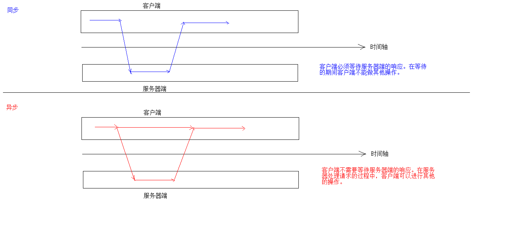

Ajax 是一种在无需重新加载整个网页的情况下，能够更新部分网页的技术。通过在后台与服务器进行少量数据交换，Ajax 可以使网页实现异步更新。这意味着可以在不重新加载整个网页的情况下，对网页的某部分进行更新。
传统的网页（不使用 Ajax）如果需要更新内容，必须重载整个网页页面。

```
JQeury实现方式
		1. $.ajax()
			* 语法：$.ajax({键值对});
			 //使用$.ajax()发送异步请求
	            $.ajax({
	                url:"ajaxServlet1111" , // 请求路径
	                type:"POST" , //请求方式
	                //data: "username=jack&age=23",//请求参数
	                data:{"username":"jack","age":23},
	                success:function (data) {
	                    alert(data);
	                },//响应成功后的回调函数
	                error:function () {
	                    alert("出错啦...")
	                },//表示如果请求响应出现错误，会执行的回调函数
	
	                dataType:"text"//设置接受到的响应数据的格式
	            });
		2. $.get()：发送get请求
			* 语法：$.get(url, [data], [callback], [type])
				* 参数：
					* url：请求路径
					* data：请求参数
					* callback：回调函数
					* type：响应结果的类型

		3. $.post()：发送post请求
			* 语法：$.post(url, [data], [callback], [type])
				* 参数：
					* url：请求路径
					* data：请求参数
					* callback：回调函数
					* type：响应结果的类型
```

#### JSON

* JSON现在多用于存储和交换文本信息的语法
* 进行数据的传输
* JSON 比 XML 更小、更快，更易解析。

```
语法：
	1. 基本规则
		* 数据在名称/值对中：json数据是由键值对构成的
			* 键用引号(单双都行)引起来，也可以不使用引号
			* 值得取值类型：
				1. 数字（整数或浮点数）
				2. 字符串（在双引号中）
				3. 逻辑值（true 或 false）
				4. 数组（在方括号中）	{"persons":[{},{}]}
				5. 对象（在花括号中） {"address":{"province"："陕西"....}}
				6. null
		* 数据由逗号分隔：多个键值对由逗号分隔
		* 花括号保存对象：使用{}定义json 格式
		* 方括号保存数组：[]
	2. 获取数据:
		1. json对象.键名
		2. json对象["键名"]
		3. 数组对象[索引]
```

##### JSON数据和Java对象的相互转换

```
JSON数据和Java对象的相互转换
	* JSON解析器：
		* 常见的解析器：Jsonlib，Gson，fastjson，jackson
	
	1. JSON转为Java对象
		1. 导入jackson的相关jar包
		2. 创建Jackson核心对象 ObjectMapper
		3. 调用ObjectMapper的相关方法进行转换
			1. readValue(json字符串数据,Class)
	2. Java对象转换JSON
		1. 使用步骤：
			1. 导入jackson的相关jar包
			2. 创建Jackson核心对象 ObjectMapper
			3. 调用ObjectMapper的相关方法进行转换
				1. 转换方法：
					* writeValue(参数1，obj):
	                    参数1：
	                        File：将obj对象转换为JSON字符串，并保存到指定的文件中
	                        Writer：将obj对象转换为JSON字符串，并将json数据填充到字符输出流中
	                        OutputStream：将obj对象转换为JSON字符串，并将json数据填充到字节输出流中
	                * writeValueAsString(obj):将对象转为json字符串

				2. 注解：
					1. @JsonIgnore：排除属性。
					2. @JsonFormat：属性值得格式化
						* @JsonFormat(pattern = "yyyy-MM-dd")

				3. 复杂java对象转换
					1. List：数组
					2. Map：对象格式一致
```

#### Redis

Redis是一款高性能的NOSQL系列的非关系型数据库

##### NOSQL

```
NoSQL数据库的产生就是为了解决大规模数据集合多重数据种类带来的挑战，尤其是大数据应用难题。
1.NOSQL和关系型数据库比较
优点：
1）成本：nosql数据库简单易部署，基本都是开源软件，不需要像使用oracle那样花费大量成本购买使用，相比关系型数据库价格便宜。
2）查询速度：nosql数据库将数据存储于缓存之中，关系型数据库将数据存储在硬盘中，自然查询速度远不及nosql数据库。
3）存储数据的格式：nosql的存储格式是key,value形式、文档形式、图片形式等等，所以可以存储基础类型以及对象或者是集合等各种格式，而数据库则只支持基础类型。
4）扩展性：关系型数据库有类似join这样的多表查询机制的限制导致扩展很艰难。

缺点：
1）维护的工具和资料有限，因为nosql是属于新的技术，不能和关系型数据库10几年的技术同日而语。
2）不提供对sql的支持，如果不支持sql这样的工业标准，将产生一定用户的学习和使用成本。
3）不提供关系型数据库对事务的处理。

2.非关系型数据库的优势：
1）性能NOSQL是基于键值对的，可以想象成表中的主键和值的对应关系，而且不需要经过SQL层的解析，所以性能非常高。
2）可扩展性同样也是因为基于键值对，数据之间没有耦合性，所以非常容易水平扩展。

3.关系型数据库的优势：
1）复杂查询可以用SQL语句方便的在一个表以及多个表之间做非常复杂的数据查询。
2）事务支持使得对于安全性能很高的数据访问要求得以实现。对于这两类数据库，对方的优势就是自己的弱势，反之亦然。

4.总结
关系型数据库与NoSQL数据库并非对立而是互补的关系，即通常情况下使用关系型数据库，在适合使用NoSQL的时候使用NoSQL数据库，让NoSQL数据库对关系型数据库的不足进行弥补。
一般会将数据存储在关系型数据库中，在nosql数据库中备份存储关系型数据库的数据

5.主流的NOSQL产品
•	键值(Key-Value)存储数据库
相关产品： Tokyo Cabinet/Tyrant、Redis、Voldemort、Berkeley DB
典型应用： 内容缓存，主要用于处理大量数据的高访问负载。 
数据模型： 一系列键值对
优势： 快速查询
劣势： 存储的数据缺少结构化
•	列存储数据库
相关产品：Cassandra, HBase, Riak
典型应用：分布式的文件系统
数据模型：以列簇式存储，将同一列数据存在一起
优势：查找速度快，可扩展性强，更容易进行分布式扩展
劣势：功能相对局限
•	文档型数据库
相关产品：CouchDB、MongoDB
典型应用：Web应用（与Key-Value类似，Value是结构化的）
数据模型： 一系列键值对
优势：数据结构要求不严格
劣势： 查询性能不高，而且缺乏统一的查询语法
•	图形(Graph)数据库
相关数据库：Neo4J、InfoGrid、Infinite Graph
典型应用：社交网络
数据模型：图结构
优势：利用图结构相关算法。
劣势：需要对整个图做计算才能得出结果，不容易做分布式的集群方案。
```

##### Redis应用场景

```
Redis是用C语言开发的一个开源的高性能键值对（key-value）数据库，官方提供测试数据，50个并发执行100000个请求,读的速度是110000次/s,写的速度是81000次/s ，且Redis通过提供多种键值数据类型来适应不同场景下的存储需求，目前为止Redis支持的键值数据类型如下：
1) 字符串类型 string
2) 哈希类型 hash
3) 列表类型 list
4) 集合类型 set
5) 有序集合类型 sortedset

redis的应用场景
•	缓存（数据查询、短连接、新闻内容、商品内容等等）
•	聊天室的在线好友列表
•	任务队列。（秒杀、抢购、12306等等）
•	应用排行榜
•	网站访问统计
•	数据过期处理（可以精确到毫秒
•	分布式集群架构中的session分离
```

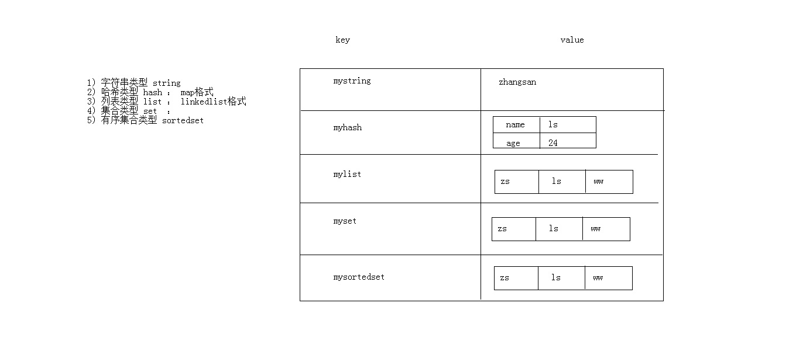

##### Redis命令操作

```
1. 字符串类型 string
		1. 存储： set key value
			127.0.0.1:6379> set username zhangsan
			OK
		2. 获取： get key
			127.0.0.1:6379> get username
			"zhangsan"
		3. 删除： del key
			127.0.0.1:6379> del age
			(integer) 1
2. 哈希类型 hash
		1. 存储： hset key field value
			127.0.0.1:6379> hset myhash username lisi
			(integer) 1
			127.0.0.1:6379> hset myhash password 123
			(integer) 1
		2. 获取： 
			* hget key field: 获取指定的field对应的值
				127.0.0.1:6379> hget myhash username
				"lisi"
			* hgetall key：获取所有的field和value
				127.0.0.1:6379> hgetall myhash
				1) "username"
				2) "lisi"
				3) "password"
				4) "123"
				
		3. 删除： hdel key field
			127.0.0.1:6379> hdel myhash username
			(integer) 1
	
3. 列表类型 list:可以添加一个元素到列表的头部（左边）或者尾部（右边）
		1. 添加：
			1. lpush key value: 将元素加入列表左表
				
			2. rpush key value：将元素加入列表右边
				
				127.0.0.1:6379> lpush myList a
				(integer) 1
				127.0.0.1:6379> lpush myList b
				(integer) 2
				127.0.0.1:6379> rpush myList c
				(integer) 3
		2. 获取：
			* lrange key start end ：范围获取
				127.0.0.1:6379> lrange myList 0 -1
				1) "b"
				2) "a"
				3) "c"
		3. 删除：
			* lpop key： 删除列表最左边的元素，并将元素返回
			* rpop key： 删除列表最右边的元素，并将元素返回
4. 集合类型 set ： 不允许重复元素
		1. 存储：sadd key value
			127.0.0.1:6379> sadd myset a
			(integer) 1
			127.0.0.1:6379> sadd myset a
			(integer) 0
		2. 获取：smembers key:获取set集合中所有元素
			127.0.0.1:6379> smembers myset
			1) "a"
		3. 删除：srem key value:删除set集合中的某个元素	
			127.0.0.1:6379> srem myset a
			(integer) 1
5. 有序集合类型 sortedset：不允许重复元素，且元素有顺序.每个元素都会关联一个double类型的分数。redis正是通过分数来为集合中的成员进行从小到大的排序。

		1. 存储：zadd key score value
			127.0.0.1:6379> zadd mysort 60 zhangsan
			(integer) 1
			127.0.0.1:6379> zadd mysort 50 lisi
			(integer) 1
			127.0.0.1:6379> zadd mysort 80 wangwu
			(integer) 1
		2. 获取：zrange key start end [withscores]
			127.0.0.1:6379> zrange mysort 0 -1
			1) "lisi"
			2) "zhangsan"
			3) "wangwu"

			127.0.0.1:6379> zrange mysort 0 -1 withscores
			1) "zhangsan"
			2) "60"
			3) "wangwu"
			4) "80"
			5) "lisi"
			6) "500"
		3. 删除：zrem key value
			127.0.0.1:6379> zrem mysort lisi
			(integer) 1

6. 通用命令
		1. keys * : 查询所有的键
		2. type key ： 获取键对应的value的类型
		3. del key：删除指定的key value
```

##### Redis持久化

```
持久化
	1. redis是一个内存数据库，当redis服务器重启，获取电脑重启，数据会丢失，我们可以将redis内存中的数据持久化保存到硬盘的文件中。
	2. redis持久化机制：
		1. RDB：默认方式，不需要进行配置，默认就使用这种机制
			* 在一定的间隔时间中，检测key的变化情况，然后持久化数据
			1. 编辑redis.windwos.conf文件
				#   after 900 sec (15 min) if at least 1 key changed
				save 900 1
				#   after 300 sec (5 min) if at least 10 keys changed
				save 300 10
				#   after 60 sec if at least 10000 keys changed
				save 60 10000
				
			2. 重新启动redis服务器，并指定配置文件名称
				D:\JavaWeb2018\day23_redis\资料\redis\windows-64\redis-2.8.9>redis-server.exe redis.windows.conf	
			
		2. AOF：日志记录的方式，可以记录每一条命令的操作。可以每一次命令操作后，持久化数据
			1. 编辑redis.windwos.conf文件
				appendonly no（关闭aof） --> appendonly yes （开启aof）
				
				# appendfsync always ： 每一次操作都进行持久化
				appendfsync everysec ： 每隔一秒进行一次持久化
				# appendfsync no	 ： 不进行持久化


```

##### Java客户端 Jedis

```
Java客户端 Jedis
	* Jedis: 一款java操作redis数据库的工具.
	* 使用步骤：
		1. 下载jedis的jar包
		2. 使用
			//1. 获取连接
    		Jedis jedis = new Jedis("localhost",6379);
   			//2. 操作
   			jedis.set("username","zhangsan");
    		//3. 关闭连接
    		jedis.close();
    * Jedis操作各种redis中的数据结构
		1) 字符串类型 string
	        //存储
	        jedis.set("username","zhangsan");
	        //获取
	        String username = jedis.get("username");
	        //可以使用setex()方法存储可以指定过期时间的 key value
	        jedis.setex("activecode",20,"hehe");//将activecode：hehe键值对存入redis，并				且20秒后自动删除该键值对
		2) 哈希类型 hash ： map格式  
	        // 存储hash
	        jedis.hset("user","name","lisi");
	        jedis.hset("user","age","23");
	        jedis.hset("user","gender","female");
	        // 获取hash
	        String name = jedis.hget("user", "name");
	        // 获取hash的所有map中的数据
	        Map<String, String> user = jedis.hgetAll("user");
	
	        // keyset
	        Set<String> keySet = user.keySet();
	        for (String key : keySet) {
	            //获取value
	            String value = user.get(key);
	            System.out.println(key + ":" + value);
	        }
	      3) 列表类型 list ： linkedlist格式。支持重复元素
	        // list 存储
	        jedis.lpush("mylist","a","b","c");//从左边存
	        jedis.rpush("mylist","a","b","c");//从右边存
	        // list 范围获取
	        List<String> mylist = jedis.lrange("mylist", 0, -1);
	        // list 弹出
	        String element1 = jedis.lpop("mylist");//c
	        // list 范围获取
	        List<String> mylist2 = jedis.lrange("mylist", 0, -1);
	     4) 集合类型 set  ： 不允许重复元素
	        // set 存储
	        jedis.sadd("myset","java","php","c++");
	        // set 获取
	        Set<String> myset = jedis.smembers("myset");
		5) 有序集合类型 sortedset：不允许重复元素，且元素有顺序
	        // sortedset 存储
	        jedis.zadd("mysortedset",3,"亚瑟");
	        jedis.zadd("mysortedset",30,"后裔");
	        jedis.zadd("mysortedset",55,"孙悟空");	
	        // sortedset 获取
	        Set<String> mysortedset = jedis.zrange("mysortedset", 0, -1);
	        
```

##### Jedis连接池

```
public class JedisPoolUtils {

			    private static JedisPool jedisPool;
			
			    static{
			        //读取配置文件
			        InputStream is = JedisPoolUtils.class.getClassLoader().getResourceAsStream("jedis.properties");
			        //创建Properties对象
			        Properties pro = new Properties();
			        //关联文件
			        try {
			            pro.load(is);
			        } catch (IOException e) {
			            e.printStackTrace();
			        }
			        //获取数据，设置到JedisPoolConfig中
			        JedisPoolConfig config = new JedisPoolConfig();
			        config.setMaxTotal(Integer.parseInt(pro.getProperty("maxTotal")));
			        config.setMaxIdle(Integer.parseInt(pro.getProperty("maxIdle")));
			
			        //初始化JedisPool
			        jedisPool = new JedisPool(config,pro.getProperty("host"),Integer.parseInt(pro.getProperty("port")));
			        }
			        /**
			     * 获取连接方法
			     */
			    public static Jedis getJedis(){
			        return jedisPool.getResource();
			    }
			}
```

#### Maven

##### maven项目构建流程

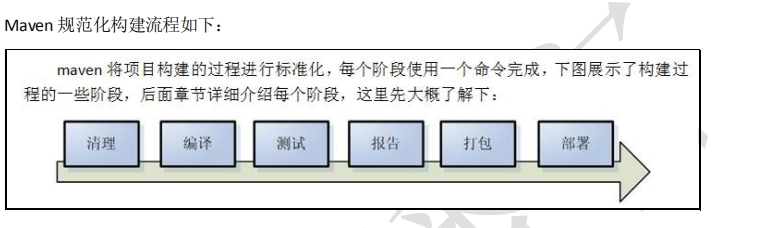

##### maven工作目录结构

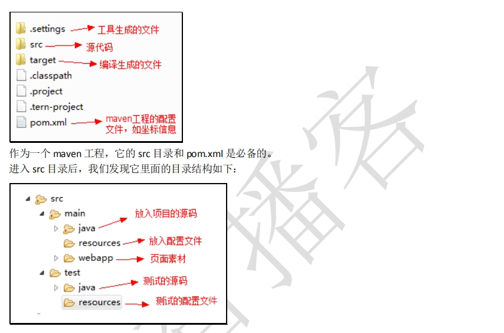

##### Maven 指令的生命周期

maven 对项目构建过程分为三套相互独立的生命周期，请注意这里说的是“三套”，而且“相互独立”，
这三套生命周期分别是：

Clean Lifecycle 在进行真正的构建之前进行一些清理工作。

Default Lifecycle 构建的核心部分，编译，测试，打包，部署等等。

Site Lifecycle 生成项目报告，站点，发布站点。

##### maven依赖管理

```
<!-- 依赖关系 -->
<dependencies>
<!-- 此项目运行使用 junit，所以此项目依赖 junit -->
	<dependency>
        <!-- junit 的项目名称 -->
        <groupId>junit</groupId>
        <!-- junit 的模块名称 -->
        <artifactId>junit</artifactId>
        <!-- junit 版本 -->
        <version>4.9</version>
        <!-- 依赖范围：单元测试时使用 junit -->
		<scope>test</scope>
	</dependency>
</dependencies>
```

##### scope

compile：编译范围，指 A 在编译时依赖 B，此范围为默认依赖范围。编译范围的依赖会用在
编译、测试、运行，由于运行时需要所以编译范围的依赖会被打包。 

provided 依赖只有在当 JDK 或者一个容器已提供该依赖之后才使用， provided 依 赖在编译和测试时需要，在运行时不需要，比如：servlet api 被 tomcat 容器提供。

runtime 依赖在运行和测试系统的时候需要，但在编译的时候不需要。比如：jdbc
的驱动包。由于运行时需要所以 runtime 范围的依赖会被打包。

test 范围依赖 在编译和运行时都不需要，它们只有在测试编译和测试运行阶段可用，
比如：junit。由于运行时不需要所以 test范围依赖不会被打包。

system 范围依赖与 provided 类似，但是你必须显式的提供一个对于本地系统中 JAR
文件的路径，需要指定 systemPath 磁盘路径，system依赖不推荐使用。

总结：

默认引入 的 jar 包 ------- compile 【默认范围 可以不写】（编译、测试、运行 都有效 ） 

servlet-api 、jsp-api ------- provided （编译、测试 有效， 运行时无效 防止和 tomcat 下 jar 冲突）

 jdbc 驱动 jar 包 ---- runtime （测试、运行 有效 ） 

junit ----- test （测试有效）

依赖范围由强到弱的顺序是：compile>provided>runtime>test

##### pom配置

```
<packaging > ：打包类型
    jar：执行 package 会打成 jar 包
    war：执行 package 会打成 war 包
    pom ：用于 maven 工程的继承，通常父工程设置为 pom
    
pom 基本配置
pom.xml 是 Maven 项目的核心配置文件，位于每个工程的根目录，基本配置如下：
<project > ：文件的根节点 .
<modelversion > ： pom.xml 使用的对象模型版本
<groupId > ：项目名称，一般写项目的域名
<artifactId > ：模块名称，子项目名或模块名称
<version > ：产品的版本号 . 
<packaging > ：打包类型，一般有 jar、war、pom 等
<name > ：项目的显示名，常用于 Maven 生成的文档。 
<description > ：项目描述，常用于 Maven 生成的文档
<dependencies> ：项目依赖构件配置，配置项目依赖构件的坐标
<build> ：项目构建配置，配置编译、运行插件等
```

##### Maven依赖调解原则

```
当两个jar包同时依赖于某一个jar包，且不同版本
1、第一声明者优先原则
在 pom 文件定义依赖，先声明的依赖为准。
2、路径近者优先原则
在 pom 文件定义该jar包，以该jar包版本为准。
3、排除依赖
使用关键字<exclusions>
4、锁定版本
此方法在企业开发中常用
<dependencyManagment>
```

##### Maven私服

###### nexus仓库

```
1.	hosted，宿主仓库，部署自己的 jar 到这个类型的仓库，包括 releases 和 snapshot 两部 分，Releases 公司内部发布版本仓库、 Snapshots 公司内部测试版本仓库
2.	proxy，代理仓库，用于代理远程的公共仓库，如 maven中央仓库，用户连接私服，私服自动去中央仓库下载jar包或者插件。
3.	group，仓库组，用来合并多个 hosted/proxy  仓库，通常我们配置自己的maven连接仓库组。
4.	virtual(虚拟)：兼容 Maven1 版本的 jar 或者插件
```

###### 将项目发布到私服

```
第一步：需要在客户端即部署ssm_dao工程的电脑上配置maven环境，并修改 settings.xml文件，配置连接私服的用户和密码。此用户名和密码用于私服校验，因为私服需要知道上传的账号和密码是否和私服中的账号和密码一致。
    <server>
        <id>releases</id>
        <username>admin</username>
        <password>admin123</password>
    </server>
    <server>
        <id>snapshots</id>
        <username>admin</username>
        <password>admin123</password>
    </server>
    releases   连接发布版本项目仓库
    snapshots 连接测试版本项目仓库
    
第二步： 配置项目pom.xml
配置私服仓库的地址，根据工程的版本号决定上传到哪个宿主仓库，如果版本为release则上传到私服的 release 仓库，如果版本为snapshot则上传到私服的snapshot仓库
注意：pom.xml 这里<id> 和 settings.xml 配置 <id> 对应！
    <distributionManagement>
    <repository>
        <id>releases</id>
        <url>http://localhost:8081/nexus/content/repositories/releases/</url>
    </repository>
    <snapshotRepository>
        <id>snapshots</id>
        <url>http://localhost:8081/nexus/content/repositories/snapshots/</url>
    </snapshotRepository>
    </distributionManagement>

第三步：将项目 dao 工程打成 jar 包发布到私服：
1、首先启动 nexus
2、对 ssm_dao 工程执行 deploy 命令
```

###### 从私服下载jar包

```
1.在 setting.xml 中配置仓库
在客户端的 setting.xml 中配置私服的仓库，由于setting.xml中没有repositories的配置标签需要使用 profile 定义仓库。
<profile>
    <!--profile 的 id-->
    <id>dev</id>
    <repositories>
        <repository>
        <!--仓库 id，repositories 可以配置多个仓库，保证 id 不重复-->
        <id>nexus</id>
        <!--仓库地址，即 nexus 仓库组的地址-->
        <url>http://localhost:8081/nexus/content/groups/public/</url>
        <!--是否下载 releases 构件-->
        <releases>
        <enabled>true</enabled>
        </releases>
        <!--是否下载 snapshots 构件-->
        <snapshots>
        <enabled>true</enabled>
        </snapshots>
        </repository>
    </repositories>
    <pluginRepositories>
        <!--  插件仓库，maven 的运行依赖插件，也需要从私服下载插件 -->
        <pluginRepository>
        <!--  插件仓库的 id 不允许重复，如果重复后边配置会覆盖前边 -->
        <id>public</id>
        <name>Public Repositories</name>
        <url>http://localhost:8081/nexus/content/groups/public/</url>
        </pluginRepository>
    </pluginRepositories>
</profile>

<activeProfiles>
<activeProfile>dev</activeProfile>
</activeProfiles>
```

###### 把第三方 jar 包放入本地仓库或私服

```
1.导入本地库
随便找一个 jar 包测试，可以先 CMD 进入到 jar 包所在位置，运行
mvn  install:install-file  -DgroupId=com.alibaba  -DartifactId=fastjson -Dversion=1.1.37 -Dfile=  fastjson-1.1.37.jar  -Dpackaging=jar

2.导入私服
需要在 maven 软件的核心配置文件 settings.xml 中配置第三方仓库的 server 信息
<server>
<id>thirdparty</id>
<username>admin</username>
<password>admin123</password>
</server>

才能执行以下命令
mvn deploy:deploy-file  -DgroupId=com.alibaba  -DartifactId=fastjson -Dversion=1.1.37
-Dpackaging=jar   -Dfile=fastjson-1.1.37.jar 
-Durl=http://localhost:8081/nexus/content/repositories/thirdparty/
-DrepositoryId=thirdparty

参数说明
DgroupId 和 DartifactId 构成了该 jar 包在 pom.xml 的坐标，项目就是依靠这两个属性定位。 自己起名字也行。
Dfile 表示需要上传的 jar 包的绝对路径。
Durl   私服上仓库的位置，打开 nexus——>repositories  菜单，可以看到该路径。
DrepositoryId 服务器的表示 id，在 nexus 的 configuration 可以看到。
Dversion  表示版本信息，
关于 jar包准确的版本： 包的名字上一般会带版本号，如果没有那可以解压该包，会发现一个叫MANIFEST.MF   的文件这个文件就有描述该包的版本信息。
```


### 三、Java框架

#### Mybatis

mybatis是一个持久层框架，用java编写的。它封装了jdbc操作的很多细节，使开发者只需要关注sql语句本身，而无需关注注册驱动，创建连接等繁杂过程
。它使用了ORM思想实现了结果集的封装。

ORM：
Object Relational Mapping 对象关系映射
，简单的说：
就是把数据库表和实体类及实体类的属性对应起来
，让我们可以操作实体类就实现操作数据库表。

##### mybatis环境搭建

```
第一步：创建maven工程并导入坐标
第二步：创建实体类和dao的接口
第三步：创建Mybatis的主配置文件，SqlMapConifg.xml
第四步：创建映射配置文件，IUserDao.xml

环境搭建的注意事项：
第一个：创建IUserDao.xml 和 IUserDao.java时名称是为了和我们之前的知识保持一致。
	在Mybatis中它把持久层的操作接口名称和映射文件也叫做：Mapper
	所以：IUserDao 和 IUserMapper是一样的
第二个：在idea中创建目录的时候，它和包是不一样的
	包在创建时：com.itheima.dao它是三级结构
	目录在创建时：com.itheima.dao是一级目录
第三个：mybatis的映射配置文件位置必须和dao接口的包结构相同
第四个：映射配置文件的mapper标签namespace属性的取值必须是dao接口的全限定类名
第五个：映射配置文件的操作配置（select），id属性的取值必须是dao接口的方法名

当我们遵从了第三，四，五点之后，我们在开发中就无须再写dao的实现类。


mybatis基于注解的入门案例：
    把IUserDao.xml移除，在dao接口的方法上使用@Select注解，并且指定SQL语句
    同时需要在SqlMapConfig.xml中的mapper配置时，使用class属性指定dao接口的全限定类名。
```


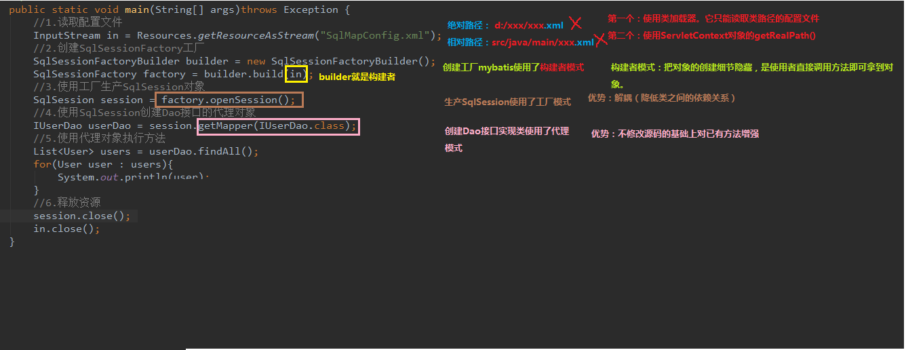


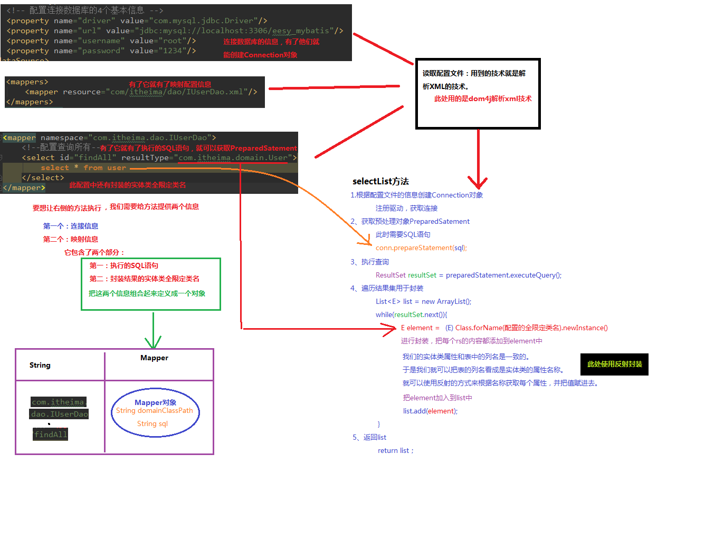

##### SqlMapConfig.xml

```
-properties（属性）
	--property
-settings（全局配置参数）
	--setting
-typeAliases（类型别名）
	--typeAliase
	--package
-typeHandlers（类型处理器）
-objectFactory（对象工厂）
-plugins（插件）
-environments（环境集合属性对象）
	--environment（环境子属性对象）
		---transactionManager（事务管理）
		---dataSource（数据源）
-mappers（映射器）
	--mapper
	--package
```

###### properties

```
在使用 properties 标签配置时，我们可以采用两种方式指定属性配置。
第一种
<properties> 
    <property name="jdbc.driver" value="com.mysql.jdbc.Driver"/>
    <property name="jdbc.url" value="jdbc:mysql://localhost:3306/eesy"/>
    <property name="jdbc.username" value="root"/>
    <property name="jdbc.password" value="1234"/>
</properties>
第二种
在 classpath 下定义 db.properties 文件
jdbc.driver=com.mysql.jdbc.Driver
jdbc.url=jdbc:mysql://localhost:3306/eesy
jdbc.username=root
jdbc.password=1234

<!-- 配置连接数据库的信息
    resource 属性：用于指定 properties 配置文件的位置，要求配置文件必须在类路径下
    resource="jdbcConfig.properties"
    url 属性：
    URL： Uniform Resource Locator 统一资源定位符
    http://localhost:8080/mystroe/CategoryServlet URL
    协议 主机 端口 URI
    URI：Uniform Resource Identifier 统一资源标识符
    /mystroe/CategoryServlet
    它是可以在 web 应用中唯一定位一个资源的路径
--> 
<properties url=
file:///D:/IdeaProjects/day02_eesy_01mybatisCRUD/src/main/resources/jdbcConfig.prop
erties">
</properties>
<dataSource type="POOLED"> 
    <property name="driver" value="${jdbc.driver}"/>
    <property name="url" value="${jdbc.url}"/>
    <property name="username" value="${jdbc.username}"/>
    <property name="password" value="${jdbc.password}"/>
</dataSource>
```

###### typeAliases（类型别名）

```
<typeAliases>
<!-- 单个别名定义 --> 
<typeAlias alias="user" type="com.itheima.domain.User"/>
<!-- 批量别名定义，扫描整个包下的类，别名为类名（首字母大写或小写都可以） --> 
<package name="com.itheima.domain"/>
<package name="其它包"/>
</typeAliases>
```

###### mappers（映射器）

```
<mapper resource="com/itheima/dao/IUserDao.xml" />
<mapper class="com.itheima.dao.UserDao"/>
<package name="cn.itcast.mybatis.mapper"/>
```

##### mybatis连接池

```
mybatis连接池提供了3种方式的配置：
配置的位置：
	主配置文件SqlMapConfig.xml中的dataSource标签，type属性就是表示采用何种连接池方式。
	type属性的取值：
		POOLED	 采用传统的javax.sql.DataSource规范中的连接池，mybatis中有针对规范的实现
		UNPOOLED 采用传统的获取连接的方式，虽然也实现Javax.sql.DataSource接口，但是并没有使用池的思想。
		JNDI	 采用服务器提供的JNDI技术实现，来获取DataSource对象，不同的服务器所能拿到DataSource是不一样。
<dataSource type="POOLED"> 
    <property name="driver" value="${jdbc.driver}"/>
    <property name="url" value="${jdbc.url}"/>
    <property name="username" value="${jdbc.username}"/>
    <property name="password" value="${jdbc.password}"/>
</dataSource>
```

##### mybatis动态sql

```
<select id="findByUser" resultType="user" parameterType="user">
	select * from user where 1=1
<if test="username!=null and username != '' ">
	and username like #{username}
</if> 
<if test="address != null">
	and address like #{address}
</if>
</select>
注意：<if>标签的 test 属性中写的是对象的属性名，如果是包装类的对象要使用 OGNL 表达式的写法。
另外要注意 where 1=1 的作用~！

<sql id="defaultSql">
	select * from user
</sql>

<select id="findInIds" resultType="user" parameterType="queryvo">
<!-- select * from user where id in (1,2,3,4,5); --> 
<include refid="defaultSql"></include> 
<where> 
<if test="ids != null and ids.size() > 0"> 
	<foreach collection="ids" open="id in ( " close=")" item="uid" 
separator=",">
		#{uid}
	</foreach>
</if>
</where>
</select>
```

#####  mybatis 多表查询

使用 resultMap，定义专门的 resultMap 用于映射一对一查询结果。
通过面向对象的(has a)关系可以得知，我们可以在 Account 类中加入一个 User 类的对象来代表这个账户
是哪个用户的

```
<mapper namespace="com.itheima.dao.IAccountDao">
<!-- 建立对应关系 --> 
<resultMap type="account" id="accountMap"> 
	<id column="aid" property="id"/>
    <result column="uid" property="uid"/>
    <result column="money" property="money"/>
<!-- 它是用于指定从表方的引用实体属性的 -->
	<association property="user" javaType="user"> 
		<id column="id" property="id"/>
        <result column="username" property="username"/>
        <result column="sex" property="sex"/>
        <result column="birthday" property="birthday"/>
        <result column="address" property="address"/>
	</association>
</resultMap>
<select id="findAll" resultMap="accountMap">
select u.*,a.id as aid,a.uid,a.money from account a,user u where a.uid =u.id;
</select>
</mapper>


<mapper namespace="com.itheima.dao.IUserDao"> 
	<resultMap type="user" id="userMap">
    	<id column="id" property="id"></id> 
    	<result column="username" property="username"/>
        <result column="address" property="address"/>
        <result column="sex" property="sex"/>
        <result column="birthday" property="birthday"/>
        <!-- collection 是用于建立一对多中集合属性的对应关系
        ofType 用于指定集合元素的数据类型
        --> 
        <collection property="accounts" ofType="account"> 
        	<id column="aid" property="id"/>
            <result column="uid" property="uid"/>
            <result column="money" property="money"/>
            </collection>
	</resultMap>
<!-- 配置查询所有操作 --> 
<select id="findAll" resultMap="userMap">
    select u.*,a.id as aid ,a.uid,a.money from user u left outer join account 
    a on u.id =a.uid
</select>
</mapper>

collection
部分定义了用户关联的账户信息。表示关联查询结果集
property="accList"：
关联查询的结果集存储在 User 对象的上哪个属性。
ofType="account"：
指定关联查询的结果集中的对象类型即List中的对象类型。此处可以使用别名，也可以使用全限定名
```

##### mybatis一级缓存和二级缓存

```
Mybatis中的一级缓存和二级缓存
一级缓存：
    它指的是Mybatis中SqlSession对象的缓存。
    当我们执行查询之后，查询的结果会同时存入到SqlSession为我们提供一块区域中。
    该区域的结构是一个Map。当我们再次查询同样的数据，mybatis会先去sqlsession中
    查询是否有，有的话直接拿出来用。
    当SqlSession对象消失时，mybatis的一级缓存也就消失了。
		
二级缓存:
	它指的是Mybatis中SqlSessionFactory对象的缓存。由同一个SqlSessionFactory对象创建的SqlSession共享其缓存。
	二级缓存的使用步骤：
        第一步：让Mybatis框架支持二级缓存（在SqlMapConfig.xml中配置）
            <settings>
                <setting name="cacheEnabled" value="true"/>
            </settings>
            因为 cacheEnabled 的取值默认就为 true，所以这一步可以省略不配置。为 true 代表开启二				级缓存；为false 代表不开启二级缓存。
        第二步：让当前的映射文件支持二级缓存（在IUserDao.xml中配置）
            <mapper namespace="com.itheima.dao.IUserDao">
                <!-- 开启二级缓存的支持 -->
                <cache></cache>
            </mapper>
        第三步：让当前的操作支持二级缓存（在select标签中配置）
        <select id="findById" resultType="user" parameterType="int" useCache="true">
			select * from user where id = #{uid}
		</select>
```

##### mybatis延迟加载

```
<settings> 
    <setting name="lazyLoadingEnabled" value="true"/>
    <setting name="aggressiveLazyLoading" value="false"/>
</settings>
```

##### mybatis常用注解

```
@Insert:实现新增
@Update:实现更新
@Delete:实现删除
@Select:实现查询
@Result:实现结果集封装
@Results:可以与@Result 一起使用，封装多个结果集
@ResultMap:实现引用@Results 定义的封装
@One:实现一对一结果集封装
@Many:实现一对多结果集封装
@SelectProvider: 实现动态 SQL 映射
@CacheNamespace:实现注解二级缓存的使用
@CacheNamespace(blocking=true)//mybatis 基于注解方式实现配置二级缓存

编写 SqlMapConfig 配置文件
<?xml version="1.0" encoding="UTF-8"?>
<!DOCTYPE configuration 
 PUBLIC "-//mybatis.org//DTD Config 3.0//EN" 
 "http://mybatis.org/dtd/mybatis-3-config.dtd"> <configuration>
<!-- 配置 properties 文件的位置 --> 
<properties resource="jdbcConfig.properties"></properties>
<!-- 配置别名的注册 --> 
<typeAliases> 
	<package name="com.itheima.domain"/>
</typeAliases>
<!-- 配置环境 --> 
<environments default="mysql">
<!-- 配置 mysql 的环境 --> 
	<environment id="mysql">
<!-- 配置事务的类型是 JDBC --> 
	<transactionManager type="JDBC"></transactionManager>
<!-- 配置数据源 --> 
	<dataSource type="POOLED"> 
        <property name="driver" value="${jdbc.driver}"/>
        <property name="url" value="${jdbc.url}"/>
        <property name="username" value="${jdbc.username}"/>
        <property name="password" value="${jdbc.password}"/>
	</dataSource>
	</environment>
</environments>
<!-- 配置映射信息 --> 
<mappers>
<!-- 配置 dao 接口的位置，它有两种方式
第一种：使用 mapper 标签配置 class 属性
第二种：使用 package 标签，直接指定 dao 接口所在的包
--> 
	<package name="com.itheima.dao"/>
</mappers>
</configuration>


```


```
@Select("select * from user")
@Results(id="userMap",
value= {
@Result(id=true,column="id",property="userId"),
@Result(column="username",property="userName"),
@Result(column="sex",property="userSex"),
@Result(column="address",property="userAddress"),
@Result(column="birthday",property="userBirthday")
})

@Select("select * from user where id = #{uid} ")
@ResultMap("userMap")


@Insert("insert into 
user(username,sex,birthday,address)values(#{username},#{sex},#{birthday},#{address}
)")
@SelectKey(keyColumn="id",keyProperty="id",resultType=Integer.class,before = 
false, statement = { "select last_insert_id()" })
```

###### @Results注解

```
@Results 注解
    代替的是标签<resultMap>
    该注解中可以使用单个@Result 注解，也可以使用@Result 集合
    @Results（{@Result（），@Result（）}）或@Results（@Result（））
    
@Result 注解
    代替了 <id>标签和<result>标签
    @Result 中 属性介绍：
    id 是否是主键字段
    column 数据库的列名
    property 需要装配的属性名
    one 需要使用的@One 注解（@Result（one=@One）（）））
    many 需要使用的@Many 注解（@Result（many=@many）（）））
    
@One 注解（一对一）
代替了<assocation>标签，是多表查询的关键，在注解中用来指定子查询返回单一对象。
@One 注解属性介绍
    select 指定用来多表查询的 sqlmapper
    fetchType 会覆盖全局的配置参数 lazyLoadingEnabled。
使用格式：
@Result(column=" ",property="",one=@One(select=""))

@Many 注解（多对一）
代替了<Collection>标签,是是多表查询的关键，在注解中用来指定子查询返回对象集合。
注意：聚集元素用来处理“一对多”的关系。需要指定映射的 Java 实体类的属性，属性的 javaType
（一般为 ArrayList）但是注解中可以不定义；
使用格式：
@Result(property="",column="",many=@Many(select=""))


@Select("select * from account")
@Results(id="accountMap",
value= {
    @Result(id=true,column="id",property="id"),
    @Result(column="uid",property="uid"),
    @Result(column="money",property="money"),
    @Result(column="uid",
            property="user",
            one=@One(select="com.itheima.dao.IUserDao.findById",
            fetchType=FetchType.LAZY) )
})


@Select("select * from user")
@Results(id="userMap",
        value= {
                @Result(id=true,column="id",property="userId"),
                @Result(column="username",property="userName"),
                @Result(column="sex",property="userSex"),
                @Result(column="address",property="userAddress"),
                @Result(column="birthday",property="userBirthday"),
                @Result(column="id",property="accounts",
                many=@Many(
                        select="com.itheima.dao.IAccountDao.findByUid",
                        fetchType=FetchType.LAZY
        ) )
})
```

#### Spring

Spring 是分层的 Java SE/EE 应用 full-stack 轻量级开源框架，以 IoC（Inverse Of Control：
反转控制）和 AOP（Aspect Oriented Programming：面向切面编程）为内核，提供了展现层 Spring 
MVC 和持久层 Spring JDBC 以及业务层事务管理等众多的企业级应用技术，还能整合开源世界众多
著名的第三方框架和类库，逐渐成为使用最多的 Java EE 企业应用开源框架。

spring优势

```
方便解耦，简化开发
    通过 Spring 提供的 IoC 容器，可以将对象间的依赖关系交由 Spring 进行控制，避免硬编码所造
    成的过度程序耦合。用户也不必再为单例模式类、属性文件解析等这些很底层的需求编写代码，可
    以更专注于上层的应用。
AOP 编程的支持
    通过 Spring 的 AOP 功能，方便进行面向切面的编程，许多不容易用传统 OOP 实现的功能可以
    通过 AOP 轻松应付。
声明式事务的支持
    可以将我们从单调烦闷的事务管理代码中解脱出来，通过声明式方式灵活的进行事务的管理，
    提高开发效率和质量。
方便程序的测试
    可以用非容器依赖的编程方式进行几乎所有的测试工作，测试不再是昂贵的操作，而是随手可
    做的事情。
方便集成各种优秀框架
    Spring 可以降低各种框架的使用难度，提供了对各种优秀框架（Struts、Hibernate、Hessian、Quartz
    等）的直接支持。
降低 JavaEE API 的使用难度
    Spring 对 JavaEE API（如 JDBC、JavaMail、远程调用等）进行了薄薄的封装层，使这些 API 的
    使用难度大为降低。
Java 源码是经典学习范例
    Spring 的源代码设计精妙、结构清晰、匠心独用，处处体现着大师对 Java 设计模式灵活运用以
    及对 Java 技术的高深造诣。它的源代码无意是 Java 技术的最佳实践的范例。
```

BeanFactory 和 ApplicationContext 的区别

```
BeanFactory 才是 Spring 容器中的顶层接口。
ApplicationContext 是它的子接口。
BeanFactory 和 ApplicationContext 的区别：
创建对象的时间点不一样。
ApplicationContext：只要一读取配置文件，默认情况下就会创建对象。
BeanFactory：什么使用什么时候创建对象。
```

ApplicationContext 接口的实现类

```
ClassPathXmlApplicationContext：
	它是从类的根路径下加载配置文件 推荐使用这种
FileSystemXmlApplicationContext：
	它是从磁盘路径上加载配置文件，配置文件可以在磁盘的任意位置。
AnnotationConfigApplicationContext:
	当我们使用注解配置容器对象时，需要使用此类来创建 spring 容器。它用来读取注解
```

bean标签

```
作用：
用于配置对象让 spring 来创建的。
默认情况下它调用的是类中的无参构造函数。如果没有无参构造函数则不能创建成功。

属性：
id：给对象在容器中提供一个唯一标识。用于获取对象。
class：指定类的全限定类名。用于反射创建对象。默认情况下调用无参构造函数。
scope：指定对象的作用范围。
	* singleton :默认值，单例的.
	* prototype :多例的.
	* request :WEB 项目中,Spring 创建一个 Bean 的对象,将对象存入到 request 域中.
	* session :WEB 项目中,Spring 创建一个 Bean 的对象,将对象存入到 session 域中.
	* global session :WEB 项目中,应用在 Portlet 环境.如果没有 Portlet 环境那么
		globalSession 相当于 session.
init-method：指定类中的初始化方法名称。
destroy-method：指定类中销毁方法名称


单例对象：scope="singleton"
    一个应用只有一个对象的实例。它的作用范围就是整个引用。
    生命周期：
    对象出生：当应用加载，创建容器时，对象就被创建了。
    对象活着：只要容器在，对象一直活着。
    对象死亡：当应用卸载，销毁容器时，对象就被销毁了。
多例对象：scope="prototype"
    每次访问对象时，都会重新创建对象实例。
    生命周期：
    对象出生：当使用对象时，创建新的对象实例。
    对象活着：只要对象在使用中，就一直活着。
    对象死亡：当对象长时间不用时，被 java 的垃圾回收器回收了
    
    
实例化bean的三种方式
第一种方式：使用默认无参构造函数
    <!--在默认情况下：它会根据默认无参构造函数来创建类对象。如果 bean 中没有默认无参构造函数，将会创建失败。--> 
    <bean id="accountService" class="com.itheima.service.impl.AccountServiceImpl"/>

第二种方式：spring 管理静态工厂-使用静态工厂的方法创建对象
    /**
    * 模拟一个静态工厂，创建业务层实现类
    */
    public class StaticFactory {
    public static IAccountService createAccountService(){
        return new AccountServiceImpl();
    } }
    <!-- 此种方式是:
    使用 StaticFactory 类中的静态方法 createAccountService 创建对象，并存入 spring 容器
    id 属性：指定 bean 的 id，用于从容器中获取
    class 属性：指定静态工厂的全限定类名
    factory-method 属性：指定生产对象的静态方法
    --> 
    <bean id="accountService"
     class="com.itheima.factory.StaticFactory"
     factory-method="createAccountService"></bean>
 
第三种方式：spring 管理实例工厂-使用实例工厂的方法创建对象
    /**
    * 模拟一个实例工厂，创建业务层实现类
    * 此工厂创建对象，必须现有工厂实例对象，再调用方法
    */
    public class InstanceFactory {
    public IAccountService createAccountService(){
    return new AccountServiceImpl();
    } }
    <!-- 此种方式是：
    先把工厂的创建交给 spring 来管理。
    然后在使用工厂的 bean 来调用里面的方法
    factory-bean 属性：用于指定实例工厂 bean 的 id。
    factory-method 属性：用于指定实例工厂中创建对象的方法。
    --> 
    <bean id="instancFactory" class="com.itheima.factory.InstanceFactory">
    </bean> <bean id="accountService"
     factory-bean="instancFactory"
     factory-method="createAccountService"></bean>
```

##### spring 的依赖注入

```
构造函数注入
     <!-- 使用构造函数的方式，给 service 中的属性传值
    要求：类中需要提供一个对应参数列表的构造函数。
    涉及的标签：
    constructor-arg
    属性：
    index:指定参数在构造函数参数列表的索引位置
    type:指定参数在构造函数中的数据类型
    name:指定参数在构造函数中的名称 用这个找给谁赋值
    =======上面三个都是找给谁赋值，下面两个指的是赋什么值的==============
    value:它能赋的值是基本数据类型和 String 类型
    ref:它能赋的值是其他 bean 类型，也就是说，必须得是在配置文件中配置过的 bean--> 
    <bean id="accountService" class="com.itheima.service.impl.AccountServiceImpl"> 
        <constructor-arg name="name" value="张三"></constructor-arg> 
        <constructor-arg name="age" value="18"></constructor-arg> 
        <constructor-arg name="birthday" ref="now"></constructor-arg>
	</bean> 
	<bean id="now" class="java.util.Date"></bean>
	
set方法注入
    <!-- 通过配置文件给 bean 中的属性传值：使用 set 方法的方式
    涉及的标签：
    property
    属性：
    name：找的是类中 set 方法后面的部分
    ref：给属性赋值是其他 bean 类型的
    value：给属性赋值是基本数据类型和 string 类型的
    实际开发中，此种方式用的较多。
    --> 
    <bean id="accountService" class="com.itheima.service.impl.AccountServiceImpl"> 
        <property name="name" value="test"></property> 
        <property name="age" value="21"></property> 
        <property name="birthday" ref="now"></property>
    </bean> 
    <bean id="now" class="java.util.Date"></bean>
    
    
<!-- 注入集合数据
        List 结构的：
        array,list,set
        Map 结构的
        map,entry,props,prop--> 
<bean id="accountService" class="com.itheima.service.impl.AccountServiceImpl">
	 <property name="myStrs"> 
	 	<set>
            <value>AAA</value> 
            <value>BBB</value> 
            <value>CCC</value>
		</set>
	</property>
	<!-- 注入 list 集合数据 --> 
	<property name="myList"> 
		<array> 
            <value>AAA</value> 
            <value>BBB</value> 
            <value>CCC</value>
		</array>
	</property>
	<!-- 注入 set 集合数据 --> 
	<property name="mySet"> 
		<list>
			<value>AAA</value> 
			<value>BBB</value> 
			<value>CCC</value>
		</list>
	</property>
	<!-- 注入 Map 数据 --> 
	<property name="myMap">
    	<props> 
    		<prop key="testA">aaa</prop> 
    		<prop key="testB">bbb</prop>
		</props>
	</property>
	<!-- 注入 properties 数据 -->
	<property name="myProps"> 
		<map>
			<entry key="testA" value="aaa"></entry> 
			<entry key="testB"> <value>bbb</value></entry>
        </map>
    </property>
</bean>
```

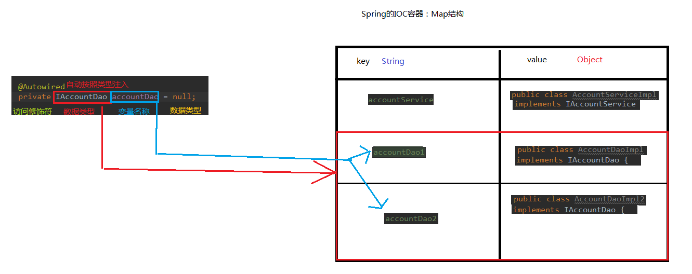

##### 常用注解

###### 用于创建对象的

```
@Component
作用：
把资源让 spring 来管理。相当于在 xml 中配置一个 bean。
属性：
value：指定 bean 的 id。如果不指定 value 属性，默认 bean 的 id 是当前类的类名。首字母小写。

@Controller @Service @Repository
@Controller：一般用于表现层的注解。
@Service：一般用于业务层的注解。
@Repository：一般用于持久层的注解。


```

###### 用于注入数据的

```
@Autowired
作用：
自动按照类型注入。当使用注解注入属性时，set 方法可以省略。它只能注入其他 bean 类型。当有多个类型匹配时，使用要注入的对象变量名称作为 bean 的 id，在 spring 容器查找，找到了也可以注入成功。找不到就报错

@Qualifier
作用：
在自动按照类型注入的基础之上，再按照 Bean 的 id 注入。它在给字段注入时不能独立使用，必须和@Autowire 一起使用；但是给方法参数注入时，可以独立使用。
属性：
value：指定 bean 的 id。

@Resource
作用：
直接按照 Bean 的 id 注入。它也只能注入其他 bean 类型。
属性：
name：指定 bean 的 id。

@Value
作用：
注入基本数据类型和 String 类型数据的
属性：
value：用于指定值
```

###### **用于改变作用范围的**

```
@Scope
作用：
指定 bean 的作用范围。
属性：
value：指定范围的值。
 取值：singleton prototype request session globalsession
```

###### 配置

```
@Configuration
作用：
用于指定当前类是一个 spring 配置类，当创建容器时会从该类上加载注解。获取容器时需要使用
AnnotationApplicationContext(有@Configuration 注解的类.class)。
属性：
value:用于指定配置类的字节码


@ComponentScan
作用：
用于指定 spring 在初始化容器时要扫描的包。作用和在 spring 的 xml 配置文件中的：
<context:component-scan base-package="com.itheima"/>是一样的。
属性：
basePackages：用于指定要扫描的包。和该注解中的 value 属性作用一样。


@Bean
作用：
该注解只能写在方法上，表明使用此方法创建一个对象，并且放入 spring 容器。
属性：
name：给当前@Bean 注解方法创建的对象指定一个名称(即 bean 的 id）。
@Bean(name="dataSource")
public DataSource createDataSource() {
    try {
        ComboPooledDataSource ds = new ComboPooledDataSource();
        ds.setUser("root");
        ds.setPassword("1234");
        ds.setDriverClass("com.mysql.jdbc.Driver");
        ds.setJdbcUrl("jdbc:mysql:///spring_day02");
        return ds;
    } catch (Exception e) {
    	throw new RuntimeException(e);
    } }
    
    
@Import
作用：
用于导入其他配置类，在引入其他配置类时，可以不用再写@Configuration 注解。当然，写上也没问题。
属性：
value[]：用于指定其他配置类的字节码。
```

##### spring整合Junit

使用@RunWith 注解替换原有运行器，使用@ContextConfiguration 指定 spring 配置文件的位置，

@ContextConfiguration 注解：

locations 属性：用于指定配置文件的位置。如果是类路径下，需要用 classpath:表明

classes 属性：用于指定注解的类。当不使用 xml 配置时，需要用此属性指定注解类的位置。

```
@RunWith(SpringJUnit4ClassRunner.class)
@ContextConfiguration(locations= {"classpath:bean.xml"})
public class AccountServiceTest {
    @Autowired
    private IAccountService as ; }
```

##### AOP

简单的说它就是把我们程序重复的代码抽取出来，在需要执行的时候，使用动态代理的技术，在不修改源码的
基础上，对我们的已有方法进行增强。

动态代理的特点：

字节码随用随创建，随用随加载。它与静态代理的区别也在于此。因为静态代理是字节码一上来就创建好，并完成加载。
装饰者模式就是静态代理的一种体现。

###### AOP相关术语

```
Joinpoint(连接点):
	所谓连接点是指那些被拦截到的点。在 spring 中,这些点指的是方法,因为 spring 只支持方法类型的连接点。
Pointcut(切入点):
	所谓切入点是指我们要对哪些 Joinpoint 进行拦截的定义。
Advice(通知/增强):
    所谓通知是指拦截到 Joinpoint 之后所要做的事情就是通知。通知的类型：前置通知,后置通知,异常通知,最终通知,环绕通知。
Introduction(引介):
	引介是一种特殊的通知在不修改类代码的前提下, 可以在运行期为类动态地添加一些方法或Field。
Target(目标对象):
	代理的目标对象。
Weaving(织入):
    是指把增强应用到目标对象来创建新的代理对象的过程。
    spring 采用动态代理织入，而 AspectJ 采用编译期织入和类装载期织入。
Proxy（代理）:
	一个类被 AOP 织入增强后，就产生一个结果代理类。
Aspect(切面):
	是切入点和通知（引介）的结合
```

###### AOP的xml配置

```
此处要导入 aop 的约束
<?xml version="1.0" encoding="UTF-8"?>
<beans xmlns="http://www.springframework.org/schema/beans"
 xmlns:xsi="http://www.w3.org/2001/XMLSchema-instance"
 xmlns:aop="http://www.springframework.org/schema/aop"
 xsi:schemaLocation="http://www.springframework.org/schema/beans 
 http://www.springframework.org/schema/beans/spring-beans.xsd
 http://www.springframework.org/schema/aop 
 http://www.springframework.org/schema/aop/spring-aop.xsd">
</beans>

<!-- 配置通知 --> 
<bean id="txManager" class="com.itheima.utils.TransactionManager"> <property name="dbAssit" ref="dbAssit"></property>
</bean>
<aop:config> 
    <aop:pointcut expression="execution(* com.itheima.service.impl.*.*(..))"
    id="pt1"/>
	<aop:aspect id="txAdvice" ref="txManager">
<!-- 配置环绕通知 --> 
		<aop:around method="transactionAround" pointcut-ref="pt1"/>
	</aop:aspect>
</aop:config>
```

###### AOP的注解

```
<?xml version="1.0" encoding="UTF-8"?>
<beans xmlns="http://www.springframework.org/schema/beans"
xmlns:aop="http://www.springframework.org/schema/aop"
xmlns:context="http://www.springframework.org/schema/context"
 xmlns:xsi="http://www.w3.org/2001/XMLSchema-instance"
 xsi:schemaLocation="http://www.springframework.org/schema/beans
 http://www.springframework.org/schema/beans/spring-beans.xsd
 http://www.springframework.org/schema/aop
 http://www.springframework.org/schema/aop/spring-aop.xsd
 http://www.springframework.org/schema/context
 http://www.springframework.org/schema/context/spring-context.xsd">
 <context:component-scan base-package="com.itheima"></context:component-scan>
<!-- 配置数据库操作对象 --> 
<bean id="dbAssit" class="com.itheima.dbassit.DBAssit">
	<property name="dataSource" ref="dataSource"></property>
<!-- 指定 connection 和线程绑定 --> 
	<property name="useCurrentConnection" value="true"></property>
</bean>
<!-- 配置数据源 -->
<bean id="dataSource" class="com.mchange.v2.c3p0.ComboPooledDataSource"> 
    <property name="driverClass" value="com.mysql.jdbc.Driver"></property> 
    <property name="jdbcUrl" value="jdbc:mysql:///spring_day02"></property>
    <property name="user" value="root"></property> 
    <property name="password" value="1234"></property>
</bean>
<aop:aspectj-autoproxy/>
</beans>


@Component("txManager")
@Aspect//表明当前类是一个切面类
public class TransactionManager {
    //定义一个 DBAssit
    @Autowired
    private DBAssit dbAssit ; }
   
@Pointcut("execution(* com.itheima.service.impl.*.*(..))")
private void pt1() {}

@Around("pt1()")
```

##### spring事务隔离

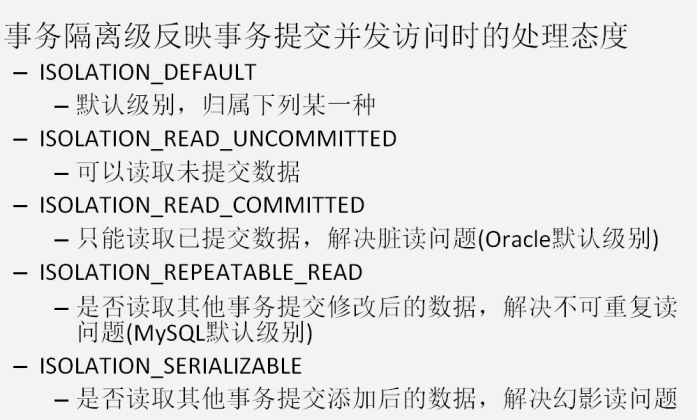

##### 事务的传播行为

REQUIRED:如果当前没有事务，就新建一个事务，如果已经存在一个事务中，加入到这个事务中。一般的选
择（默认值）

SUPPORTS:支持当前事务，如果当前没有事务，就以非事务方式执行（没有事务）

MANDATORY：使用当前的事务，如果当前没有事务，就抛出异常

REQUERS_NEW:新建事务，如果当前在事务中，把当前事务挂起。

NOT_SUPPORTED:以非事务方式执行操作，如果当前存在事务，就把当前事务挂起

NEVER:以非事务方式运行，如果当前存在事务，抛出异常

NESTED:如果当前存在事务，则在嵌套事务内执行。如果当前没有事务，则执行 REQUIRED 类似的操作。

##### 事务的xml配置

```
<!--在 tx:advice 标签内部 配置事务的属性 --> <tx:attributes>
<!-- 指定方法名称：是业务核心方法
    read-only：是否是只读事务。默认 false，不只读。
    isolation：指定事务的隔离级别。默认值是使用数据库的默认隔离级别。
    propagation：指定事务的传播行为。
    timeout：指定超时时间。默认值为：-1。永不超时。
    rollback-for：用于指定一个异常，当执行产生该异常时，事务回滚。产生其他异常，事务不回滚。
    没有默认值，任何异常都回滚。
    no-rollback-for：用于指定一个异常，当产生该异常时，事务不回滚，产生其他异常时，事务回
    滚。没有默认值，任何异常都回滚。
--> 
<tx:method name="*" read-only="false" propagation="REQUIRED"/>
<tx:method name="find*" read-only="true" propagation="SUPPORTS"/>
</tx:attributes>
```

##### 事务的注解配置

```
@Transactional(readOnly=true,propagation=Propagation.SUPPORTS)
该注解的属性和 xml 中的属性含义一致。该注解可以出现在接口上，类上和方法上。
出现接口上，表示该接口的所有实现类都有事务支持。
出现在类上，表示类中所有方法有事务支持
出现在方法上，表示方法有事务支持。
以上三个位置的优先级：方法>类>接口
<tx:annotation-driven transaction-manager="transactionManager"/>
```

#### SpringMVC

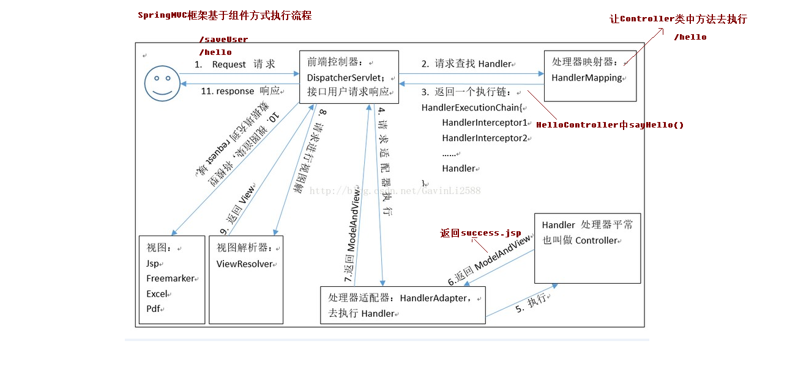


MVC模型
1. MVC全名是Model View Controller 模型视图控制器，每个部分各司其职。
2. Model：数据模型，JavaBean的类，用来进行数据封装。
3. View：指JSP、HTML用来展示数据给用户
4. Controller：用来接收用户的请求，整个流程的控制器。用来进行数据校验等

 SpringMVC的入门程序

```
1. 创建WEB工程，引入开发的jar包
2. 配置核心的控制器（配置DispatcherServlet） 
	在web.xml配置文件中核心控制器DispatcherServlet
	<!-- SpringMVC的核心控制器 --> 
	<servlet> 
	<servlet-name>dispatcherServlet</servlet-name> 
	<servlet-class>org.springframework.web.servlet.DispatcherServlet</servlet- class> 		<!-- 配置Servlet的初始化参数，读取springmvc的配置文件，创建spring容器 -->
    <init-param>
		<param-name>contextConfigLocation</param-name> 
		<param-value>classpath:springmvc.xml</param-value> 
	</init-param> 
	<!-- 配置servlet启动时加载对象 --> 
	<load-on-startup>1</load-on-startup> 
	</servlet>
    <servlet-mapping>
    <servlet-name>dispatcherServlet</servlet-name>
    <url-pattern>/</url-pattern> 
    </servlet-mapping>
3. 编写springmvc.xml的配置文件
<?xml version="1.0" encoding="UTF-8"?> <beans xmlns="http://www.springframework.org/schema/beans" xmlns:mvc="http://www.springframework.org/schema/mvc" xmlns:context="http://www.springframework.org/schema/context" xmlns:xsi="http://www.w3.org/2001/XMLSchema-instance" xsi:schemaLocation=" http://www.springframework.org/schema/beans http://www.springframework.org/schema/beans/spring-beans.xsd http://www.springframework.org/schema/mvc http://www.springframework.org/schema/mvc/spring-mvc.xsd http://www.springframework.org/schema/context http://www.springframework.org/schema/context/spring-context.xsd"> 
<!-- 配置spring创建容器时要扫描的包 --> 
<context:component-scan base-package="com.itheima"></context:component-scan> 
<!-- 配置视图解析器 --> 
<bean id="viewResolver" class="org.springframework.web.servlet.view.InternalResourceViewResolver"> 
<property name="prefix" value="/WEB-INF/pages/"></property> 
<property name="suffix" value=".jsp"></property> 
</bean> 
<!-- 配置spring开启注解mvc的支持 
<mvc:annotation-driven></mvc:annotation-driven>--> </beans>
```

##### 常用的注解

###### RequestMapping注解

```
1. RequestMapping注解的作用是建立请求URL和处理方法之间的对应关系
2. RequestMapping注解可以作用在方法和类上
    1. 作用在类上：第一级的访问目录
    2. 作用在方法上：第二级的访问目录
    3. 细节：路径可以不编写 / 表示应用的根目录开始
    4. 细节：${ pageContext.request.contextPath }也可以省略不写，但是路径上不能写 /
3. RequestMapping的属性
    1. path 指定请求路径的url
    2. value value属性和path属性是一样的
    3. method 指定该方法的请求方式
    4. params 指定限制请求参数的条件
    5. headers 发送的请求中必须包含的请求头
```

###### RequestParam注解

```
RequestParam注解
1. 作用：把请求中的指定名称的参数传递给控制器中的形参赋值
2. 属性
    1. value：请求参数中的名称
    2. required：请求参数中是否必须提供此参数，默认值是true，必须提供
3. 代码如下
@RequestMapping(path="/hello") 
public String sayHello(@RequestParam(value="username",required=false)String name) { 	System.out.println("aaaa"); 
	System.out.println(name); 
	return "success"; }
```

###### RequestBody注解

```
1. 作用：用于获取请求体的内容（注意：get方法不可以）
2. 属性
	1. required：是否必须有请求体，默认值是true
3. 代码如下
@RequestMapping(path="/hello") 
public String sayHello(@RequestBody String body) { 
    System.out.println("aaaa"); 
    System.out.println(body); 
    return "success"; }
```

###### PathVariable注解

```
1. 作用：拥有绑定url中的占位符的。例如：url中有/delete/{id}，{id}就是占位符
2. 属性
	1. value：指定url中的占位符名称
3. Restful风格的URL
    1. 请求路径一样，可以根据不同的请求方式去执行后台的不同方法
    2. restful风格的URL优点
        1. 结构清晰
        2. 符合标准
        3. 易于理解
        4. 扩展方便
        
@RequestMapping(path="/hello/{id}") 
public String sayHello(@PathVariable(value="id") String id){ 
	System.out.println(id); 
	return "success"; }
```

######  RequestHeader注解

```
1. 作用：获取指定请求头的值
2. 属性
	1. value：请求头的名称
3. 代码如下
@RequestMapping(path="/hello") 
public String sayHello(@RequestHeader(value="Accept") String header) { 	
	System.out.println(header); 
	return "success"; }
```

###### CookieValue注解

```
1. 作用：用于获取指定cookie的名称的值
2. 属性
	1. value：cookie的名称
3. 代码
@RequestMapping(path="/hello") 
public String sayHello(@CookieValue(value="JSESSIONID") String cookieValue) { 
	System.out.println(cookieValue); 
	return "success"; }
```

######  ModelAttribute注解

```
1. 作用
    1. 出现在方法上：表示当前方法会在控制器方法执行前先执行。
    2. 出现在参数上：获取指定的数据给参数赋值。
2. 应用场景
	1. 当提交表单数据不是完整的实体数据时，保证没有提交的字段使用数据库原来的数据。
3. 具体的代码
@ModelAttribute 
public User showUser(String name) { 
	System.out.println("showUser执行了..."); 
	// 模拟从数据库中查询对象 
	User user = new User(); 
	user.setName("哈哈"); 
	user.setPassword("123"); 
	user.setMoney(100d); 
	return user; }


@RequestMapping(path="/updateUser") 
public String updateUser(User user) { 
	System.out.println(user); 
	return "success"; }
	
@RequestMapping(path="/updateUser") 
public String updateUser(@ModelAttribute(value="abc") User user) { 
	System.out.println(user); 
	return "success"; }
```

###### SessionAttributes注解

```
1. 作用：用于多次执行控制器方法间的参数共享
2. 属性
	1. value：指定存入属性的名称
3. 代码如下
@Controller 
@RequestMapping(path="/user") 
@SessionAttributes(value= {"username","password","age"},types= {String.class,Integer.class}) 
// 把数据存入到session域对象中 
public class HelloController { 
	@RequestMapping(path="/save") 
	public String save(Model model) { 
		System.out.println("向session域中保存数据"); 
		model.addAttribute("username", "root"); 
		model.addAttribute("password", "123"); 
		model.addAttribute("age", 20);
		return "success"; }
	@RequestMapping(path="/find") 
	public String find(ModelMap modelMap) { 
		String username = (String) modelMap.get("username"); 
		String password = (String) modelMap.get("password"); 
		Integer age = (Integer) modelMap.get("age"); 
		System.out.println(username + " : "+password +" : "+age); 
		return "success"; }
	@RequestMapping(path="/delete") 
	public String delete(SessionStatus status) {
		status.setComplete(); 
		return "success"; } }
```

##### SpringMVC的异常处理

```
1.自定义异常类
public class SysException extends Exception{ 
	private static final long serialVersionUID = 4055945147128016300L; 
	// 异常提示信息 
	private String message; 
	public String getMessage() { 
		return message; }
	public void setMessage(String message) { 
		this.message = message; }
	public SysException(String message) { 
		this.message = message; }
		
2.自定义异常处理器
public class SysExceptionResolver implements HandlerExceptionResolver{ 
 /*** 跳转到具体的错误页面的方法 */ 
 	public ModelAndView resolveException(HttpServletRequest request, 
 				HttpServletResponse response, Object handler, Exception ex) { 
 		ex.printStackTrace(); 
 		SysException e = null; // 获取到异常对象 
 		if(ex instanceof SysException) { 
 			e = (SysException) ex; }
 		else { 
 			e = new SysException("请联系管理员"); }
 		ModelAndView mv = new ModelAndView(); // 存入错误的提示信息 
        mv.addObject("message", e.getMessage()); // 跳转的Jsp页面 
        mv.setViewName("error"); return mv; } }
3.配置异常处理器
 <!-- 配置异常处理器 --> <bean id="sysExceptionResolver" class="cn.itcast.exception.SysExceptionResolver"/>
```

##### SpringMVC拦截器

```
拦截器和过滤器的功能比较类似，有区别
1. 过滤器是Servlet规范的一部分，任何框架都可以使用过滤器技术。
2. 拦截器是SpringMVC框架独有的。
3. 过滤器配置了/*，可以拦截任何资源。
4. 拦截器只会对控制器中的方法进行拦截。
拦截器也是AOP思想的一种实现方式
想要自定义拦截器，需要实现HandlerInterceptor接口。


1. 创建类，实现HandlerInterceptor接口，重写需要的方法
public class MyInterceptor1 implements HandlerInterceptor{ 
	public boolean preHandle(HttpServletRequest request, HttpServletResponse response, Object handler) throws Exception { 
		System.out.println("拦截器执行了..."); 
		return true; } }
2.在springmvc.xml中配置拦截器类
<!-- 配置拦截器 --> 
<mvc:interceptors> 
	<mvc:interceptor> <!-- 哪些方法进行拦截 --> 
	<mvc:mapping path="/user/*"/> 
	<!-- 哪些方法不进行拦截 <mvc:exclude-mapping path=""/> --> <!-- 注册拦截器对象 --> 		<bean class="cn.itcast.demo1.MyInterceptor1"/> </mvc:interceptor> 
</mvc:interceptors>


HandlerInterceptor接口中的方法
1. preHandle方法是controller方法执行前拦截的方法
    1. 可以使用request或者response跳转到指定的页面
    2. return true放行，执行下一个拦截器，如果没有拦截器，执行controller中的方法。
    3. return false不放行，不会执行controller中的方法。
2. postHandle是controller方法执行后执行的方法，在JSP视图执行前。
    1. 可以使用request或者response跳转到指定的页面
    2. 如果指定了跳转的页面，那么controller方法跳转的页面将不会显示。
3. postHandle方法是在JSP执行后执行
	1. request或者response不能再跳转页面了
```

#### SSM

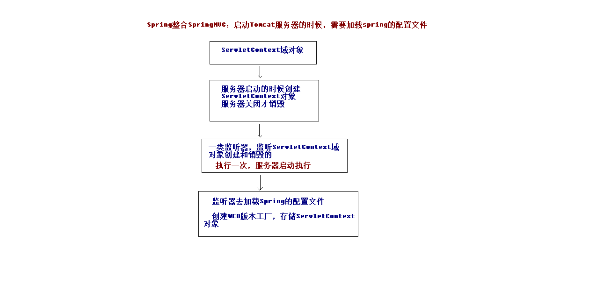

创建maven的工程

```
1. 创建ssm_parent父工程（打包方式选择pom，必须的）
2. 创建ssm_web子模块（打包方式是war包）
3. 创建ssm_service子模块（打包方式是jar包）
4. 创建ssm_dao子模块（打包方式是jar包）
5. 创建ssm_domain子模块（打包方式是jar包）
6. web依赖于service，service依赖于dao，dao依赖于domain
7. 在ssm_parent的pom.xml文件中引入坐标依赖
8. 部署ssm_web的项目，只要把ssm_web项目加入到tomcat服务器中即可

在ssm_web项目中创建applicationContext.xml的配置文件，编写具体的配置信息。
<?xml version="1.0" encoding="UTF-8"?> <beans xmlns="http://www.springframework.org/schema/beans" xmlns:xsi="http://www.w3.org/2001/XMLSchema-instance" xmlns:context="http://www.springframework.org/schema/context" xmlns:aop="http://www.springframework.org/schema/aop" xmlns:tx="http://www.springframework.org/schema/tx" xsi:schemaLocation="http://www.springframework.org/schema/beans http://www.springframework.org/schema/beans/spring-beans.xsd http://www.springframework.org/schema/context http://www.springframework.org/schema/context/spring-context.xsd http://www.springframework.org/schema/aop http://www.springframework.org/schema/aop/spring-aop.xsd
http://www.springframework.org/schema/tx http://www.springframework.org/schema/tx/spring-tx.xsd"> 
<!-- 开启注解扫描，要扫描的是service和dao层的注解，要忽略web层注解，因为web层让SpringMVC框架 去管理 --> 
<context:component-scan base-package="cn.itcast"> 
<!-- 配置要忽略的注解 --> 
<context:exclude-filter type="annotation" expression="org.springframework.stereotype.Controller"/> 
</context:component-scan> </beans>


在web.xml中配置DispatcherServlet前端控制器
 <!-- 配置Spring的监听器 --> 
 <listener> 
 <listener-class>org.springframework.web.context.ContextLoaderListener</listener- class></listener> 
 <!-- 配置加载类路径的配置文件 --> 
 <context-param> 
 	<param-name>contextConfigLocation</param-name> 
 	<param-value>classpath:applicationContext.xml</param-value> 
 </context-param>
 <!-- 配置前端控制器：服务器启动必须加载，需要加载springmvc.xml配置文件 -->
 <servlet> 
 <servlet-name>dispatcherServlet</servlet-name> 
 <servlet-class>org.springframework.web.servlet.DispatcherServlet</servlet-class> 
 <!-- 配置初始化参数，创建完DispatcherServlet对象，加载springmvc.xml配置文件 --> 
 <init-param> 
 <param-name>contextConfigLocation</param-name> 
 <param-value>classpath:springmvc.xml</param-value>
 </init-param> <
 !-- 服务器启动的时候，让DispatcherServlet对象创建 --> 
 <load-on-startup>1</load-on-startup> 
 </servlet> 
 <servlet-mapping> 
 <servlet-name>dispatcherServlet</servlet-name> 
 <url-pattern>/</url-pattern> 
 </servlet-mapping>
 <!-- 配置解决中文乱码的过滤器 --> 
 <filter> 
 <filter-name>characterEncodingFilter</filter-name> 
 <filter-class>org.springframework.web.filter.CharacterEncodingFilter</filter-class> <init-param> 
 <param-name>encoding</param-name> 
 <param-value>UTF-8</param-value> 
 </init-param> 
 </filter> 
 <filter-mapping> 
 <filter-name>characterEncodingFilter</filter-name> 
 <url-pattern>/*</url-pattern> 
 </filter-mapping>
 
 
 
创建springmvc.xml的配置文件，编写配置文件
  
 <?xml version="1.0" encoding="UTF-8"?> <beans xmlns="http://www.springframework.org/schema/beans" xmlns:mvc="http://www.springframework.org/schema/mvc" xmlns:context="http://www.springframework.org/schema/context" xmlns:xsi="http://www.w3.org/2001/XMLSchema-instance" xsi:schemaLocation=" http://www.springframework.org/schema/beans http://www.springframework.org/schema/beans/spring-beans.xsd http://www.springframework.org/schema/mvc http://www.springframework.org/schema/mvc/spring-mvc.xsd http://www.springframework.org/schema/context http://www.springframework.org/schema/context/spring-context.xsd"> 
 <!-- 扫描controller的注解，别的不扫描 --> 
 <context:component-scan base-package="cn.itcast"> 
 <context:include-filter type="annotation" expression="org.springframework.stereotype.Controller"/> 
 </context:component-scan> 
 <!-- 配置视图解析器 --> 
 <bean id="viewResolver"
 class="org.springframework.web.servlet.view.InternalResourceViewResolver"> 
 <!-- JSP文件所在的目录 --> 
 <property name="prefix" value="/WEB-INF/pages/" /> 
 <!-- 文件的后缀名 --> 
 <property name="suffix" value=".jsp" /> </bean> 
 <!-- 设置静态资源不过滤 --> 
 <mvc:resources location="/css/" mapping="/css/**" /> 
 <mvc:resources location="/images/" mapping="/images/**" /> 
 <mvc:resources location="/js/" mapping="/js/**" /> 
 <!-- 开启对SpringMVC注解的支持 --> 
 <mvc:annotation-driven /> </beans>
 
把SqlMapConfig.xml配置文件中的内容配置到applicationContext.xml配置文件中
 <!-- 配置C3P0的连接池对象 --> 
 <bean id="dataSource" class="org.springframework.jdbc.datasource.DriverManagerDataSource"> 
 <property name="driverClassName" value="com.mysql.jdbc.Driver" /> 
 <property name="url" value="jdbc:mysql:///ssm" /> 
 <property name="username" value="root" /> 
 <property name="password" value="root" /> 
 </bean> 
 <!-- 配置SqlSession的工厂 --> 
 <bean id="sqlSessionFactory" class="org.mybatis.spring.SqlSessionFactoryBean"> <property name="dataSource" ref="dataSource" /> </bean> 
 <!-- 配置扫描dao的包 --> 
 <bean id="mapperScanner" class="org.mybatis.spring.mapper.MapperScannerConfigurer"> <property name="basePackage" value="cn.itcast.dao"/> </bean>
```


#### SpringData JPA

##### JPA与hibernate的关系


##### JPA操作步骤

```
1.加载配置文件创建实体管理器工厂
    Persisitence：静态方法（根据持久化单元名称创建实体管理器工厂）
    createEntityMnagerFactory（持久化单元名称）
    作用：创建实体管理器工厂
			
2.根据实体管理器工厂，创建实体管理器
    EntityManagerFactory ：获取EntityManager对象
    方法：createEntityManager
    * 内部维护的很多的内容
    内部维护了数据库信息，
    维护了缓存信息
    维护了所有的实体管理器对象
    再创建EntityManagerFactory的过程中会根据配置创建数据库表
    * EntityManagerFactory的创建过程比较浪费资源
    特点：线程安全的对象
    多个线程访问同一个EntityManagerFactory不会有线程安全问题
    * 如何解决EntityManagerFactory的创建过程浪费资源（耗时）的问题？
    思路：创建一个公共的EntityManagerFactory的对象
    * 静态代码块的形式创建EntityManagerFactory
			
3.创建事务对象，开启事务
    EntityManager对象：实体类管理器
        beginTransaction : 创建事务对象
        presist ： 保存
        merge  ： 更新
        remove ： 删除
        find/getRefrence ： 根据id查询

    Transaction 对象 ： 事务
        begin：开启事务
        commit：提交事务
        rollback：回滚
		4.增删改查操作
		5.提交事务
		6.释放资源
	
i.搭建环境的过程
		1.创建maven工程导入坐标
		2.需要配置jpa的核心配置文件
			*位置：配置到类路径下的一个叫做 META-INF 的文件夹下
			*命名：persistence.xml
		3.编写客户的实体类
		4.配置实体类和表，类中属性和表中字段的映射关系
		5.保存客户到数据库中
	ii.编写一个符合springDataJpa的dao层接口
		* 只需要编写dao层接口，不需要编写dao层接口的实现类
		* dao层接口规范
			1.需要继承两个接口（JpaRepository，
			JpaSpecificationExecutor）
			2.需要提供响应的泛型
		persist ： 保存
		merge ： 更新
		remove ： 删除
		find/getRefrence ： 根据id查询
		
	iii.jpql查询
		sql：查询的是表和表中的字段
		jpql：查询的是实体类和类中的属性
		* jpql和sql语句的语法相似

		
		
```

##### JPA注解

```
@Entity
	作用：指定当前类是实体类。
@Table
    作用：指定实体类和表之间的对应关系。
    属性：
    	name：指定数据库表的名称
@Id
    作用：指定当前字段是主键。
@GeneratedValue
    作用：指定主键的生成方式。。
    属性：
        strategy ：指定主键生成策略。
       		IDENTITY:主键由数据库自动生成（主要是自动增长型）
       		SEQUENCE：根据底层数据库的序列来生成主键，条件是数据库
       		支持序列。
       		AUTO：主键由程序控制
       		TABLE：使用一个特定的数据库表格来保存主键
@Column
    作用：指定实体类属性和数据库表之间的对应关系
    属性：
        name：指定数据库表的列名称。
        unique：是否唯一  
        nullable：是否可以为空  
        inserttable：是否可以插入  
        updateable：是否可以更新  
        columnDefinition: 定义建表时创建此列的DDL  
        secondaryTable: 从表名。如果此列不建在主表上（默认建在主表），该属性定义该列所在从表的名字
        
@Query
	value ：jpql语句 | sql语句
	nativeQuery ：false（使用jpql查询） | true（使用本地查询：sql查询）
	
@OneToMany:
   	作用：建立一对多的关系映射
    属性：
    	targetEntityClass：指定多的多方的类的字节码
    	mappedBy：指定从表实体类中引用主表对象的名称。
    	cascade：指定要使用的级联操作
    	fetch：指定是否采用延迟加载
    	orphanRemoval：是否使用孤儿删除

@ManyToOne
    作用：建立多对一的关系
    属性：
    	targetEntityClass：指定一的一方实体类字节码
    	cascade：指定要使用的级联操作
    	fetch：指定是否采用延迟加载
    	optional：关联是否可选。如果设置为false，则必须始终存在非空关系。

@JoinColumn
     作用：用于定义主键字段和外键字段的对应关系。
     属性：
    	name：指定外键字段的名称
    	referencedColumnName：指定引用主表的主键字段名称
    	unique：是否唯一。默认值不唯一
    	nullable：是否允许为空。默认值允许。
    	insertable：是否允许插入。默认值允许。
    	updatable：是否允许更新。默认值允许。
    	columnDefinition：列的定义信息。
    	
@ManyToMany
	作用：用于映射多对多关系
	属性：
		cascade：配置级联操作。
		fetch：配置是否采用延迟加载。
    	targetEntity：配置目标的实体类。映射多对多的时候不用写。

@JoinTable
    作用：针对中间表的配置
    属性：
    	nam：配置中间表的名称
    	joinColumns：中间表的外键字段关联当前实体类所对应表的主键字段			  			
    	inverseJoinColumn：中间表的外键字段关联对方表的主键字段
```

##### JPA配置文件

```
<!--配置持久化单元 
		name：持久化单元名称 
		transaction-type：事务类型
		 	RESOURCE_LOCAL：本地事务管理 
		 	JTA：分布式事务管理 -->
<persistence-unit name="myJpa" transaction-type="RESOURCE_LOCAL">
		<!--配置JPA规范的服务提供商 -->
		<provider>org.hibernate.jpa.HibernatePersistenceProvider</provider>
		<properties>
			<!-- 数据库驱动 -->
			<property name="javax.persistence.jdbc.driver"
			value="com.mysql.jdbc.Driver" />
			<!-- 数据库地址 -->
			<property name="javax.persistence.jdbc.url"
			value="jdbc:mysql://localhost:3306/ssh" />
			<!-- 数据库用户名 -->
			<property name="javax.persistence.jdbc.user" value="root" />
			<!-- 数据库密码 -->
			<property name="javax.persistence.jdbc.password" value="111111" />

			<!--jpa提供者的可选配置：我们的JPA规范的提供者为hibernate，所以jpa的核心配置中兼容hibernate的配 -->
			<property name="hibernate.show_sql" value="true" />
			<property name="hibernate.format_sql" value="true" />
			<property name="hibernate.hbm2ddl.auto" value="create" />
		</properties>
	</persistence-unit>
</persistence>
```

##### Specification动态查询

```
JpaSpecificationExecutor 方法列表
	
		T findOne(Specification<T> spec);  //查询单个对象

		List<T> findAll(Specification<T> spec);  //查询列表

		//查询全部，分页
		//pageable：分页参数
		//返回值：分页pageBean（page：是springdatajpa提供的）
		Page<T> findAll(Specification<T> spec, Pageable pageable);

		//查询列表
		//Sort：排序参数
		List<T> findAll(Specification<T> spec, Sort sort);

		long count(Specification<T> spec);//统计查询
		
Specification ：查询条件
		自定义我们自己的Specification实现类
			实现
				//root：查询的根对象（查询的任何属性都可以从根对象中获取）
				//CriteriaQuery：顶层查询对象，自定义查询方式（了解：一般不用）
				//CriteriaBuilder：查询的构造器，封装了很多的查询条件
				Predicate toPredicate(Root<T> root, CriteriaQuery<?> query, CriteriaBuilder cb); //封装查询条件

```

#### SpringBoot

##### SpringBoot核心功能

```
- 起步依赖
  起步依赖本质上是一个Maven项目对象模型（Project Object Model，POM），定义了对其他库的传递依赖，这些东西加在一起即支持某项功能。
  简单的说，起步依赖就是将具备某种功能的坐标打包到一起，并提供一些默认的功能。

- 自动配置
  Spring Boot的自动配置是一个运行时（更准确地说，是应用程序启动时）的过程，考虑了众多因素，才决定Spring配置应该用哪个，不该用哪个。该过程是Spring自动完成的。
  
  
- 为基于Spring的开发提供更快的入门体验
- 开箱即用，没有代码生成，也无需XML配置。同时也可以修改默认值来满足特定的需求
- 提供了一些大型项目中常见的非功能性特性，如嵌入式服务器、安全、指标，健康检测、外部配置等
- SpringBoot不是对Spring功能上的增强，而是提供了一种快速使用Spring的方式
```

##### SpringBoot配置文件类型

```
SpringBoot是基于约定的，所以很多配置都有默认值，但如果想使用自己的配置替换默认配置的话，就可以使用application.properties或者application.yml（application.yaml）进行配置。

SpringBoot默认会从Resources目录下加载application.properties或application.yml（application.yaml）文件

其中，application.properties文件是键值对类型的文件。
```

##### application.yml配置文件

```
##### 配置普通数据
- 语法： key: value
- 示例代码：name: haohao
注意：value之前有一个空格


##### 配置对象数据
- 语法： 
  key: 
  	key1: value1
	key2: value2
  或者：
   key: {key1: value1,key2: value2}

- 示例代码：
  person:
    name: haohao
    age: 31
    addr: beijing
  或者
  person: {name: haohao,age: 31,addr: beijing}


##### 配置数组（List、Set）数据
- 语法： 
  key: 
	- value1
	- value2
  或者：key: [value1,value2]
```

##### SpringBoot配置信息的查询

上面提及过，SpringBoot的配置文件，主要的目的就是对配置信息进行修改的，但在配置时的key从哪里去查询呢？我们可以查阅SpringBoot的官方文档

文档URL：https://docs.spring.io/spring-boot/docs/2.0.1.RELEASE/reference/htmlsingle/#common-application-properties

##### 配置文件与配置类的属性映射

###### 使用注解@Value映射

```
application.yml配置如下：
person:
  name: zhangsan
  age: 18
 
@Controller
public class QuickStartController {

    @Value("${person.name}")
    private String name;
    @Value("${person.age}")
    private Integer age;


    @RequestMapping("/quick")
    @ResponseBody
    public String quick(){
        return "springboot 访问成功! name="+name+",age="+age;
    }

}

```

###### 使用注解@ConfigurationProperties映射

```
使用@ConfigurationProperties方式可以进行配置文件与实体字段的自动映射，但需要字段必须提供set方法才可以，而使用@Value注解修饰的字段不需要提供set方法


application.yml配置如下：
person:
  name: zhangsan
  age: 18
  
@Controller
@ConfigurationProperties(prefix = "person")
public class QuickStartController {

    private String name;
    private Integer age;

    @RequestMapping("/quick")
    @ResponseBody
    public String quick(){
        return "springboot 访问成功! name="+name+",age="+age;
    }

    public void setName(String name) {
        this.name = name;
    }

    public void setAge(Integer age) {
        this.age = age;
    }
}
```


#### idea快捷键

```
archetypeCatalog
internal


idea常用的快捷键

Alt+回车 导入包,自动修正

Ctrl+N   查找类

Ctrl+Shift+N 查找文件

Ctrl+Alt+L  格式化代码

Ctrl+Alt+O 优化导入的类和包

Alt+Insert 生成代码(如get,set方法,构造函数等)

Ctrl+E或者Alt+Shift+C  最近更改的代码

Ctrl+R 替换文本

Ctrl+F 查找文本

Ctrl+Shift+Space 自动补全代码

Ctrl+空格 代码提示

Ctrl+Alt+Space 类名或接口名提示

Ctrl+P 方法参数提示

Ctrl+Shift+Alt+N 查找类中的方法或变量

Alt+Shift+C 对比最近修改的代码

Shift+F6  重构-重命名

Ctrl+Shift+先上键

Ctrl+X 删除行

Ctrl+D 复制行

Ctrl+/ 或 Ctrl+Shift+/  注释（// 或者/*...*/ ）

Ctrl+J  自动代码

Ctrl+E 最近打开的文件

Ctrl+H 显示类结构图

Ctrl+Q 显示注释文档

Alt+F1 查找代码所在位置

Alt+1 快速打开或隐藏工程面板

Ctrl+Alt+ left/right 返回至上次浏览的位置

Alt+ left/right 切换代码视图

Alt+ Up/Down 在方法间快速移动定位

Ctrl+Shift+Up/Down 代码向上/下移动。

F2 或Shift+F2 高亮错误或警告快速定位

代码标签输入完成后，按Tab，生成代码。

选中文本，按Ctrl+Shift+F7 ，高亮显示所有该文本，按Esc高亮消失。

Ctrl+W 选中代码，连续按会有其他效果

选中文本，按Alt+F3 ，逐个往下查找相同文本，并高亮显示。

Ctrl+Up/Down 光标跳转到第一行或最后一行下

Ctrl+B 快速打开光标处的类或方法 

Intellij IDEA最常用快捷键

1.Ctrl＋E，可以显示最近编辑的文件列表

2.Shift＋Click可以关闭文件

3.Ctrl＋[或]可以跳到大括号的开头结尾

4.Ctrl＋Shift＋Backspace可以跳转到上次编辑的地方

5.Ctrl＋F12，可以显示当前文件的结构

6.Ctrl＋F7可以查询当前元素在当前文件中的引用，然后按F3可以选择

7.Ctrl＋N，可以快速打开类

8.Ctrl＋Shift＋N，可以快速打开文件

9.Alt＋Q可以看到当前方法的声明

10.Ctrl＋W可以选择单词继而语句继而行继而函数

11.Alt＋F1可以将正在编辑的元素在各个面板中定位

12.Ctrl＋P，可以显示参数信息

13.Ctrl＋Shift＋Insert可以选择剪贴板内容并插入

14.Alt＋Insert可以生成构造器/Getter/Setter等

15.Ctrl＋Alt＋V 可以引入变量。例如把括号内的SQL赋成一个变量

16.Ctrl＋Alt＋T可以把代码包在一块内，例如try/catch

17.Alt＋Up and Alt＋Down可在方法间快速移动
```

